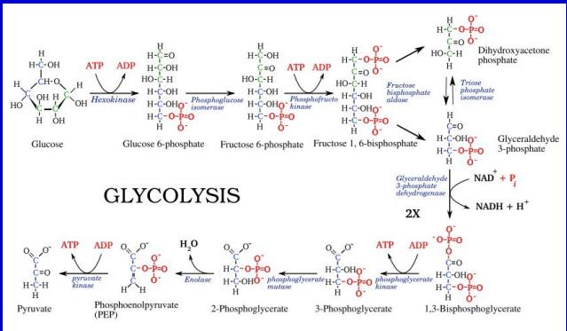
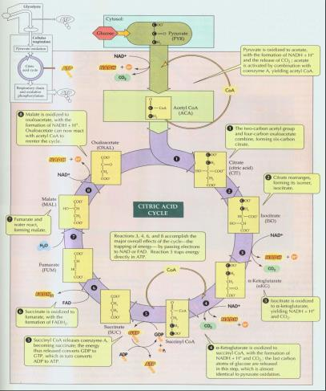
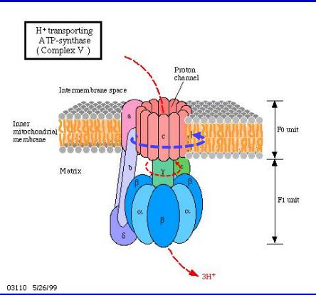
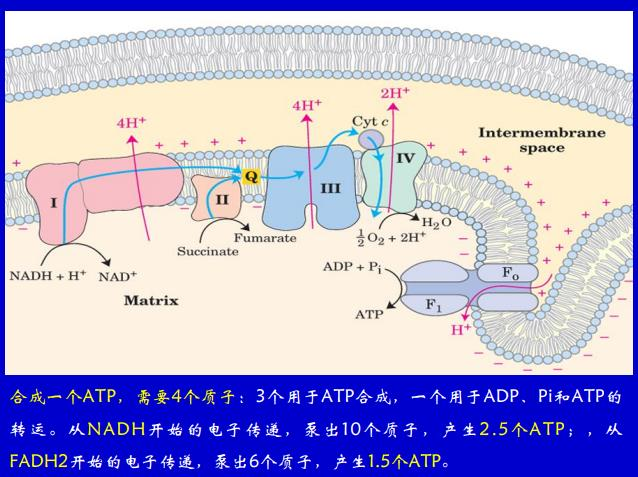

# 能量的获得与释放

### 酶

具有催化作用的大分子, 绝大多数是蛋白质

- 催化效率高
- 高度专一性: 结构专一(绝对专一/相对专一/键专一); 立体结构专一性(旋光异构专一性/几何异构专一性). 诱导契合假说
- 易失活: 一般要求常温常压众性pH
- 酶的抑制与失活: 不可逆的抑制(化学结合); 可逆的抑制(竞争性抑制: 增加底物浓度就可以补救; 非竞争性的抑制: 抑制剂结合在不同的位点上, 改变酶的高级结构, 别构调节, 调节分子结合在别构中心上, 改变活性); 共价修饰(形成共价键, 改变酶的构象; 肾上腺素集合G蛋白, 合成camp, 结合在xx上, 活化蛋白激酶A, 共价调节糖原磷酸化酶)

### 细胞呼吸

有机物经过一系列的氧化分解, 生成CO2, H2O, 其他产物, 释放出能量, 生成ATP的过程.

ATP和ADP+Pi转化, NAD: 脱氢酶的辅酶, 脱别人的氢, 拿到两个高能电子, 还原成NADH和氢离子, 也叫辅酶I

#### 糖酵解

```text
Glu + 2Pi + 2ADP + 2NAD+ ===> 2Pyr + 2ATP + 2NADH + 2H+ + 2H2O
```

- 先搭上一个ATP, 己糖激酶, 把葡萄糖磷酸化成6-磷酸葡萄糖
- 再异构成6-磷酸果糖, 磷酸葡萄糖异构酶
- 再搭一个ATP, 磷酸果糖激酶, 变成二磷酸果糖
- 二磷酸果糖不稳定, 醛缩酶作用下, 分解成磷酸甘油醛, 磷酸二羟基丙酮, 二者通过异构酶互相转化
- 磷酸丙糖脱氢酶, 辅酶NAD, 加两个Pi, 变成二磷酸甘油酸, 得到两个NADH
- 磷酸甘油酸激酶(以逆反应命名), 生成3-磷酸甘油酸, 拿回两个ATP, 底物水平的磷酸化
- 磷酸甘油酸转位酶, 得到2-磷酸甘油酸
- 烯醇化酶, 得到磷酸烯醇式丙酮酸
- 丙酮酸激酶, 生成丙酮酸, 拿到两个ATP, 糖酵解结束



无需氧的参与, 所有反应不依赖于任何细胞器或膜结构; 生命史中无氧阶段很长, 糖酵解最早出现; 糖酵解作为进化起点; 糖酵解速度与ATP水平和NAD+的再生速度有关

NAD+再生: 没有氧气的时候: 把h交给丙酮酸, 丙酮酸变成乳酸, 肝脏里面乳酸再变回丙酮酸

细菌, 无氧的条件下: 丙酮酸脱羧基 -> 变成乙醛, 再脱氢, 变成乙醇, 但是酒精对酵母也是有毒的, 12%左右就被抑制了


#### 三羧酸循环

人类发现的第二个循环, 在线粒体的基质里面进行, 必须要有氧气的参与

- 丙酮酸进到线粒体时, 变成乙酰组酶A, 得到一个CO2和NADH
- 和草酰乙酸反应, 变成柠檬酸, 柠檬酸核酶, 控制步骤
- 乌头酸酶作用下, 变成异柠檬酸
- 脱氢, 得到一个CO2和一个NADH, 变成alpha酮戊二酸
- 脱氢, 脱一个CO2, 拿到一个NADH, 和辅酶A连在一起, 变成琥珀酰辅酶A
- 底物水平的磷酸化, 得到琥珀酸, 和辅酶A, 和ATP
- 琥珀酸脱氢酶, 辅酶是FAD(氧化能力比NAD强), 得到延胡索酸
- 加一个水, 变成苹果酸
- 苹果酸脱氢酶, 变成草酰乙酸, 回来了



剩下的能量在还原性的辅酶里面, 这一个过程必须要有氧气的参与, 因为要把还原性的辅酶氧化回去, 氢又只能交给氧.

#### 从还原性辅酶获取能量

**电子传递**, 通过线粒体内膜上一系列的电子载体, 电子最终交给氧气, 生成水; 电子传递链, NADH脱氢酶 - 琥珀酸-Q还原酶 - 辅酶Q - 细胞色素还原酶 - 细胞色素氧化酶 - 氧气, 实际上是1or2 -> 3 -> 4

**氧化磷酸化**, 电子传递的过程, 伴随着ADP磷酸化成ATP的过程(在天冷的时候, 会取消掉这种耦联, 产热保暖)(化学能实际上是电子势能, 所以羟基可认为没能量).

算线粒体嵴内外的电动势, 发现差距比磷酸键还是大一点的, 氢离子流进来, 质子ATP合酶的c亚基就转起来了, γ也跟着转, 其他的不转, 一个氢离子大致形成一个ATP




#### 总结算

一个葡萄糖大致生成36或38个ATP(因为NADH进不去膜, 把氢交给磷酸二羟基丙酮, 变成磷酸甘油, 它脱氢的辅酶是FAD, FAD只能变成两个ATP, 糖酵解两个NADH就少了两个; 也可以通过苹果酸穿梭, 把氢给草酰乙酸, 变成苹果酸, 进入线粒体, 再脱氢变成草酰乙酸, 辅酶时辅酶I, 变成天冬氨酸和α酮戊二酸, 出线粒体内膜)


但实际上只能得到30个ATP, 因为需要四个ATP才能转圈, 其中1个用于ATP转运, 剩下的变成热能



#### 代谢整合

所有有机分子都能产生能量, 糖代谢是中心的, 典型的; 三酸循环是彻底氧化的共同途径.

脂肪变成甘油和脂肪酸, 后者一次切下两个C, 变成甘油和乙酰辅酶A

核酸和蛋白质里面的N是不能被氧化的, N必须先脱掉, 人的话变成尿素

三酰甘油是高密度的能量的储存库, 同质量下能存两倍的能量, 高度不溶于水.

#### 糖-脂肪-氨基酸的相互转化

糖可以转化成脂肪, 储存糖是有限的, 储存脂肪是无限的

丙酮酸 --> 乙酰辅酶A 是单向的, 所以脂肪变成乙酰辅酶A之后变不回糖, 储存起来就形成酮, 血液酸化, 口气丙酮味, 减肥失败, 生命垂危

但是植物可以啊, 虽然植物不需要减肥, 乙醛酸循环

三碳以上都能变成糖

大脑, 血细胞需要葡萄糖, 糖异生

### 光合作用

helmont: 植物增加的重量来自于水.

普利斯特里: 发现了氧气, 能维持呼吸

光合作用方程式

$$6CO_{2} + 6H_{2}O \to C_6H_{12}O_6 + 6O_2$$

硫细菌, 氢细菌的反应类似, 产生S或水, 类比得到氧气来自于水

在叶绿体里面进行, 叶绿体(2-4微米, 比细胞核小一点)比线粒体(1-2μ)大得多, 双层膜, 里面还有类囊体, 叠成基粒, 分"基粒内囊体"和"基质类囊体", 所有类囊体的腔都连在一起.

分成两个部分, 一个光反应, 一个暗反应; 只光照, 无二氧化碳, 还能释放氧气; 突然去掉光照, 给二氧化碳, 也能反应; 光反应在类囊体膜上, 叶绿素在膜上, 叶绿素吸收那个波段的光? 找一条水绵, 用彩虹照它, 周围养一圈好氧细菌, 红蓝光很多; 暗反应在基质里面进行.

#### 光反应

化学能的本质是电子势能, 稳定的分子受到光子激发, 跃迁
- 再跃迁回去, 发光发热
- 被另一个分子吸收, 最终把电子给$$CO_{2}$$

光合作用效率有极值, 即便这时, 也只是2500个叶绿素分子放出1分子氧气; 9-10个光量子能放出一分子氧气 ==> 250叶绿素才能吸收一个光子; 剩下的分子是捕光色素(B, 胡萝卜, xxx): 把光子的能量转走, 转到能吸收的色素, 叫做中心色素(叶绿素A), 电子再给原初电子受体.

叶绿素分子的结构状态, 卟啉里面是一个Mg, 一个疏水的尾巴插到脂双层里面去, 和蛋白紧密结合在一起. 整个结构叫光系统

中心色素有两种: 680nm  700nm, 一起照比单独的和还多, 说明两个系统有关联; p-700: 光系统1; p-680: 光系统2.
