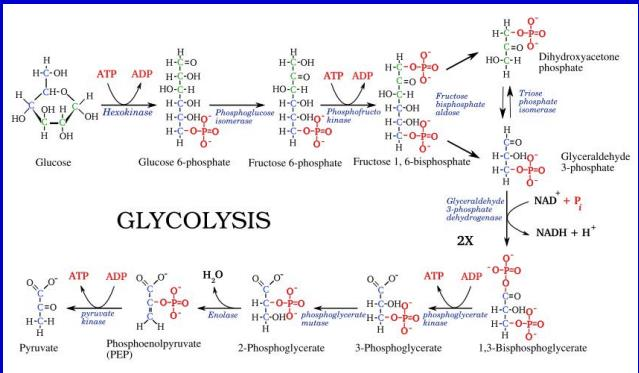
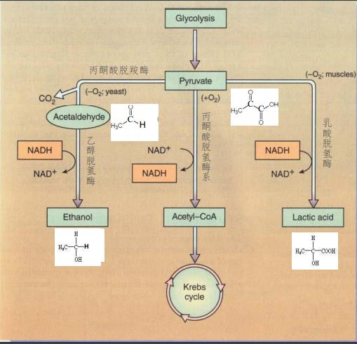
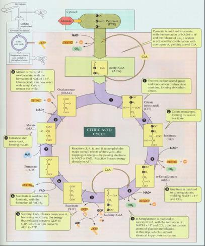
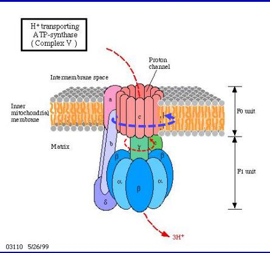
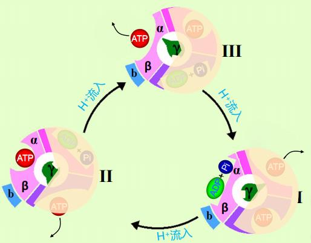
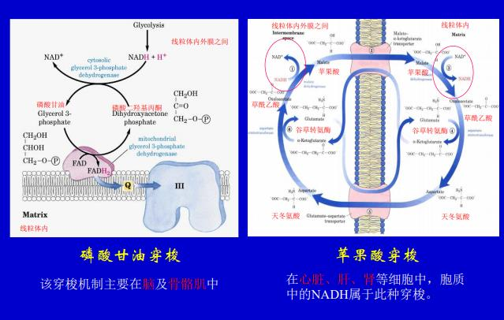

# 绪论

生命科学有最多的未解之谜, 将极大改变人类的生活方式健康状况

流感: H血凝集素1-15, N神经氨酸酶1-9型, 都是病毒上的糖蛋白

结核病, 结核杆菌, 1/3人感染; 疟疾, 青蒿素

生命科学中的数学

# 从分子到细胞

### 微量元素

微量元素是许多生物分子(包括酶)的结构, 功能成分. I是甲状腺素的必要成分, 缺碘引起甲状腺增生. Fe是血红蛋白的必要成分, 卟啉中间夹一个二价铁, 血红素也可以和CO2, CO结合, CO 氰化物结合很紧密, 就会中毒, 注射和CO紧密结合的东西可以解毒. Mn,Cu,Zn超氧化物歧化酶, 催化超氧化物歧化成氧气和过氧化氢, 真核都有Cu,Zn, 线粒体细菌有Mn的SOD.

Fe:SOD, 细胞色素氧化酶; Cu细胞色素氧化酶; Mn精氨酸酶; Zn脱氢酶, DNA聚合酶, 碳酸酐酶; Co: B12; Si结缔组织和骨的形成; F骨的形成.

### 水

60%以上的重量, 体细胞生活在水环境中, 生命起源于水中

水分子的极性和氢键, 氢端阳性, 氧端隐性, 高度极性

4°C密度最大; 强大的表面张力和内聚力; 比热容大, 蒸发散热多

### 无机盐

食盐作用: 维持细胞外液的渗透压; 维持电性平衡, 酸碱平衡, 胃酸形成; 参与电信号的形成

#### 离子与神经电信号

静息电位-70mV, 内负外正, NaK泵(进去两个K, 出去三个Na, NaK各自还有通道)

极化阶段Na进来, 去极化阶段K出去, undershoot阶段K接着出去, 直到重新达到静息电位

动作电位的传播, 极化阶段进去的Na事实上是向两边传播的(两边都是负电位), 信号向一个方向传播

动作电位在有髓轴突上的传导, 施万细胞, 郎飞氏结, 一端的Na通道打开, 把另一端的Na吸走, 达到阈值, 相邻的Na通道也打开了, 信号传递.

#### pH值, 缓冲液

血液的缓冲系统$H_2CO_3 \iff HCO_3^- + H^+$, 细胞内液的缓冲系统$H_2PO_4^- \iff HPO_4^{2-} + H^+$

### 糖类

化学通式是$(CH_2O)n$, 根据水解情况, 分成单糖(葡萄糖, 果糖, 核糖), 寡糖(麦芽糖, 蔗糖, 乳糖), 多糖(淀粉, 纤维素, 糖原)

单糖: 核糖5个碳, 葡萄糖6个碳, C=O在末端, C=O在2号碳的叫核酮糖, 果糖

旋光异构, 巴斯德发现, L型, 大拇指朝着CO, 用左手从OH转到H就是L形, 右手转过去就是D型. 单糖按照离CO最远的C的构型, 定为D形糖或L形糖

葡萄糖的环式结构: COH的H和5号碳的OH脱掉一分子水, 形成六边形, 6号碳支出来

寡糖: 两个同侧的OH(譬如说都在六边形的下边)脱水, 叫alpha糖苷键, 反向的叫beta糖苷键. 麦芽糖, 蔗糖就是alpha, 乳糖是beta

之前提到的多糖都以葡萄糖为结构单元. 直链淀粉, 一群葡萄糖形成alpha-1-4糖苷键, 形成螺旋, 也可以形成alpha-1-6糖苷键形成支链淀粉. 几丁质也是一种多糖, 壳多糖, 把葡萄糖的6号碳换成NH-COCH3

糖类的功能: 提供能量, 结构成分, 生物合成的原料, 识别作用

### 脂类

难溶于水易溶于有机溶剂的物质, 主要由CH组成, O少. 包含单纯脂, 复合脂, 萜类, 类固醇和衍生物

#### 单纯脂 - 三酰甘油

脂肪包括动物的脂肪和植物的油, 因为植物的脂肪酸双键较多, 脂肪酸歪歪扭扭, 分子间作用力小, 呈液态, 动物的脂肪相反. 人体可以合成所有不多于一个双键的脂肪酸, 但是只有亚油酸和亚麻酸是需要自己吃的

#### 复合脂 - 磷脂

一个脂肪酸的侧链被磷酸取代, 就亲水(头部还可以结合别的物质, 形成磷脂酰胆碱/卵磷脂), 两个尾巴就疏水

#### 固醇类物质(没有酯键)

胆甾醇, 只有羟基亲水, 剩下的部分全疏水, 可以插到细胞膜里面调节流动性, 占比相当高. 用低密度脂蛋白的形式在血液运输, 吃多了就沉积, 刺激血管内壁细胞, 把它包起来, 越包越沉积, 形成动脉粥样硬化, 动脉弯曲容易形成这种东西

固醇类的物质: 维生素D(促进钙的吸收), 皮质醇(提高代谢能力)(早期禁药的成分), 性激素

#### 萜类

异戊二烯(152烯)的衍生物, 天然橡胶, 维生素A(防止夜盲症, 和视觉的形成有关,  顺反? 双键的两边), 胡萝卜里面是beta胡萝卜素(切两半就是两个维生素A)

视杆细胞: 一个一个凹进去的膜, 叫做视盘, 镶嵌着视蛋白, 结合着有视黄醛, 视黄醛变化, 视蛋白也变, 信号传导 ==> 神经冲动

顺视黄醛 -光照-> 反视黄醛 -黑暗, 肝脏-> 回去, 但是会损失一部分, 补充的不够就变少了, 视杆细胞很多, 比视锥细胞多, 负责暗视力, 但是视杆细胞看不见颜色, 视锥细胞的三种视蛋白对红绿蓝起反应

### 蛋白质

细胞干重的最多部分, 基本成分氨基酸, 20种, 都是alpha氨基酸(大拇指COOH, 右手从NH2转到R), 全是L型的(除了甘氨酸, 它侧链也是H), 脱水之后的叫氨基酸残基, 平均分子量110, 从N端写到C端

#### 蛋白质的结构层次

- 一级结构: 氨基酸的排列顺序
- 二级结构: 肽链初步折叠扭曲的结构 弹簧一样的: alpha螺旋, 箭头: beta折叠
    - alpha螺旋: 主链基团形成氢键, 氧和后面第四个NH上面的氢形成氢键, 大致4个氨基酸一圈, 比方说alpha角蛋白:头发, 指甲, 角, 爪子, 可以拉伸
    - beta折叠: 两段肽链间形成氢键, 比方说 蚕丝 可以吃, 不能拉伸, 绿色荧光蛋白
    - 但是是可以相互转换的, 温度高湿度大 => alpha->beta, 烫头: 洗洗, 刷东西(破坏二硫键), 烫, 再刷东西(氧化剂, 形成二硫键)
- 结构域: 三级结构之下, 结构功能上相对独立的部分, 比方说转录因子有很多结构域
- 三级结构: 一条肽链的最高级结构, 空间构象
- 四级结构: 多条肽链组成的, 每一个成为一个亚基, 血红蛋白两个alpha链, 两个beta链

维持高级结构的力: 氢键, 疏水相互作用, 静电相互吸引, 二硫键

#### 蛋白质的变性复性

- 变性: 酸碱, 有机溶剂, 去污剂(两性物质), 尿素, 加热, 紫外线. 破坏空间结构, 丧失生物活性
- 复性: 变性因素去除后, 恢复到天然构象(最稳定, 能量低的结构), 有些是可以的

###### 决定高级结构的信息在哪里: (white & anifinsen)信息在一级结构那里, 蛋白质可以自发折叠形成天然构象

#### 蛋白质的构象病

镰形红细胞贫血症: 弹性差, 毛细血管一挤压就碎了, beta链谷氨酸(强极性)变成缬氨酸(非极性, 和旁边的缬氨酸抱团, 变成纤维结晶(正常的不粘连), 但是抗疟疾)

### 核酸

核苷酸 (脱氧)核糖 + 碱基 + 磷酸; 碱基: 两个环, 嘌呤, 一个环, 嘧啶; 3'5'磷酸二酯键(从碱基那里开始编号), 碱基环(最复杂)上用1234, 糖环1'2'3'4'; A=2=T, C=3=G

#### DNA高级结构

磷酸和五碳糖在外边形成链, 内部形成碱基配对, 两条链是反向的

5'磷酸是自由的, 最后一个3'羟基也是自由的, 核酸链从5'写到3'

每一个碱基0.34nm, 大概10个核酸, DNA直径2nm

沟(碱基陷进去了, 因为碱基和链不在一个平面上), 小沟, 大沟(因为DNA双链比较细, 垂直双链的沟大, 平行于双链的沟小)

人类基因组3*1e9bp

# 生命的基本单位 - 细胞

### 细胞学说的建立

1665 胡克看到细胞壁(软木塞), 列文虎克看到活的细菌原生动物

#### 显微镜

人眼分辨率0.1mm, 真核细胞几十个微米, 原核细胞几个微米, 病毒几个纳米.

放大镜提高张角, 物镜决定好坏, 最高100x, 倍数越高孔越小, 太小就衍射了, 艾里斑, 当一个点的中央和另一个点的第一暗纹重合时, 刚好能分辨, 分辨率D的公式$D = 0.61\lambda n \sin \mu$, nsinμ最大1.3-1.4, D约等于0.5λ, 光学分辨率最高0.2微米

施莱登: 植物是细胞. 施旺: 动物也是细胞. 魏尔肖: 细胞来自细胞

现代细胞学说: 动植物都是细胞/细胞产物, 所有细胞结构组成相似, 新细胞由原有的细胞分裂而来

### 细胞的结构与功能

细胞核有无: 真核细胞 / 原核细胞

| 原核细胞 | 真核细胞 |
| --- | --- |
| 1-10微米 | 10-100微米 |
| 核区, 无核膜 | 有核膜 |
| 环状DNA, 有质粒 | 线装DNA, 染色体 |
| 核糖体70(50 + 30) | 80(60 + 40) |
| 无 | 有内膜, 膜细胞器, 细胞骨架 |
| 细胞壁肽聚糖 | 纤维素, 几丁质 |

植物细胞: 叶绿体可以转化成质体(蒜黄), 也可以转化回去(土豆发芽)

动物细胞: 中心体, 中心粒

#### 细胞质膜, 细胞外基质

外基质: 细胞壁, 细胞产物, 糖蛋白(生理活性强 =, 细胞迁移)

细胞膜: 电镜看见的是蛋白质吸附亲水染料, 流动镶嵌模型需要修正(跨膜区只有20几个氨基酸). 冰冻蚀刻技术掀开磷脂双分子层, 看到镶嵌的蛋白质. 流动性(人+小鼠融合实验)

膜蛋白类型: 内在膜蛋白(整合膜蛋白, 跨膜蛋白, α螺旋或β折叠跨膜), 外在膜蛋白(膜周边蛋白, 和膜蛋白/膜脂非共价结合), 脂锚定膜蛋白(和脂共价相连, 脂插到磷脂双分子层中).

#### 物质的跨膜运输

简单扩散: 小分子, 不带电, 最好非极性, O, CO2, H2O, 脂溶性, 毒性(有机农药), 但是葡萄糖, 氨基酸周围一圈水进不去

协助扩散: 通道(门控:电压/压力), 载体(上车)

主动运输: 离子泵(钙泵(细胞内低, 结合一分子ATP, 运一个Ca), NaK泵(外正内负, 1/3能量, Na出去一个ATP, K进来一个ATP), 质子泵(溶酶体运H, ATP)) 间接消耗能量: 协同运输(葡萄糖和Na进来, NaK泵把Na运出去), 植物用质子泵协同运输蔗糖, 需要蔗糖就表达载体, 小肠上皮运出葡萄糖协助扩散就行了.

胞吞胞吐: 有特异性, 需要受体, 胆固醇裹一层低密度脂蛋白运输, 没有受体gg, 显性遗传; 只靠磷脂凹不进去, 需要笼型蛋白凹陷

#### 细胞内膜系统

内质网, 高尔基体, 溶酶体结构功能发生上相互联系, 电子显微镜下能看见

内质网: 细胞只有一个, 全是连在一起的, 光面内质网很少, 合成脂类固醇类; 粗面内质网上面有核糖体, 合成分泌蛋白和所有膜蛋白, 进行一定的糖基化

##### 信号肽学说

内质网中去除了一段N端开始的序列, 它被SRP识别, 拽到内质网上, 新合成的肽链就跑到内质网里了, 胞吐出去就在细胞外面了.

##### 膜蛋白的跨膜机制

N端在细胞外, 一开始正常合成, 之后合成一个一段序列, 给一个"强烈"的信号, "我不想走", 停止转运, 移位子旁边打开, 蛋白质进到磷脂双分子层, 之后的蛋白就在内质网外面.

N端在细胞内, 一开始在内质网外合成, 中间有一段信号肽的东西, 中间被拉到内质网上, 之后合成的东西就传到内质网内, 也就是细胞外了.

高尔基体: 可以有很多, 不连通, 一个接受面, 一个是释放面; 分选, 蛋白质糖基化, 只有三种侧链才能连上糖, 修饰内质网进行的N糖基化(糖基连接到天冬酰胺上), 进行O糖基化(连到丝氨酸和苏氨酸残基上).

溶酶体就是高尔基体吐出去的囊泡, 里面是水解酶

#### 半自助性细胞器

少数蛋白质自身编码, 在自己的核糖体上合成, 多数由一段特殊序列(导肽), 引导到线粒体上去

### 细胞骨架

微丝微管, 一段不断组装, 另一端不断水解, 但是有结合蛋白的话可以把水解掉的部分封住

微丝只有几个nm, 小肠上皮微绒毛, 张力纤维, 变形运动, 有丝分裂的溢裂.

肌肉收缩的原理: 肌钙蛋白结合Ca之后, 形状变化, 微丝上结合肌球蛋白的位点暴露, 肌球蛋白的头部收回来, 微丝运动了, 结合ATP, 它同时也是水解酶, 把ATP水解掉, 恢复原状, 如果还有Ca, 接着动.

微管: 纺锤丝, 13根蛋白围成的管状结构, 两种球蛋白首尾相连组成一根, 外径25nm, 内径15nm. 马达蛋白牵着膜泡在微管上运输, 染色体分离是马达蛋白牵着微管. 微管组织中心: 生成微管的地方.

鞭毛/纤毛: 外围9组二联体微管, 中间两个完整的微管; 微管之间由马达蛋白结合; 细菌的鞭毛是鞭毛蛋白

原核生物没有细胞骨架.

中心体: 微管的中心, 两个中心粒, 每一个由9组3联体微管组成

中间纤维: 有很多种, 非动态的. 直径介于细肌丝和粗肌丝之间. 角蛋白, 核膜下面的核纤层, 成纤维细胞里面的波形蛋白. 只知道能维持刚性.

### 细胞核

核膜是双层的, 把DNA的行为和蛋白质的行为区分开, 外面的核膜和内质网连在一起, 上面可以有内质网

核孔由多种蛋白质围成, 核孔复合体, 鱼笼模型(类似下面封死的篮球网)

### 染色体

着丝粒: 微管附着在染色体的地方, 也叫主溢痕, 短臂叫p, 长臂叫q

端粒: 染色体两端高度重复的序列

次溢痕: 主溢痕之外的溢缩部分. 核仁组织区: rDNA所在部位, 和核仁形成有关. 随体: 末端的球形染色体片段, 通过次溢痕和染色体相连

三个基本功能元件: 自主复制DNA序列(自我复制); 着丝粒(染色体平均分配); 端粒(保持独立稳定)

染色体数目和亲缘, 进化没关系, 猩猩48条, 两个合起来和人的2号染色体很像

染色体显带: 特定染色方法下, 产生明暗相间的条带, 可用于定位基因

#### 染色体的结构

串珠结构, 染色质的基本单位核小体(10nm), 146个碱基对缠在组蛋白的8聚体上, 1.74圈, H1用于稳定核小体; 核小体每圈6个, 绕成直径30nm的螺线管; 螺线管呈环状结合在蛋白骨架上, 形成300nm的放射环; 进一步包装成700nm的染色体

#### 核仁

rRNA基因存储, rRNA合成加工, 核糖体亚基组装的地方, 核糖体的r蛋白在表面, rRNA在内部

### 细胞的社会联系

细胞连接: 紧密连接(上皮细胞之间连接); 锚定连接(角蛋白之类的连接, 分散力, 大家都锚定一个细胞); 通讯连接(除了骨骼肌和血细胞都有, 间隙连接(两个通道紧挨着), 化学突触, 相邻细胞交流小分子物质; 植物细胞通过胞间连丝, 内质网跑过去, 病毒之类的也能过去);

化学通讯的步骤: 释放信号分子, 信号分子运输到靶细胞, 引号分子和受体结合

#### 信号分子&受体

配基: 激素, 细胞因子, 神经递质

受体: 全是蛋白质
 - 细胞内受体: 亲脂性激素受体
 - 细胞表面受体:
    - 离子通道藕联
    - G蛋白藕联受体
    - 酶连接的受体

类固醇激素能跑到细胞里面, 甚至有核受体

平滑肌的NO信号受体, NO穿过血管内皮, 之后平滑肌舒张 ==> 硝酸甘油, 心脏病急救

离子通道受体: 突触后膜, 一个位点结合递质, 之后通道打开

酪氨酸激酶受体: 酪氨酸: 有羟基的氨基酸,  激酶: 利用atp把底物磷酸化的酶,  酪氨酸正好有羟基, 能形成脂键, 酪氨酸激酶受体有酪氨酸, 本身也是酪氨酸激酶, 受体一来, 两个受体结合到一起, 把对方磷酸化, 激活下游信号分子, 信号传递下去, 生长因子受体家族都是这样.

G蛋白偶联受体(是膜蛋白): G蛋白是一大类蛋白, 能结合GTP, 把GTP水解成GDP, 水解之后就没有活性了;  受体和G蛋白挨在一起, 受体变化就把G蛋白激活了, G蛋白在激活另一个蛋白质(通常是腺苷酸环化器), 把ATP环化成环式AMP(cAMP, 它成为第二信使(非蛋白小分子, 通过浓度调控信号), 因为不是第一信使) 再往下传递信号, 比方说激活磷酸化酶, 分解糖原

为何少量激素就能发挥大作用?

信号传导的级联放大作用

视蛋白就是G蛋白耦联受体, 激化磷酸二酯酶, 把环式GMP切了, 通道关闭, 立刻导致膜两端的电位差别

一个光子500个G蛋白, 一个磷酸二酯酶降解2000个cGMP, 5个光子就能感觉到了

### 细胞周期

细胞周期是对分裂的细胞而言的, 最主要的变化是细胞核的变化.

M: 分裂期, S间期, SM之间有两个gap

三个检验点
- G1-S: 检验细胞大小, 营养, 生长因子, DNA是否损伤, 这一个检验点最重要, 如果通过了这个, 但是没有通过后面的检验点, 细胞会调往掉
- G2-M: 检验DNA是否复制完成
- M的中期: 检查是否有纺锤丝附着

#### 细胞周期的秘密

Hela细胞中期含有让染色质凝聚的东西; 非洲爪蟾成熟的卵中有能使不成熟的卵减数分裂的物质; 海胆中发现随细胞周期含量变化的蛋白质cyc; 对温度敏感的酵母中有蛋白激酶cdc

细胞周期的调控: 快到S期的时候, cdk和G1cyc结合到一起, 磷酸化一系列蛋白质, 之后G1cyc被降解, 快到M期的时候, cdk和Mcyc结合, 叫MPF, 现在的底物就变了.

# 能量的获得与释放

### 酶

具有催化作用的大分子, 绝大多数是蛋白质

- 催化效率高
- 高度专一性: 结构专一(绝对专一/相对专一/键专一); 立体结构专一性(旋光异构专一性/几何异构专一性). 诱导契合假说
- 易失活: 一般要求常温常压众性pH
- 酶的抑制与失活: 不可逆的抑制(化学结合); 可逆的抑制(竞争性抑制: 增加底物浓度就可以补救; 非竞争性的抑制: 抑制剂结合在不同的位点上, 改变酶的高级结构, 别构调节, 调节分子结合在别构中心上, 改变活性); 共价修饰(形成共价键, 改变酶的构象; 肾上腺素集合G蛋白, 合成camp, 结合在xx上, 活化蛋白激酶A, 共价调节糖原磷酸化酶)

### 细胞呼吸

有机物经过一系列的氧化分解, 生成CO2, H2O, 其他产物, 释放出能量, 生成ATP的过程.

ATP和ADP+Pi转化, NAD: 脱氢酶的辅酶, 脱别人的氢, 拿到两个高能电子, 还原成NADH和氢离子, 也叫辅酶I

#### 糖酵解

```text
Glu + 2Pi + 2ADP + 2NAD+ ===> 2Pyr + 2ATP + 2NADH + 2H+ + 2H2O
```

- 先搭上一个ATP, 己糖激酶, 把葡萄糖磷酸化成6-磷酸葡萄糖
- 再异构成6-磷酸果糖, 磷酸葡萄糖异构酶
- 再搭一个ATP, 磷酸果糖激酶, 变成二磷酸果糖
- 二磷酸果糖不稳定, 醛缩酶作用下, 分解成磷酸甘油醛, 磷酸二羟基丙酮, 二者通过异构酶互相转化
- 磷酸丙糖脱氢酶, 辅酶NAD, 加两个Pi, 变成二磷酸甘油酸, 得到两个NADH
- 磷酸甘油酸激酶(以逆反应命名), 生成3-磷酸甘油酸, 拿回两个ATP, 底物水平的磷酸化
- 磷酸甘油酸转位酶, 得到2-磷酸甘油酸
- 烯醇化酶, 得到磷酸烯醇式丙酮酸
- 丙酮酸激酶, 生成丙酮酸, 拿到两个ATP, 糖酵解结束



无需氧的参与, 所有反应不依赖于任何细胞器或膜结构; 生命史中无氧阶段很长, 糖酵解最早出现; 糖酵解作为进化起点; 糖酵解速度与ATP水平和NAD+的再生速度有关

NAD+再生: 没有氧气的时候: 把h交给丙酮酸, 丙酮酸变成乳酸, 肝脏里面乳酸再变回丙酮酸

细菌, 无氧的条件下: 丙酮酸脱羧基 -> 变成乙醛, 再脱氢, 变成乙醇, 但是酒精对酵母也是有毒的, 12%左右就被抑制了



#### 三羧酸循环

人类发现的第二个循环, 在线粒体的基质里面进行, 必须要有氧气的参与

- 丙酮酸进到线粒体时, 变成乙酰组酶A, 得到一个CO2和NADH
- 和草酰乙酸反应, 变成柠檬酸, 柠檬酸核酶, 控制步骤
- 乌头酸酶作用下, 变成异柠檬酸
- 脱氢, 得到一个CO2和一个NADH, 变成alpha酮戊二酸
- 脱氢, 脱一个CO2, 拿到一个NADH, 和辅酶A连在一起, 变成琥珀酰辅酶A
- 底物水平的磷酸化, 得到琥珀酸, 和辅酶A, 和ATP
- 琥珀酸脱氢酶, 辅酶是FAD(氧化能力比NAD强), 得到延胡索酸
- 加一个水, 变成苹果酸
- 苹果酸脱氢酶, 变成草酰乙酸, 回来了



剩下的能量在还原性的辅酶里面, 这一个过程必须要有氧气的参与, 因为要把还原性的辅酶氧化回去, 氢又只能交给氧.

#### 从还原性辅酶获取能量

**电子传递**, 通过线粒体内膜上一系列的电子载体, 电子最终交给氧气, 生成水; 电子传递链, NADH脱氢酶 - 琥珀酸-Q还原酶 - 辅酶Q - 细胞色素还原酶 - 细胞色素氧化酶 - 氧气, 实际上是1or2 -> 3 -> 4

**氧化磷酸化**, 电子传递的过程, 伴随着ADP磷酸化成ATP的过程(在天冷的时候, 会取消掉这种耦联, 产热保暖)(化学能实际上是电子势能, 所以羟基可认为没能量).

算线粒体嵴内外的电动势, 发现差距比磷酸键还是大一点的, 氢离子流进来, 质子ATP合酶的c亚基就转起来了, γ也跟着转, 其他的不转, 一个氢离子大致形成一个ATP





#### 总结算

一个葡萄糖大致生成36或38个ATP(因为NADH进不去膜, 把氢交给磷酸二羟基丙酮, 变成磷酸甘油, 它脱氢的辅酶是FAD, FAD只能变成两个ATP, 糖酵解两个NADH就少了两个; 也可以通过苹果酸穿梭, 把氢给草酰乙酸, 变成苹果酸, 进入线粒体, 再脱氢变成草酰乙酸, 辅酶时辅酶I, 变成天冬氨酸和α酮戊二酸, 出线粒体内膜)



但实际上只能得到30个ATP, 因为需要四个ATP才能转圈, 其中1个用于ATP转运, 剩下的变成热能


#### 代谢整合

所有有机分子都能产生能量, 糖代谢是中心的, 典型的; 三酸循环是彻底氧化的共同途径.

脂肪变成甘油和脂肪酸, 后者一次切下两个C, 变成甘油和乙酰辅酶A

核酸和蛋白质里面的N是不能被氧化的, N必须先脱掉, 人的话变成尿素

三酰甘油是高密度的能量的储存库, 同质量下能存两倍的能量, 高度不溶于水.

#### 糖-脂肪-氨基酸的相互转化

糖可以转化成脂肪, 储存糖是有限的, 储存脂肪是无限的

丙酮酸 --> 乙酰辅酶A 是单向的, 所以脂肪变成乙酰辅酶A之后变不回糖, 储存起来就形成酮, 血液酸化, 口气丙酮味, 减肥失败, 生命垂危

但是植物可以啊, 虽然植物不需要减肥, 乙醛酸循环

三碳以上都能变成糖

大脑, 血细胞需要葡萄糖, 糖异生

### 光合作用

helmont: 植物增加的重量来自于水.

普利斯特里: 发现了氧气, 能维持呼吸

光合作用方程式

$$6CO_{2} + 6H_{2}O \to C_6H_{12}O_6 + 6O_2$$

硫细菌, 氢细菌的反应类似, 产生S或水, 类比得到氧气来自于水

在叶绿体里面进行, 叶绿体(2-4微米, 比细胞核小一点)比线粒体(1-2μ)大得多, 双层膜, 里面还有类囊体, 叠成基粒, 分"基粒内囊体"和"基质类囊体", 所有类囊体的腔都连在一起.

分成两个部分, 一个光反应, 一个暗反应; 只光照, 无二氧化碳, 还能释放氧气; 突然去掉光照, 给二氧化碳, 也能反应; 光反应在类囊体膜上, 叶绿素在膜上, 叶绿素吸收那个波段的光? 找一条水绵, 用彩虹照它, 周围养一圈好氧细菌, 红蓝光很多; 暗反应在基质里面进行.

#### 光反应

化学能的本质是电子势能, 稳定的分子受到光子激发, 跃迁
- 再跃迁回去, 发光发热
- 被另一个分子吸收, 最终把电子给$$CO_{2}$$

光合作用效率有极值, 即便这时, 也只是2500个叶绿素分子放出1分子氧气; 9-10个光量子能放出一分子氧气 ==> 250叶绿素才能吸收一个光子; 剩下的分子是捕光色素(B, 胡萝卜, xxx): 把光子的能量转走, 转到能吸收的色素, 叫做中心色素(叶绿素A), 电子再给原初电子受体.

叶绿素分子的结构状态, 卟啉里面是一个Mg, 一个疏水的尾巴插到脂双层里面去, 和蛋白紧密结合在一起. 整个结构叫光系统

中心色素有两种: 680nm  700nm, 一起照比单独的和还多, 说明两个系统有关联; p-700: 光系统1; p-680: 光系统2.

光系统1: 所有能光合的都有, 光和异养的也有, 但只有光系统1的话不会放氧; 电子给铁氧化还原蛋白, 给NADP(辅酶2). 还原粒: 还原性辅酶2 NADPH. 为什么加一个磷酸? 区分NADH(呼吸链上氧化获得ATP用, 能量来源), NADPH(用作还原剂). 但是p-700缺了一个电子, 如何对敌?

光系统2: 电子在膜上传递, 给质体醌Pq(辅酶q), 再给细胞色素, 再给质体青(可溶, 不是膜蛋白), 再给p-700. 有电子传递就有atp形成, 类囊体内膜, 光合磷酸化, 光反应产生ATP. p-680的电子从哪来? 从水中取电子, 氧气出来了. 两个光和系统都有就是放氧的, 只要有光系统2就会有光系统1. Z型电子传递链. 通过放氧复合物把水氧化掉, 靠Mn的价态变化. 光合磷酸化也有质子泵, Pq从基质里面拿一个氢, 扔到内膜里面, 氢离子也在内膜里面(水的分解也在里面), NADP -> NADPH 的氢也是从基质拿的

总方程式: 看看就行, 生成了2NADPH(还原粒)和2ATP, 暗反应拿走12还原粒和18ATP, NADPH就剩下来了, 光系统1光系统1gg了/

环式光合磷酸化: 光系统1的电子给细胞色素复合物, 再给质体青, 在给自己, 形成ATP, 如果只有光系统1就只能产生ATP, 还原糖各显神通.

#### 暗反应

卡尔文循环, 同位素标记技术, 用单细胞生物, 镁光灯.

二氧化碳的固定: 和五碳化合物(RuBP, 核酮糖-1,5-二磷酸), 在rubp羧化酶/加氧酶催化下, 合成六碳的糖, 不稳定, 分解成3-磷酸甘油酸. 还原: 变成1,3-二磷酸甘油酸, 3-磷酸甘油醛, 正好逆着糖酵解回去. 再生: 过于复杂.

### 三碳植物&四碳植物

很多热带亚热带的植物, 玉米甘蔗, 菠萝, 第一个有机物不是3-磷酸甘油酸, 而是草酰乙酸, 苹果酸(四个碳). 它们叶肉细胞围着维管束排列, 维管细胞也有叶绿体.

磷酸烯醇式丙酮酸, 接受二氧化碳, 磷酸烯醇式丙酮酸羧化酶(不加氧)催化, 变成草酰乙酸, 变成苹果酸, 被运到维管束鞘细胞(只有光系统1, 不放氧, 但是苹果酸脱羧产生辅酶2, 有还原粒了, 或者别人运过来也行), 脱羧, 形成丙酮酸, 二氧化碳, 进入卡尔文循环.

核酮糖-1,5-二磷酸羧化酶/加氧酶, 在氧气高的时候就加氧作用强, 把rubp变成二氧化碳了, 比方说热的时候, 气孔少了, 二氧化碳进不来, 叫光呼吸, 所有$$C_{3}$$的植物都有这个, 损失有机物多(40%).

景天酸代谢, 譬如仙人掌, 总之都需要卡尔文循环, 只是固定的阶段不大一样
