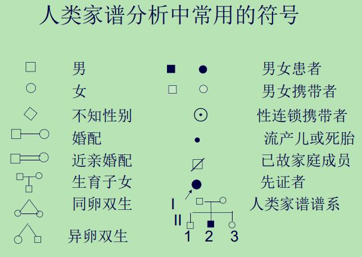
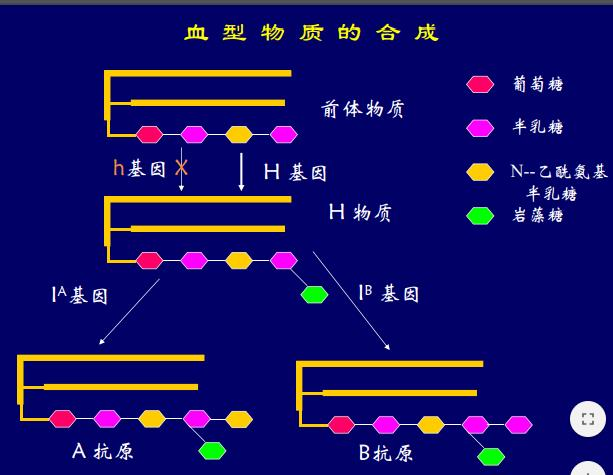
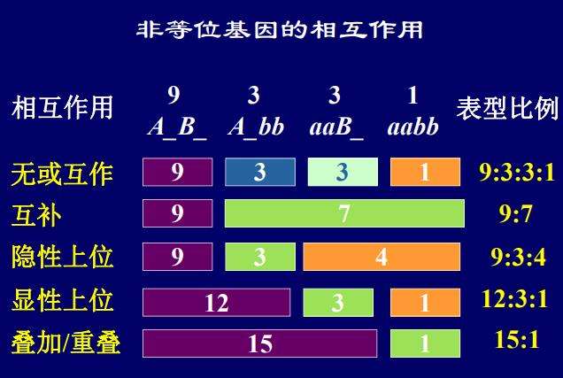
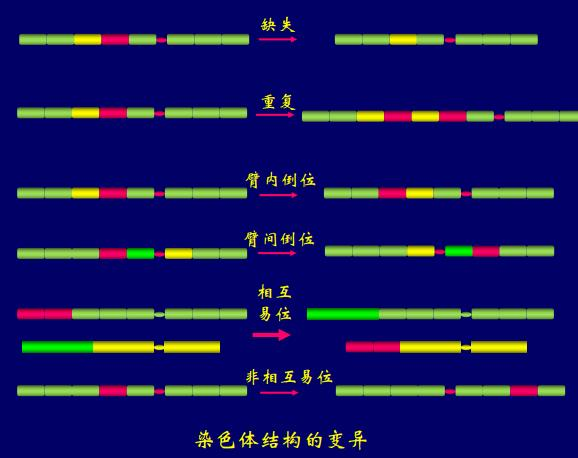

# 不朽的基因

希波克拉底: 泛生论(生殖细胞包含了所有组织的信息); 拉马克: 获得性遗传(受泛生论影响); 魏斯曼: 种质说(一部分是体质, 另一部分是种质, 影响后代性状)

### 孟德尔学说

孟发现3:1和9:3:3:1; 孟德尔的解释如下
- 性状由颗粒性遗传因子决定
- 每对性状由一对等位因子决定, 有显隐性关系
- 每对因子均等分到生殖细胞中
- 每一个生殖细胞只有一个因子
- 受精时配子随机结合

单基因的性状按孟德尔方式遗传, 有耳垂(显性), 卷舌(显性)

### 孟德尔学说的拓展

- 表型: 可观测的特征
- 显性性状: 杂合体表现的性状
- 隐性性状: 杂合体不表现的性状
- 基因座: 染色体上基因所在的位置

#### 等位基因的相互作用

- 不完全显性: 基因编码蛋白是连续变化的, 而不是有一个threhold
- 共显性: 两个性状同时表现出来(花色并不是, 白色基因不决定性状)

#### 显性突变的发生

- 单倍型不足, 比方说张尾巴需要150, 野生型一个等位基因是100, 突变直接变成0
- 异位表达: 头上长腿
- 显性负效: 一个突变了把另一个搞掉
- 增效突变: 突变之后蛋白增多, 神经麻痹了, 比如夜盲

复等位基因: ABO血型系统, A型血抗B, B型血抗A, O型全抗, $I_{A}, I_{B}$共显性



#### 非等位基因的相互作用

- 基因互作: 9 3 3 1
- 基因互补: 两个都有才能表现出性状 9 7
- 叠加效应: 15 1
- 上位效应: 显性上位(12 3 1), 隐性上位(隐性纯和才能掩盖另一个性状, 9 3 4, 人体血型就是, 如果他甚至没有H物质, 那测不出血型, O型血也不能输)





区分无和互作是看9的性状, 互作的9和任何一个都不一样

多基因效应: 如果基因的权重不同, 那就有$3^{n}$种表型, 全相同就有$2n + 1$种, 性状的表现是基因和环境共同的结果, 但是单基因的话环境的作用不大

基因的多效性: 决定性状的基因纯和致死; 镰刀贫血

限性性状(胡子), 从性性状(某一个性别更多, 秃顶, 对男性是显性的)

### 遗传的染色体学说

萨顿: 蚱蜢减数分裂染色体的行为和孟德尔的遗传因子的行为相似(成对, 分离, 二倍性, 自由分配, 自由组合); 摩尔根: 发现果蝇的伴性遗传, 交叉遗传发现野生纯合雄性和白眼纯合杂交得到的还有纯合体! 所以只能是雄性只有纯合体, 有一个东西不成对, 所以这一个基因在X染色体上. morgan学生bridges发现交叉遗传出了例外, 性状和亲代一样了, 还有蝇不育, 跑去看染色体, 果然是XXY和XO型的染色体(减数分裂的不分离, 果蝇性别决定是看X的比例)

#### 性别决定

研究蝗虫时发现有的染色体只在一半的精子里面有, 就叫未知数X. 哺乳动物, 有些植物是XY型; 蝗虫XO型, 看X的个数; ZW型和XY正好反过来, 所有鸟类, 绝大多数爬虫, 鳞翅目; 单双倍, 蜜蜂蚂蚁, 要看等位基因(二十多种)的纯合(很难, 所以只单倍体纯合, 二倍体就被拖出去了)或者杂合. 爬行类用温度决定. 海肠子, 雄性(没爬出去)终生寄生在雌性子宫里

人体的Y染色体有睾丸决定因子和SRY基因, 否则默认向女性发育.

果蝇的性别决定: XXY雌性, XO雄性, X的条数(1, 2)和常染色体套数(2)的比决定性别. X编码因子, 常染色体编码另一个因子, 互相都能形成二聚体, 只有X-X的二聚体有活性, 就表达, 就是雌性的

#### 剂量补偿效应

赖昂假说很多X连锁的性状并没有表现出性别的差别(红绿色盲, 血友病), 但女性有两个X染色体. 1949, barr研究母猫, 发现异染色质, 是一条失活的X染色体. lyon: 胚胎早期随即失活一条X, 有丝分裂的后代的X也失活, 杂合的雌性是伴性基因的嵌合体, 减数分裂之前再激活回来. 机制: 编码RNA包裹自己的染色体, 直到堵住, 谁先谁失活.

#### 基因的连锁与交换

1905香豌豆两对性状的遗传, 经卡方检验, 确实不是9331, 发现雄性果蝇完全不交换, 雌性家蚕完全不交换, 男人交换比也不大. janssens观察到同源染色体的交叉.

- 倾向于伴同遗传的基因位于同一染色体上
- 同一染色体上的基因以一定的比例分开
- 不同基因之间连锁的紧密程度不同


morgan的解释: 交叉就是基因的交换, 染色体线性排列, 任何基因都有可能交换, 重组值 = $\frac{\mbox{重组和}}{\mbox{亲组合 + 重组合}}$; 基因离得越远, 重组值越高, 但多次交换时, 重组值低于实际交换值, 两个基因座之间重组值最大50%(是一个期望)

利用重组值度量距离. 两点测交: 两两测试, 双交换比例也能随之得到; 三点测交: AaBbCc和aabbcc, 表型最少的个体就是出现双交换的个体, 那一个基因就在中间(如果看到了至少7种表型)

#### 染色体的变化和遗传变异

- 数目的变异
    - 整倍体变异
    - 非整倍体变异
- 结构的变异
    - 缺失, 重复, 倒位, 异位

**整倍体变异**: 动物少见, 胚胎发育对这种变异很敏感, 三倍体的人很早就流产了; 水果粮食蔬菜大多是多倍体的植物; 无籽西瓜(3n, 减数分裂紊乱, 很少有有功能的配子), 黄花菜香蕉都是3n; 马铃薯棉花花生油菜4n; 小麦燕麦甘薯6n; 天气骤变在减数分裂期间就加倍了, 多倍体长得大, 慢, 结实率低.

异源多倍体: 小麦和近缘物种杂交(10000年),

```text
AA(一粒麦) * BB(spelt山羊草) ==> AB ==> AABB(二粒麦) ** DD(方穗山羊草) ==> ABD ==> AABBDD(6 * 14)
```

**非整倍体变异**: 单体(少一条), 缺体(全没了), 双单体, 三体

Turner: XO, 外表是女性, 蹼颈, 没有女性性征, 容易胎死腹中

Klinefeiter: XXY, 外表是雄性, 看到barr小体(X的随机失活并不是完全失活), 发育女性性征, 长得高

XYY: 长得高, 暴力行为

Down's综合征: 21号染色体三体, 20-30岁肺部感染or癌症死掉; 13or18号三体生下来过几天就死了, 别的染色体三体生不下来



倒位异位影响不是很大, 但是缺失影响大: 猫叫综合症(5号短臂缺失), 一般致死, 不遗传
