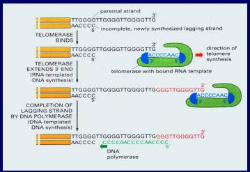

# 遗传的分子基础

### DNA是遗传物质

传统观念: 基因应该蕴含复杂的信息, 蛋白质最复杂

Griffith, 肺炎双球菌转化实验, 煮死的光滑细菌+粗糙菌能毒死老鼠; 1952年噬菌体侵染实验, 放射性同位素标记, 发现注射进去的是DNA; 1956年发现没有DNA的病毒中, RNA是遗传物质

### DNA的复制

区分旧链和新链? 氯化铯密度梯度离心; 1958 meselson证实半保留复制

解螺旋酶, 单链稳定蛋白(防止降解掉), 聚合酶, 拓扑异构酶(解开螺旋之后DNA变紧)

原核生物有三种DNA聚合酶, 主要的复制酶是DNA聚合酶III: 依赖模版, 以dNTP为底物, 有3'-5'外切酶活性, 可以矫正错配的脱氧核苷酸(合成一个就看一下, 错了就切掉), 错误率1e-9, 需要RNA引物(引物酶合成, RNA聚合酶可以从头合成核酸).

解开的时候, 一条链是3-5, 合成先导链, 5-3合成后滞链, 冈崎片段, DNA聚合酶1把RNA引物切掉, 继续和成知道把引物补上, DNA链接酶连剩下的3-5磷酸二脂键

复制起点: 原核生物只有一个复制起点, 向两端复制(50000/min, 拓扑异构酶5000rpm), 速度一般不同; 真核生物1000-2000/min, 有多个复制起点

DNA的末端, RNA引物被水解掉之后, 先延伸母链的3', 再接一个引物, 就补回去了.

### 基因决定酶的形成

Garrod发现尿黑酸症, 常染色体隐性遗传, 缺少尿黑酸氧化酶

一基因一酶学说, G.Beadle发现了不同的精氨酸营养缺陷型, 确定了谷氨酸转化到精氨酸的反应链

### mRNA的转录

被转录的链叫反义链(-)/模板链; 没有转录的链叫有义链;

RNA聚合酶从模板链的3'-5', 不需要解链酶, 大致12个碱基互补配对, 转录泡(RNA聚合酶, DNA和延伸中的RNA)大致12个碱基(1个螺旋), RNA聚合酶没有矫正功能.

转录的第一个叫+1, 之前(5')一个叫-1, 原核生物的启动子在: -35, -10(AT含量高, 氢键少, 容易解开), 真核生物在-30 -70 -110, 合成的mRNA形成发卡结构之后, RNA聚合酶就掉下来了.

真核生物的转录: 三类RNA聚合酶, I(rRNA), II(mRNA), III(tRNA, 5srRNA); 需要转录因子(识别启动子, 和RNA聚合酶形成转录起始复合物; 识别增强子, 激活RNA聚合酶)

真核生物的mRNA在转录之后, 5'端加一个帽子, 保证运输到细胞质过程中不被水解, 也是被核糖体识别的标志; 3'端加一个AA...AA尾巴. 一个类似核糖体的物质切除其中的内含子, 再拼接, 它里面的RNA识别两者的界限. 撕膜虫: RNA自剪接, 证明RNA自己有催化能力.

内含子占比很大, 第一个内含子通常很大, 有基因的调控序列, 不同的外显子按不同顺序连接起来, 编码不同的蛋白质. 果蝇的X染色体转录的二聚体翻译出的蛋白质结合在RNA上边, 挡住拼接的配体, 受体和它后面的配体结合, 少了一个外显子

### 遗传密码

Gamov: 三个核苷酸决定一个氨基酸

Nirenberg的方法1: 按碱基比例合成RNA, 观察合成的氨基酸的比例

三联体结合实验: 合成各种三联体, 和对应的核糖体结合, 加滤膜, 看哪一个氨基酸留在滤膜上

Khorara: 人工合成多核苷酸重复序列, 体外转录翻译

密码子: AUG, 起始密码, 甲硫氨酸; UAA, UAG, UGA: 终止密码.

移码突变: 少了不是3的倍数的核苷酸. 开放阅读框: 从AUG到第一个终止子, 如果阅读框很长, 很有可能是一个编码蛋白质的基因.

### 蛋白质的翻译

tRNA中间一个环有反密码子; 核糖体不翻译的话, 大小亚基是分离的, 结合之后有三个位点, E: 释放位点, P: 连接肽链, A: 下一个氨基酸. tRNA结合氨基酸需要氨酰tRNA合成酶, 特异性极强. tRNA有40+种, 有碱基I和ACU配对, 简并性.

小亚基识别mRNA, 从5'端结合, 寻找AUG, 起始tRNA结合过来(原核生物的起始tRNA携带甲酰甲硫氨酸), 大亚基也过来, 肽链的合成方向是N-C, 转肽作用, 直到释放因子结合到A位点, 就分开了. 真核生物的话, 小亚基识别帽子. 原核生物转录和翻译偶联, 缩短蛋白质表达时间.

### 基因表达的调控

操纵子: 由启动子, 操纵基因和结构基因组成

乳糖操纵子: 正常情况下, 表达一个阻遏蛋白, 和操纵子结合, 阻止结构基因的表达; 有乳糖的情况下, 乳糖和阻遏蛋白结合, 结构基因就能表达; 如果缺少葡萄糖的话, ATP-> cAMP和CAP蛋白结合, 增强转录

色氨酸操纵子: 色氨酸多的情况下, 和阻遏蛋白结合, 正好阻止转录

#### 真核生物的调控

**DNA水平的调控**

- 基因丢失: 线虫, 昆虫发育过程中体细胞丢失整条或部分染色体
- 基因扩增: 某些基因的数目大量增加
- 基因重排: DNA核苷酸序列的重新排列(抗体的合成: 外显子重排, 每一个B细胞在VDJ中只取一种, 所以免疫细胞的基因组各不相同, 图中是重链, 轻链也类似, 共可形成1.8e9种抗体)

免疫应答: 辅助T细胞将MHC抗原复合物呈递给B细胞, 如果B细胞识别了抗原, 就大量复制, 其余和高中一样.

**转录水平的调控**

真核生物的基因表达需要特殊的转录因子, 转录抑制因子一般不简称成转录因子. 而原核生物只要RNA聚合酶结合上就有一定水平的表达. 转录因子结合上之后不会随着转录复合体跑, 留在原地.

转录因子至少有两个结构域, 一个结合DNA, 另一个结合RNA
- 结合DNA: 有一种可以从大沟直接读碱基序列; 另一种靠锌离子结合在一起; 也可以亮氨酸拉链.  顺式作用元件: 只对一条DNA分子有用(增强子, 启动子...). 反式作用因子: 作用在另一个DNA分子上, 比如说不同的染色体, 因子一般指蛋白质, 反式作用因子结合在顺式作用元件上

表观遗传修饰: 不同细胞形态不同因为表达了不同的基因; 是因为有不同的转录因子; 是因为对DNA或者组蛋白进行了修饰, 让它表达或者不表达; DNA甲基化(C被甲基化, 5-甲基胞嘧啶, 很可能转录因子识别不上了, 表达强度下降) / 组蛋白乙酰化(DNA和组蛋白结合靠电性吸引, 修饰之后可能就缠的不紧密了, 就表达得多).

**转录之后的调控**

对mRNA的调控: 可变剪接, 一个基因表达多种蛋白质. 人感知声音: 耳蜗里面的膜拖着毛细胞蹭, 离子通道蛋白就感知机械振动, 就打开了, 产生动作电位, 听到了. 不同频率的声音由不同区域的细胞感知, 为什么? 因为剪切方式不同, 离子通道结构不同, 一个基因编码500+中蛋白质.  果蝇的神经识别靶组织的受体, 只用一个基因, 每一组外显子在RNA水平上只取1个.

RNA干扰(RNAi): 双链RNA可以抑制基因表达(双链RNA被切开成20bp的片段, 随机水解一条链, 互补结合, 扔一条单链就不行: 酶的专一性);  microRNA, 一段错开的双链RNA, 可以降解mRNA, 降解肽链, 调控表达.

**翻译水平的调控**

mRNA的翻译效率: 铁蛋白启动子前面有一个发卡结构, 铁少就和一个蛋白结合上, 翻译不了, 铁就排不出去, 铁多了前面的蛋白就和铁结合了, 就能翻译了, 合成铁蛋白(袋子形), 把铁派出去.

mRNA的稳定性转铁蛋白受体的mRNA的蛋白结合位点在终止密码的下游, 铁少就结合上, mRNA就不会降解掉(3'端开始降解), 铁多了就降解掉(转铁蛋白会把铁转进来).

**翻译后的调控**

蛋白酶体: 降解细胞不需要/损伤的蛋白质

泛素结合蛋白质, 蛋白质就被蛋白酶体(垃圾桶型)识别, 扣盖, 降解掉了.
