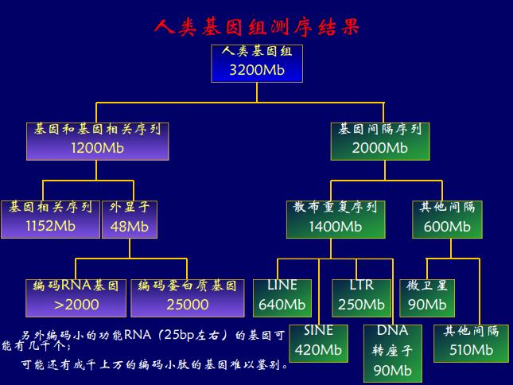

# 基因工程及应用

将外源基因组合到载体DNA, 再转到受体细胞中, 得到编码的蛋白质或者具有目的基因的生物

#### 获得目的基因

主要需要编码蛋白的序列, 所以只需要成熟的mRNA, 反转录成cDNA, 当然我们需要先验的知道DNA在哪里表达; 真核生物的mRNA有polyA尾巴, 用polyT就能分离了, 逆转录就得到了.

用不相容质粒搞到细菌里面就能找到只含一种质粒的细菌, 进行分子杂交, 就能找到要找的菌落.

PCR: 变性(94度), 退火(突然降温, 50-68度, 引物结合), 延伸(taq酶催化, 要不然普通的酶失活了)

#### 重组DNA分子

限制性内切酶: 识别双链, 回文结构(它是二聚体), 内切, 4-8+个碱基, 通常4-6, 形成粘性末端

载体: 自主复制, 通常用质粒, 必须有自主复制序列, 有多克隆位点(人造内切酶位点), 筛选标记

感受态: 能吸收外源DNA分子, 用筛选标记筛出转上的细菌

#### 基因工程的应用

转基因植物: 农杆菌的Ti质粒, 转到单子叶植物中

基因治疗: 尤其是和血液相关的病, 转到造血干细胞里面, 打进骨髓; 目的基因放到腺联病毒(单链DNA)里面, 转到干细胞.

科研应用: 基因敲除(放一段DNA序列进去, 和野生型双交换, 培养胚胎干细胞; 找一个重要的外显子破坏掉, 比方说放一个neo(抗抗生素), 外侧放一个TK, 这样随机交换的用TK筛, 只有双交换的只插了neo, 放到胚胎里面)

#### 人类基因组计划

70s末 发明了测序的方法, 末端终止法, 基于DNA的合成, 合成引物(载体序列知道就行了), 加正常的ATCG, 和一种双脱氧核苷酸, 放上去就不能形成35磷酸二酯键了, 比对碱基个数, 就知道哪几位是什么了, 测DNA长度很简单, 电泳一下就好了, 误差怎么办? 最多能测400, 一般200, 但是带上不同的荧光, 就好分了, 胶越薄越好, 电脑看就好了

#### 重构基因组

逐级鸟枪法, 逐次打碎, 随机打碎, 之后还要拼回去, STS, 重叠了就能拼回去, 得到基因组的物理图, 但是很多地方都有怎么办(eg. 转座子), 利用连锁图复原物理图

#### 草图和精细图

测了5倍就算草图了, $P = e^{-m}$, 没测到的概率

#### 测序结果

一共32亿碱基对, 间隔序列20亿, 不知道有什么用.

各染色体上基因数目不同, 没有规律, 常染色体按照长度排序, 基因少的染色体三体也能生下来

人和黑猩猩差1.23%, 人体之间差0.1%

单核苷酸多态性: at - cg 的差异, 大部分的差异在这里, 表型不同也是因为这个. 比方说镰型红细胞贫血; 导致限制酶片段多态性, 切出来的片段长短不同; 个性化给药

微卫星: 重复次数不同, 重复单元<5个碱基, 重复~100次. 用重复序列两端的序列做引物, 跑PCR就检测到了.

小卫星: 重复单元10-20bp, 重复次数非常多~1000. 先用酶切, 扩增, 做分子探针, 杂交, 一般亲子检测用, 两个小卫星相同概率37%
