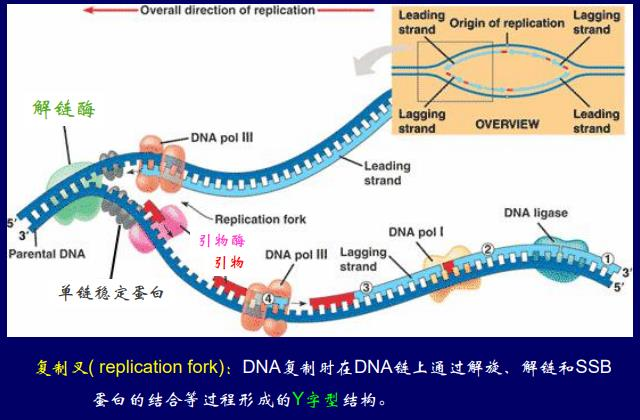
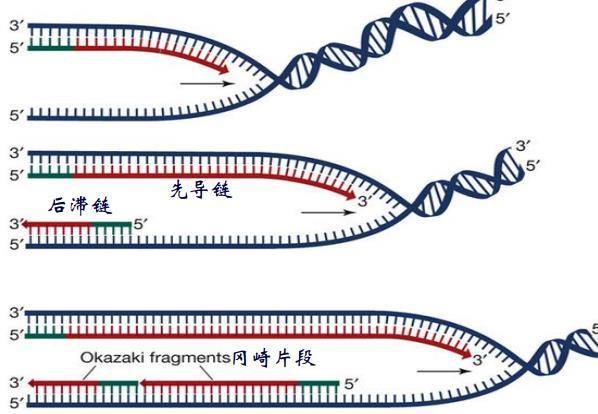
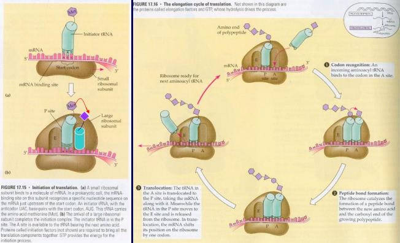
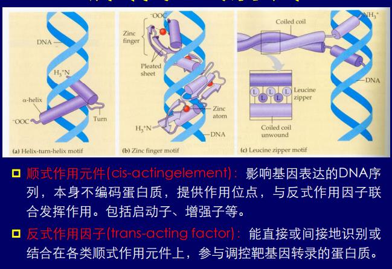
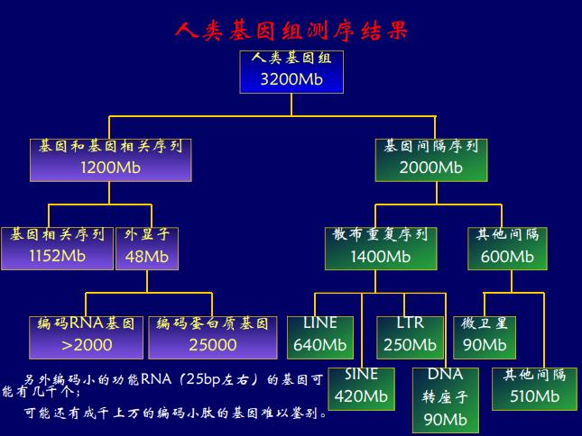

# 不朽的基因

希波克拉底: 泛生论(生殖细胞包含了所有组织的信息); 拉马克: 获得性遗传(受泛生论影响); 魏斯曼: 种质说(一部分是体质, 另一部分是种质, 影响后代性状)

### 孟德尔学说

孟发现3:1和9:3:3:1; 孟德尔的解释如下
- 性状由颗粒性遗传因子决定
- 每对性状由一对等位因子决定, 有显隐性关系
- 每对因子均等分到生殖细胞中
- 每一个生殖细胞只有一个因子
- 受精时配子随机结合

单基因的性状按孟德尔方式遗传, 有耳垂(显性), 卷舌(显性)

### 孟德尔学说的拓展

- 表型: 可观测的特征
- 显性性状: 杂合体表现的性状
- 隐性性状: 杂合体不表现的性状
- 基因座: 染色体上基因所在的位置

#### 等位基因的相互作用

- 不完全显性: 基因编码蛋白是连续变化的, 而不是有一个threhold
- 共显性: 两个性状同时表现出来(花色并不是, 白色基因不决定性状)

#### 显性突变的发生

- 单倍型不足, 比方说张尾巴需要150, 野生型一个等位基因是100, 突变直接变成0
- 异位表达: 头上长腿
- 显性负效: 一个突变了把另一个搞掉
- 增效突变: 突变之后蛋白增多, 神经麻痹了, 比如夜盲

复等位基因: ABO血型系统, A型血抗B, B型血抗A, O型全抗, $I_{A}, I_{B}$共显性


#### 非等位基因的相互作用

- 基因互作: 9 3 3 1
- 基因互补: 两个都有才能表现出性状 9 7
- 叠加效应: 15 1
- 上位效应: 显性上位(12 3 1), 隐性上位(隐性纯和才能掩盖另一个性状, 9 3 4, 人体血型就是, 如果他甚至没有H物质, 那测不出血型, O型血也不能输)


区分无和互作是看9的性状, 互作的9和任何一个都不一样

多基因效应: 如果基因的权重不同, 那就有$3^{n}$种表型, 全相同就有$2n + 1$种, 性状的表现是基因和环境共同的结果, 但是单基因的话环境的作用不大

基因的多效性: 决定性状的基因纯和致死; 镰刀贫血

限性性状(胡子), 从性性状(某一个性别更多, 秃顶, 对男性是显性的)

### 遗传的染色体学说

萨顿: 蚱蜢减数分裂染色体的行为和孟德尔的遗传因子的行为相似(成对, 分离, 二倍性, 自由分配, 自由组合); 摩尔根: 发现果蝇的伴性遗传, 交叉遗传发现野生纯合雄性和白眼纯合杂交得到的还有纯合体! 所以只能是雄性只有纯合体, 有一个东西不成对, 所以这一个基因在X染色体上. morgan学生bridges发现交叉遗传出了例外, 性状和亲代一样了, 还有蝇不育, 跑去看染色体, 果然是XXY和XO型的染色体(减数分裂的不分离, 果蝇性别决定是看X的比例)

#### 性别决定

研究蝗虫时发现有的染色体只在一半的精子里面有, 就叫未知数X. 哺乳动物, 有些植物是XY型; 蝗虫XO型, 看X的个数; ZW型和XY正好反过来, 所有鸟类, 绝大多数爬虫, 鳞翅目; 单双倍, 蜜蜂蚂蚁, 要看等位基因(二十多种)的纯合(很难, 所以只单倍体纯合, 二倍体就被拖出去了)或者杂合. 爬行类用温度决定. 海肠子, 雄性(没爬出去)终生寄生在雌性子宫里

人体的Y染色体有睾丸决定因子和SRY基因, 否则默认向女性发育.

果蝇的性别决定: XXY雌性, XO雄性, X的条数(1, 2)和常染色体套数(2)的比决定性别. X编码因子, 常染色体编码另一个因子, 互相都能形成二聚体, 只有X-X的二聚体有活性, 就表达, 就是雌性的

#### 剂量补偿效应

赖昂假说很多X连锁的性状并没有表现出性别的差别(红绿色盲, 血友病), 但女性有两个X染色体. 1949, barr研究母猫, 发现异染色质, 是一条失活的X染色体. lyon: 胚胎早期随即失活一条X, 有丝分裂的后代的X也失活, 杂合的雌性是伴性基因的嵌合体, 减数分裂之前再激活回来. 机制: 编码RNA包裹自己的染色体, 直到堵住, 谁先谁失活.

#### 基因的连锁与交换

1905香豌豆两对性状的遗传, 经卡方检验, 确实不是9331, 发现雄性果蝇完全不交换, 雌性家蚕完全不交换, 男人交换比也不大. janssens观察到同源染色体的交叉.

- 倾向于伴同遗传的基因位于同一染色体上
- 同一染色体上的基因以一定的比例分开
- 不同基因之间连锁的紧密程度不同


morgan的解释: 交叉就是基因的交换, 染色体线性排列, 任何基因都有可能交换, 重组值 = $\frac{\mbox{重组和}}{\mbox{亲组合 + 重组合}}$; 基因离得越远, 重组值越高, 但多次交换时, 重组值低于实际交换值, 两个基因座之间重组值最大50%(是一个期望)

利用重组值度量距离. 两点测交: 两两测试, 双交换比例也能随之得到; 三点测交: AaBbCc和aabbcc, 表型最少的个体就是出现双交换的个体, 那一个基因就在中间(如果看到了至少7种表型)

#### 染色体的变化和遗传变异

- 数目的变异
    - 整倍体变异
    - 非整倍体变异
- 结构的变异
    - 缺失, 重复, 倒位, 异位

**整倍体变异**: 动物少见, 胚胎发育对这种变异很敏感, 三倍体的人很早就流产了; 水果粮食蔬菜大多是多倍体的植物; 无籽西瓜(3n, 减数分裂紊乱, 很少有有功能的配子), 黄花菜香蕉都是3n; 马铃薯棉花花生油菜4n; 小麦燕麦甘薯6n; 天气骤变在减数分裂期间就加倍了, 多倍体长得大, 慢, 结实率低.

异源多倍体: 小麦和近缘物种杂交(10000年),

```text
AA(一粒麦) * BB(spelt山羊草) ==> AB ==> AABB(二粒麦) ** DD(方穗山羊草) ==> ABD ==> AABBDD(6 * 14)
```

**非整倍体变异**: 单体(少一条), 缺体(全没了), 双单体, 三体

Turner: XO, 外表是女性, 蹼颈, 没有女性性征, 容易胎死腹中

Klinefeiter: XXY, 外表是雄性, 看到barr小体(X的随机失活并不是完全失活), 发育女性性征, 长得高

XYY: 长得高, 暴力行为

Down's综合征: 21号染色体三体, 20-30岁肺部感染or癌症死掉; 13or18号三体生下来过几天就死了, 别的染色体三体生不下来


倒位异位影响不是很大, 但是缺失影响大: 猫叫综合症(5号短臂缺失), 一般致死, 不遗传

# 遗传的分子基础

### DNA是遗传物质

传统观念: 基因应该蕴含复杂的信息, 蛋白质最复杂

Griffith, 肺炎双球菌转化实验, 煮死的光滑细菌+粗糙菌能毒死老鼠; 1952年噬菌体侵染实验, 放射性同位素标记, 发现注射进去的是DNA; 1956年发现没有DNA的病毒中, RNA是遗传物质

### DNA的复制

区分旧链和新链? 氯化铯密度梯度离心; 1958 meselson证实半保留复制

解螺旋酶, 单链稳定蛋白(防止降解掉), 聚合酶, 拓扑异构酶(解开螺旋之后DNA变紧)



原核生物有三种DNA聚合酶, 主要的复制酶是DNA聚合酶III: 依赖模版, 以dNTP为底物, 有3'-5'外切酶活性, 可以矫正错配的脱氧核苷酸(合成一个就看一下, 错了就切掉), 错误率1e-9, 需要RNA引物(引物酶合成, RNA聚合酶可以从头合成核酸).

解开的时候, 一条链是3-5, 合成先导链, 5-3合成后滞链, 冈崎片段, DNA聚合酶1把RNA引物切掉, 继续和成知道把引物补上, DNA链接酶连剩下的3-5磷酸二脂键



复制起点: 原核生物只有一个复制起点, 向两端复制(50000/min, 拓扑异构酶5000rpm), 速度一般不同; 真核生物1000-2000/min, 有多个复制起点


DNA的末端, RNA引物被水解掉之后, 先延伸母链的3', 再接一个引物, 就补回去了.

### 基因决定酶的形成

Garrod发现尿黑酸症, 常染色体隐性遗传, 缺少尿黑酸氧化酶


一基因一酶学说, G.Beadle发现了不同的精氨酸营养缺陷型, 确定了谷氨酸转化到精氨酸的反应链

### mRNA的转录

被转录的链叫反义链(-)/模板链; 没有转录的链叫有义链;

RNA聚合酶从模板链的3'-5', 不需要解链酶, 大致12个碱基互补配对, 转录泡(RNA聚合酶, DNA和延伸中的RNA)大致12个碱基(1个螺旋), RNA聚合酶没有矫正功能.

转录的第一个叫+1, 之前(5')一个叫-1, 原核生物的启动子在: -35, -10(AT含量高, 氢键少, 容易解开), 真核生物在-30 -70 -110, 合成的mRNA形成发卡结构之后, RNA聚合酶就掉下来了.

真核生物的转录: 三类RNA聚合酶, I(rRNA), II(mRNA), III(tRNA, 5srRNA); 需要转录因子(识别启动子, 和RNA聚合酶形成转录起始复合物; 识别增强子, 激活RNA聚合酶)

真核生物的mRNA在转录之后, 5'端加一个帽子, 保证运输到细胞质过程中不被水解, 也是被核糖体识别的标志; 3'端加一个AA...AA尾巴. 一个类似核糖体的物质切除其中的内含子, 再拼接, 它里面的RNA识别两者的界限. 撕膜虫: RNA自剪接, 证明RNA自己有催化能力.

内含子占比很大, 第一个内含子通常很大, 有基因的调控序列, 不同的外显子按不同顺序连接起来, 编码不同的蛋白质. 果蝇的X染色体转录的二聚体翻译出的蛋白质结合在RNA上边, 挡住拼接的配体, 受体和它后面的配体结合, 少了一个外显子

### 遗传密码

Gamov: 三个核苷酸决定一个氨基酸

Nirenberg的方法1: 按碱基比例合成RNA, 观察合成的氨基酸的比例

三联体结合实验: 合成各种三联体, 和对应的核糖体结合, 加滤膜, 看哪一个氨基酸留在滤膜上

Khorara: 人工合成多核苷酸重复序列, 体外转录翻译

密码子: AUG, 起始密码, 甲硫氨酸; UAA, UAG, UGA: 终止密码.

移码突变: 少了不是3的倍数的核苷酸. 开放阅读框: 从AUG到第一个终止子, 如果阅读框很长, 很有可能是一个编码蛋白质的基因.

### 蛋白质的翻译

tRNA中间一个环有反密码子; 核糖体不翻译的话, 大小亚基是分离的, 结合之后有三个位点, E: 释放位点, P: 连接肽链, A: 下一个氨基酸. tRNA结合氨基酸需要氨酰tRNA合成酶, 特异性极强. tRNA有40+种, 有碱基I和ACU配对, 简并性.



小亚基识别mRNA, 从5'端结合, 寻找AUG, 起始tRNA结合过来(原核生物的起始tRNA携带甲酰甲硫氨酸), 大亚基也过来, 肽链的合成方向是N-C, 转肽作用, 直到释放因子结合到A位点, 就分开了. 真核生物的话, 小亚基识别帽子. 原核生物转录和翻译偶联, 缩短蛋白质表达时间.

### 基因表达的调控

操纵子: 由启动子, 操纵基因和结构基因组成

乳糖操纵子: 正常情况下, 表达一个阻遏蛋白, 和操纵子结合, 阻止结构基因的表达; 有乳糖的情况下, 乳糖和阻遏蛋白结合, 结构基因就能表达; 如果缺少葡萄糖的话, ATP-> cAMP和CAP蛋白结合, 增强转录

色氨酸操纵子: 色氨酸多的情况下, 和阻遏蛋白结合, 正好阻止转录

#### 真核生物的调控

**DNA水平的调控**

- 基因丢失: 线虫, 昆虫发育过程中体细胞丢失整条或部分染色体
- 基因扩增: 某些基因的数目大量增加
- 基因重排: DNA核苷酸序列的重新排列(抗体的合成: 外显子重排, 每一个B细胞在VDJ中只取一种, 所以免疫细胞的基因组各不相同, 图中是重链, 轻链也类似, 共可形成1.8e9种抗体)


免疫应答: 辅助T细胞将MHC抗原复合物呈递给B细胞, 如果B细胞识别了抗原, 就大量复制, 其余和高中一样.

**转录水平的调控**

真核生物的基因表达需要特殊的转录因子, 转录抑制因子一般不简称成转录因子. 而原核生物只要RNA聚合酶结合上就有一定水平的表达. 转录因子结合上之后不会随着转录复合体跑, 留在原地.

转录因子至少有两个结构域, 一个结合DNA, 另一个结合RNA
- 结合DNA: 有一种可以从大沟直接读碱基序列; 另一种靠锌离子结合在一起; 也可以亮氨酸拉链.  顺式作用元件: 只对一条DNA分子有用(增强子, 启动子...). 反式作用因子: 作用在另一个DNA分子上, 比如说不同的染色体, 因子一般指蛋白质, 反式作用因子结合在顺式作用元件上



表观遗传修饰: 不同细胞形态不同因为表达了不同的基因; 是因为有不同的转录因子; 是因为对DNA或者组蛋白进行了修饰, 让它表达或者不表达; DNA甲基化(C被甲基化, 5-甲基胞嘧啶, 很可能转录因子识别不上了, 表达强度下降) / 组蛋白乙酰化(DNA和组蛋白结合靠电性吸引, 修饰之后可能就缠的不紧密了, 就表达得多).

**转录之后的调控**

对mRNA的调控: 可变剪接, 一个基因表达多种蛋白质. 人感知声音: 耳蜗里面的膜拖着毛细胞蹭, 离子通道蛋白就感知机械振动, 就打开了, 产生动作电位, 听到了. 不同频率的声音由不同区域的细胞感知, 为什么? 因为剪切方式不同, 离子通道结构不同, 一个基因编码500+中蛋白质.  果蝇的神经识别靶组织的受体, 只用一个基因, 每一组外显子在RNA水平上只取1个.

RNA干扰(RNAi): 双链RNA可以抑制基因表达(双链RNA被切开成20bp的片段, 随机水解一条链, 互补结合, 扔一条单链就不行: 酶的专一性);  microRNA, 一段错开的双链RNA, 可以降解mRNA, 降解肽链, 调控表达.

**翻译水平的调控**

mRNA的翻译效率: 铁蛋白启动子前面有一个发卡结构, 铁少就和一个蛋白结合上, 翻译不了, 铁就排不出去, 铁多了前面的蛋白就和铁结合了, 就能翻译了, 合成铁蛋白(袋子形), 把铁派出去.

mRNA的稳定性转铁蛋白受体的mRNA的蛋白结合位点在终止密码的下游, 铁少就结合上, mRNA就不会降解掉(3'端开始降解), 铁多了就降解掉(转铁蛋白会把铁转进来).

**翻译后的调控**

蛋白酶体: 降解细胞不需要/损伤的蛋白质

泛素结合蛋白质, 蛋白质就被蛋白酶体(垃圾桶型)识别, 扣盖, 降解掉了.

# 突变与遗传病

#### 点突变

一个碱基对的变化, transition: 嘌呤换嘌呤, 嘧啶换嘧啶, transversion: 相反. C脱一个氨基就变成U, 和A配对, A脱一个氨基就和C配对. 碱基异构, 从酮变成烯醇, 配对也会出错. DNA复制本身也会出错. 外界因素影响: 5-溴尿嘧啶是T类似物, 它的烯醇式和G配对. 烷基化之后形不成氢键, 配对又出错了. 氧化之后脱氨几率提高, 比方说亚硝酸吃的非常多就致癌了

点突变的三个后果
- 错义突变: 替代一个氨基酸
- 无义突变, 变成终止密码
- 哑突变, 没有影响
如果改变了启动子, 内含子两端的识别序列, 也完蛋了

吖啶, 和碱基挺像的, 蛊惑DNA聚合酶随便填一个碱基进去, 或者占位, 让DNA聚合酶少一个碱基, 产生移码突变. 如果插入3的倍数, 读码框没有变化, 影响很少, 会有动态突变, 三核苷酸重复, 病人有40+个CAG, 产生多聚谷氨酰胺, 和GADPH结合, 减慢糖酵解, 神经细胞对其很敏感. 这种突变可以一代之内突变几十几百的序列. 可能的机制: DNA聚合酶下去休息一会, 回来之后可能刚好错开一段, 还是鼓包了, 但还是配对的, 就增长了.

#### 转座

基因从基因组的一个位置直接转移到另一个位置, 转座子的两种类型
- 编码蛋白质的DNA序列: 编码的蛋白质直接操作DNA
- 反转录: 先转录成RNA, 再反转录成DNA拷贝

DNA转座子两端有倒转重复序列, 转座过程和限制性内切酶类似, 识别一个靶序列, 其余的东西看精要吧, ppt十分混乱.

转座的遗传学效应: 插入失活, 不等交换, 缺失突变, 出现新形状.

### 遗传病

染色体病, 单基因病, 多基因遗传病.

遗传病不一定遗传: 猫叫综合症不遗传, 并且父母都正常, 患者小时候就死掉了.

什么叫致死? 留不下可育后代就叫致死

- 常隐: PKU, 镰刀贫血, 白化病
- 常显: 家族性高胆固醇血症, 亨廷顿氏病, 视网膜母细胞瘤
- X隐: 血友病, 红绿色盲; X显: 抗VD佝偻病

#### 常显

huntington舞蹈病: CAG拷贝增加, 发现的第一个显性遗传病

家族性高胆固醇血症: 低密度脂蛋白抱着胆固醇, 和细胞表面受体结合, 胞吞进去, 和溶酶体结合, 胆固醇释放出来. 受体基因突变失活, 减少, LDL增加沉积, 粥样硬化, 冠心病, 30-40岁犯病, 纯和死的更快.

#### 常隐

PKU: 苯丙氨酸羟化酶缺乏, 变成苯丙酮酸, 影响中枢神经发育, 智力低下.

镰刀贫血症: beta链6位谷氨酸变成缬氨酸.

囊性纤维病: 氯离子通道突变, 活性降低, 氯离子进不去, 粘膜大量胞吐, 聚集大量粘液, 容易感染, 2岁之内死掉.

#### X显

抗VD佝偻病: 女性发病率高, 但是症状轻, O/X形腿. 小肠对磷的吸收差(骨骼坚硬是因为有磷酸钙)

#### X隐

血友病: 血凝过程受阻(凝血: 纤维蛋白原两边的肽链(血纤维肽)被剪掉, 称为纤维蛋白, 形成网状结构, 凝血有一群级联反应)

### 多基因遗传病

受几对基因控制, 受环境影响较大; 糖尿病, 高血压, 精神分裂症, 支气管哮喘, 环境的影响在30%到70%

癌症在体细胞突变也会影响
- 肿瘤细胞: 动物体内分裂失控的细胞
- 良性肿瘤: 不会转移扩散, 不压迫血管神经就好
- 恶性肿瘤: 具有转移能力的肿瘤
- 癌: 上皮组织的恶性肿瘤, 现通称各种恶性肿瘤, 白血病, 淋巴瘤也是癌

### 癌的遗传学基础

#### 原癌基因

rous发现鸟的逆转录病毒, 致癌的比不致癌的差一个基因, 叫癌基因, 改叫细胞癌基因/原癌基因. 和分裂增殖, DNA修复, 转录因子有关的基因都可以称为癌基因

原癌基因->癌基因: 活性大大增强/拷贝数增加/突变增强了

费城染色体慢性髓性白血病: 9和22染色体异位, 两个基因融合在一起, 变成融合蛋白, 活性比原癌基因强.

burkitt淋巴瘤: 淋巴瘤和脑瘤是恶性的, 此外的瘤大多良性; 8和14异位, 8号的c-myc(诱导干细胞, 但是它失调就成癌症了, 后来不用了), 14号上有C_H, 抗体重链的恒定区(不重排的区域)

#### 抑癌基因

发现癌细胞和正常细胞融合就不致癌了, 叫抑癌基因, 通常作用在检验点上(G1-S最重要). 视网膜母细胞瘤中Rb基因缺失, 分裂失控就癌化了. p53也有这种功能.

细胞周期靠cyc和CDK调控, CDK磷酸化Rb, Rb和ETF(?存疑)结合, 促进复制. 只要DNA有损伤, p53表达增加, 转化后和CDK结合, 就不能把Rb和ETF打开了, 停止复制, 如果修复不好, p53积累, 诱导凋亡.

癌的发生涉及多基因突变: 直肠癌(正常 -- APC --> 早期腺瘤 -- Kras --> 中期腺瘤 -- DCC --> 晚期腺瘤, 割了就行 -- p53 --> 癌). 癌症需要突破基底膜才能转移, 但进入血管也会死一群, 实体癌需要很多基因的突变, 但是白血病需要的基因很少.

吸烟-肺癌, 肉食-直肠癌

#### 病毒和癌

肝癌: 病毒是首要因素, 乙肝-肝硬化-肝癌

宫颈癌首要因素是乳头状病毒, 接种疫苗可以根治

幽门螺旋菌-胃溃疡-胃癌

原癌基因的突变看成显性突变, 抑癌基因突变看成隐形突变

但是家族性肿瘤一般显现为常显, 因为个体水平上一个突变了, 另一个很容易也成为突变的基因(杂合性缺失), 就表现成显性遗传了

# 基因工程及应用

将外源基因组合到载体DNA, 再转到受体细胞中, 得到编码的蛋白质或者具有目的基因的生物

#### 获得目的基因

主要需要编码蛋白的序列, 所以只需要成熟的mRNA, 反转录成cDNA, 当然我们需要先验的知道DNA在哪里表达; 真核生物的mRNA有polyA尾巴, 用polyT就能分离了, 逆转录就得到了.

用不相容质粒搞到细菌里面就能找到只含一种质粒的细菌, 进行分子杂交, 就能找到要找的菌落.

PCR: 变性(94度), 退火(突然降温, 50-68度, 引物结合), 延伸(taq酶催化, 要不然普通的酶失活了)

#### 重组DNA分子

限制性内切酶: 识别双链, 回文结构(它是二聚体), 内切, 4-8+个碱基, 通常4-6, 形成粘性末端

载体: 自主复制, 通常用质粒, 必须有自主复制序列, 有多克隆位点(人造内切酶位点), 筛选标记

感受态: 能吸收外源DNA分子, 用筛选标记筛出转上的细菌

#### 基因工程的应用

转基因植物: 农杆菌的Ti质粒, 转到单子叶植物中

基因治疗: 尤其是和血液相关的病, 转到造血干细胞里面, 打进骨髓; 目的基因放到腺联病毒(单链DNA)里面, 转到干细胞.

科研应用: 基因敲除(放一段DNA序列进去, 和野生型双交换, 培养胚胎干细胞; 找一个重要的外显子破坏掉, 比方说放一个neo(抗抗生素), 外侧放一个TK, 这样随机交换的用TK筛, 只有双交换的只插了neo, 放到胚胎里面)

#### 人类基因组计划

70s末 发明了测序的方法, 末端终止法, 基于DNA的合成, 合成引物(载体序列知道就行了), 加正常的ATCG, 和一种双脱氧核苷酸, 放上去就不能形成35磷酸二酯键了, 比对碱基个数, 就知道哪几位是什么了, 测DNA长度很简单, 电泳一下就好了, 误差怎么办? 最多能测400, 一般200, 但是带上不同的荧光, 就好分了, 胶越薄越好, 电脑看就好了

#### 重构基因组

逐级鸟枪法, 逐次打碎, 随机打碎, 之后还要拼回去, STS, 重叠了就能拼回去, 得到基因组的物理图, 但是很多地方都有怎么办(eg. 转座子), 利用连锁图复原物理图

#### 草图和精细图

测了5倍就算草图了, $P = e^{-m}$, 没测到的概率

#### 测序结果

一共32亿碱基对, 间隔序列20亿, 不知道有什么用.



各染色体上基因数目不同, 没有规律, 常染色体按照长度排序, 基因少的染色体三体也能生下来

人和黑猩猩差1.23%, 人体之间差0.1%

单核苷酸多态性: at - cg 的差异, 大部分的差异在这里, 表型不同也是因为这个. 比方说镰型红细胞贫血; 导致限制酶片段多态性, 切出来的片段长短不同; 个性化给药

微卫星: 重复次数不同, 重复单元<5个碱基, 重复~100次. 用重复序列两端的序列做引物, 跑PCR就检测到了.

小卫星: 重复单元10-20bp, 重复次数非常多~1000. 先用酶切, 扩增, 做分子探针, 杂交, 一般亲子检测用, 两个小卫星相同概率37%
