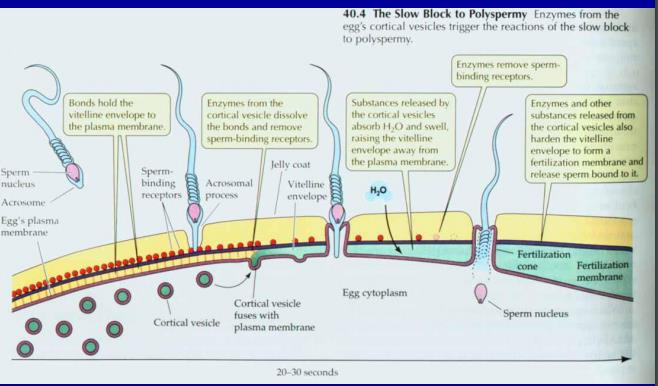
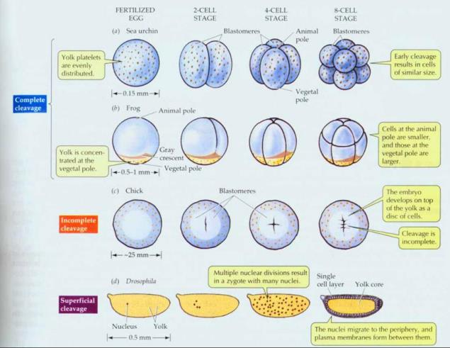
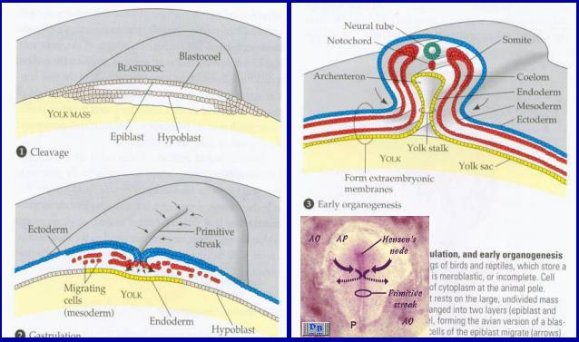
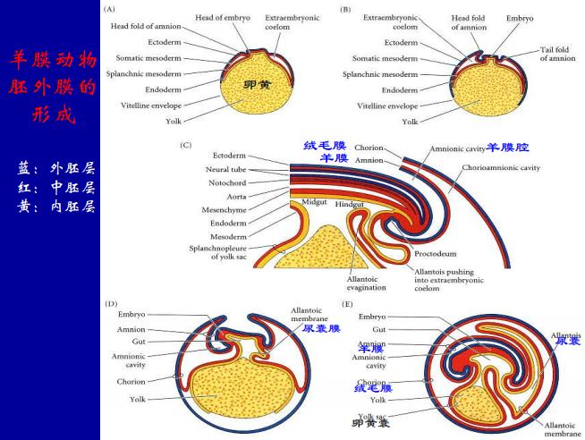
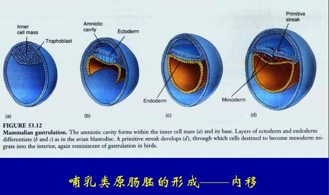
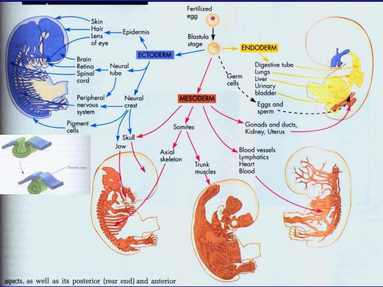

# 动物的发育

### 减数分裂

精子的形成: 生精上皮接近底面的地方有精原细胞, 膨胀, 变成初级精母细胞, 次级精母细胞, 精子细胞, 变成精子(头部是浓缩的染色体, 用精蛋白缠绕, 比组蛋白还浓缩, 顶团一个顶体, 由高尔基体变态而来)

卵子的形成: 一个初级卵母细胞只形成一个卵子. 卵原细胞胚胎期还有, 生出来就没了; 所有细胞卡在减I前期, 每一个月成熟一个, 包一层滋养细胞(很多层放射状排列的是放射冠, 颗粒细胞), 排出来的是次级卵母细胞. 减II在受精之后进行, 受精之后排出第二极体, 变成雌原核, 随后雌雄原核融合.

### 受精过程

顶体反应: 顶体膜破裂, 释放水解酶, 水解掉胶膜(不是透明带), 顶体长出顶体丝, 胞吞作用把精子的核吞进去.

皮层反应: 精细胞核进去之后, 膜电位变化, 电位上排斥其他的精子. 皮层颗粒里面的糖苷酶, 蛋白酶和亲水物质和细胞膜融合(胞吐), 释放到细胞膜和胶膜之间, 水解掉精子受体, 亲水物质吸水膨胀, 其他的就进不来了.

### 从卵裂到神经胚形成

#### 卵裂

卵裂球是指一个细胞.

- 完全卵裂: 卵裂面贯穿受精卵(辐射形: 如果卵黄少分布均匀的话, 哺乳动物都是), 卵黄多的话, 分裂接近卵黄少的一面, 卵黄多的叫植物极, 少的叫动物极.
- 不完全卵裂: 细胞质集中在一侧, 叫动物极, 只有动物极分裂, 植物极不动, 形成一个胚盘
- 表面卵裂: 先分裂细胞核, 等到分出200-500时, 细胞和分散到细胞质里面去, 形成细胞膜, 也属于不完全卵裂

#### 囊胚

- 腔囊胚(海胆, 两栖类, 哺乳动物; 外面一层细胞, 里面一团细胞)
- 盘状囊胚(鸟, 硬骨鱼; 只有一片几层细胞)
- 表面囊胚(昆虫; 外面一层细胞)

#### 原肠胚

内陷(海胆, 文昌鱼): 细胞大量运动, 植物极凹陷下去(胚孔), 形成原肠(分化成消化道黏膜和衍生物, 肺/肝/胰脏), 叫内胚层, 外面的叫外胚层, 有些细胞迁移进去叫中胚层; 另一端也打通. 胚孔发育成口的叫原口动物, 胚孔发育成另一端的叫后口动物(人, 棘皮动物)

内陷和外包(两栖类): 动物极(外胚层)包住植物极(内胚层), 有的凹陷进去变成中胚层

内移(鸟类等羊膜动物): 盘状囊胚中间加厚: 原条(只有鼓起来的是胚胎, 外面的是胚外膜, 它又把胚胎包进去, 形成羊膜原, 羊膜里面的水叫羊水), 原条有一部分凹陷进去, 叫原沟; 完全陷进去的叫内胚层, 陷进去没有凹陷的叫中胚层; 里面的中胚层叫体壁中胚层(排骨), 外面的是脏壁中胚层(肥肠, 肚片); 最外面的叫绒毛膜, 整个叫羊膜卵

人的绒毛膜和子宫内膜形成胎盘, 羊膜膨胀代替绒毛膜; 哺乳类的卵黄囊出现之后就埋到脐带里面了, 但还有造血干细胞(来自中胚层), 生殖干细胞(外胚层), 尿囊近端变成膀胱, 远端变成脐动脉脐静脉

这张图就没讲过...

神经胚的形成: 外胚层加厚变成神经板, 凹陷下去变成神经管(中空); 脊椎代替了脊索, 鱼的脊索由液泡保持刚性

- 外胚层: 表皮(不是真皮), 表皮衍生物(头发, 角膜), 中枢神经
- 内胚层: 肠道, 肺, 肝, 胰腺
- 其他的都是中胚层
- 特例: 神经棘细胞(脱离神经管发育成跨胚层的组织, 颅骨, 下颌骨, 头部真皮, 它们来自外胚层, 但是发育成了中胚层的组织)

### 发育的基本机制

神经胚时期, 所有器官的原细胞都已经就位了.
- 细胞运动
- 细胞分化
- 细胞程序性死亡

#### 诱导

胚胎发育中, 一部分细胞对附基拿到细胞影响, 决定其分化方向.

灰色新月: 两栖动物受精卵的浅色带区, 在精子的另一面(精子进去之后需要旋转一下让它跑到动植物级的中间, 就旋出一个灰色新月), 没有就不会发育.

背唇: 只要有背唇就能构建整个组织.

胚胎的其他结构都沿着脊索排列, 在脊索诱导下形成. 眼睛就是诱导分化来的; 视泡, 视杯

机制: 分泌诱导因子(旁分泌, 用组织液扩散), 诱导分化, 基因选择性表达

#### 决定

细胞分化的自主性, 它比分化来得早

决定的机制: 表达了某种转录因子之后, 就只能分化成某一种细胞.

发育的前期诱导作用大, 后期决定的作用大; 决定作用: 镶嵌形发育, 线虫(成体的细胞数都是一定的, 挖掉一个就没有什么); 诱导作用: 调整性发育, 哺乳动物(胚胎球一分为二, 两个人)

原肠胚早期, 神经细胞移植之后被诱导成腹部, 但是后期移植就变成神经板.

母源基因: 无脊椎动物典型; 果蝇分裂四次, 一个卵和15个滋养细胞, 卵吸收滋养细胞的细胞质mRNA和蛋白质, 分布不均; 如果注射一点mRNA就有两个头了; gap基因(缺了就有gap, 决定头胸腹的划分), 再诱导pair-rule表达(分成7个区), 再诱导体节极性基因(划分成14个体节), 再表达homeotic基因(体节的不同特征).

同源异型基因: 有同源结构域(包括转录因子); 基因突变了平衡棒就长成翅膀(同源器官); 脊椎动物突变, hoxc-8, 腰椎上长肋骨

#### 干细胞和细胞的全能性

- 看家基因: 大家都表达
- 组织特异基因: 字面意思

干细胞: 具有无限自我更新, 能分化成有限细胞类型, 构建组织潜能的细胞; 可以不对称分裂(一个还是干细胞, 另一个分化了)

- 全能性: 能分化成所有细胞类型. 构建完整胚胎; 全能干细胞(受精卵, 8细胞期的细胞, 囊胚就不行了)
- 多能性: 能分化成多种细胞类型, 构建多种组织; 造血干细胞, 皮肤干细胞
- 单能性: 只能分化成一种细胞类型

多潜能干细胞: 能形成三个胚层/胚胎的干细胞

细胞的全能性
- 随着发育进行, 细胞最终丧失分化能力
- 每一个体细胞含有相同的染色体, 等同于受精卵的基因组
- 能不能去分化? 植物可以, 动物搞两个内细胞团也行, 囊胚期核移植也可以; Gurdon: 蝌蚪肠上皮细胞核可以; dolly: 乳腺上皮细胞核也行. 成纤维细胞转进去4个转录因子, 能变成多潜能干细胞; 化学分子诱导也能变成多潜能干细胞

#### 细胞的程序性死亡

凋亡普遍存在(皮肤/指甲/淋巴(识别自身抗体的死掉), 神经(轴突找不到位置), 乳腺(哺乳之后变成脂肪细胞, 不凋亡就乳腺癌))

细胞变成一个个小球; 染色质固缩, 沿着核膜分布, 染色质降解(一般在核小体连接的位置, 看到长为180-200bp倍数的条带); 细胞和分开, 胞吐一样, 形成凋亡小体, 细胞表面出现特异分子, 引导吞噬细胞吞噬.

研究秀丽隐杆线虫, 发现ced-3, ced-4诱发, 启动凋亡; ced-9抑制凋亡;

caspase: 天冬氨酸特异性的半胱氨酸蛋白水解酶, 有的切蛋白, 有的切DNA, 凋亡信号激活caspase, 形成凋亡小体

#### 细胞的衰老

hayflick界限: 体外培养成纤维细胞, 胎儿传50次, 成人20次, 乌龟100+次

还能传下去的就是转化细胞/癌细胞

一些学说
 - 突变积累(但是广岛长崎看起来也不老啊)
 - 损耗假说(可是损耗什么了)
 - 端粒酶假说(但是神经不分裂最先衰老)
 - 基因钟假说

早衰症, laminA基因, 核纤层中间纤维, DNA复制受影响

成年早老症, 8p突变, 影响DNA解螺旋酶活性

衰老核能量代谢有关: 二羧酸载体基因突变, 能量利用率下降, 长寿
