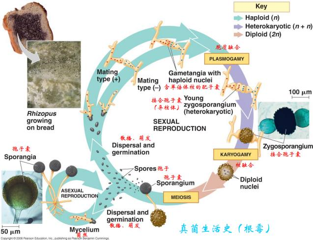
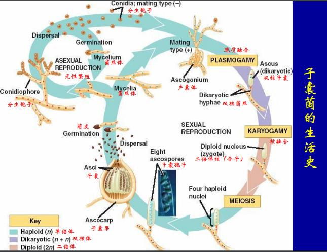
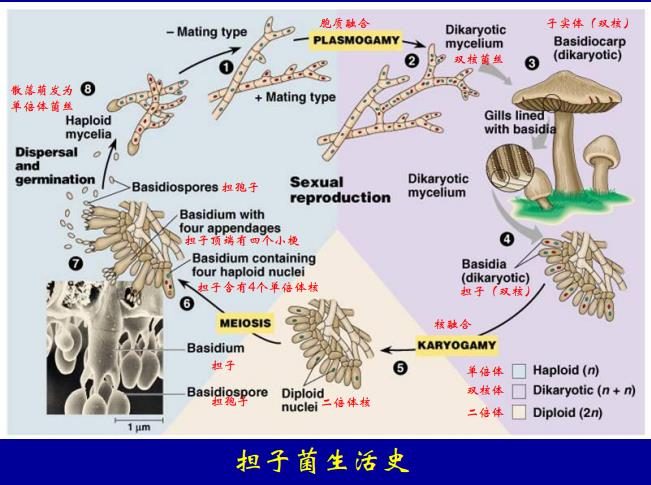
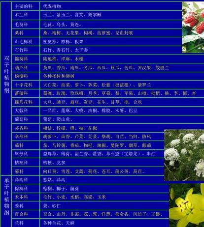
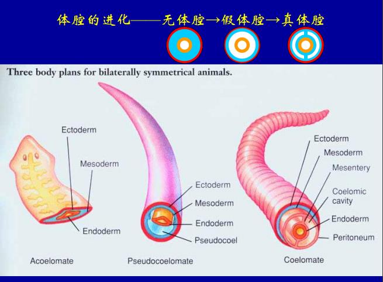

# 生命多样性

共有200万种, 植物50万, 动物150万

生物分类
- 形态学依据: 外部形态, 解刨结构, 系统发生
- 分子生物学反应: 免疫交叉反应, 同源生物大分子序列的同源性

### 物种

互交繁殖的自然群体, 和其他群体生殖隔离, 占据特定的生态位; 生殖隔离有
- 合子前隔离: 生态隔离, 行为隔离, 时间隔离, 器质性隔离
- 合子后隔离: 发育失败, 后代夭折或不育

物种的命名: 家犬(藏獒, 哈巴狗); 甘蓝(芥兰, 西兰花); 红薯(旋花科, 牵牛花)

属名(*首字母大写斜体*)+种名(*斜体*), *Homo sapiens*

### 生物分界

三域六界
- 古核生物
- 原核生物
- 真核生物
    - 原生生物
    - 植物
    - 动物
    - 真菌

- 原核生物: 细胞壁是肽聚糖; 环状DNA, 有质粒; RNA聚合酶在体外转录; 有操纵子, 没有内含子; 起始氨基酸是甲酰甲硫氨酸
- 古核生物: 细胞壁是蛋白质或假肽聚糖; 环状DNA, 有质粒, 形成类染色质的结构; 具有操纵子结构; mRNA5'和16s rRNA 3'互补, 起始氨基酸是甲硫氨酸
- 真核生物: 细胞壁多糖, 几丁质; 线性DNA, 具有染色质结构; 转录因子帮助识别启动子; 有内含子; 起始氨基酸是甲硫氨酸

### 病毒

一种准生命, 只能寄生于活细胞.

(通常一种)核酸和蛋白质的复合体; 衣壳 + 核酸 -> 核衣壳; 有的再加一层囊膜(从细胞出芽的时候带出来的); 大小介于10-300nm之间; 光镜看不到, 不能人工培养, 对抗生素不敏感

- 真病毒: DNA或RNA与组成的核酸-蛋白质复合体
- 类病毒: 感染性的RNA构成, 只有20余种

按照宿主分类: 动物病毒, 植物病毒, 细菌病毒(噬菌体)

按核酸分类
- DNA病毒
    - 单链: 细小病毒科(腺病毒相关病毒, 必须有腺病毒先来才能感染)
    - 双链
        - 有囊膜: 孢疹(起泡), 痘病毒(天花)
        - 无囊膜: 多瘤病毒, 腺病毒, T噬菌体
- RNA病毒
    - 双链: 呼肠孤病毒(呼吸道, 肠道, 孤儿病毒(只有它一个))
    - 单链逆转录: HIV, 肿瘤病毒
    - 单链
        - 正链: 黄热病毒
        - 负链: 麻疹, 流感, ebola
        - 有囊膜: 黄热, 狂犬, 麻疹, 腮腺炎, ebola
        - 无囊膜: 流感病毒, 脊髓灰质炎病毒, TMV

宿主专一性, 识别特异性的受体

#### 阮粒

只有蛋白质; $PrP^{c}$和$PrP^{sc}$(突变型, 溶解性差, 还能让别人也变成$\beta$折叠, 抗酶解, 聚集多了神经细胞死了, 就扩散到别的细胞里)

### 真细菌界

- 细菌
    - 细菌: 霍乱(和G蛋白结合, 不能水解GTP, 一直有活性, 排Na水分), 炭疽, 鼠疫, 伤寒, 破伤风
    - 放线菌: 结核(结核分岐杆菌), 白喉
    - 支原体: 类胸膜肺炎
    - 衣原体: 沙眼
    - 立克次氏体: 斑疹伤寒

细菌长1个微米左右, 形态可分为球菌, 杆菌, 螺旋菌

#### 革兰氏染色法

用结晶紫染色, 乙醇洗, 番红染色

如果是紫色的, 就是革兰氏阳性菌, 细胞壁是肽聚糖很厚, 可以用青霉素移植细胞壁生成; 金黄色葡萄球菌, 炭疽杆菌

是红/黄色的, 细胞壁很薄, 青霉素就不行; 大肠杆菌

###### 古细菌界: 极端环境下生存, 土壤里面也会有

### 真菌界

绝大部分多细胞生物, 是强大的分解者, 最早登陆的生物, 通过腐生, 寄生, 共生等异养方式摄取原料; 分泌水解酶, 分解大分子, 吸入体内.

- 大多数是多细胞
- 能有性生殖或无性繁殖, 产生孢子
- 由菌丝构成
- 有细胞壁和细胞核, 没有叶绿素
- 细胞壁主要是几丁质

可以无性生殖, 孢子 - 菌丝 - 顶端孢子囊

也可以有性繁殖, 两个菌丝分别是不同的交配型, 融合在一起, 先是两个细胞核, 核融合立刻减数分裂, 形成孢子

- 子囊菌: 酵母, 冬虫夏草; 孢子在子囊(一小条)里面
- 担子菌: 蘑菇, 木耳, 伞菌下面的褶里面有担子生成的担孢子 担子核融合之后减数分裂; 大部分细胞是n / n + n

###### 地衣门: 子囊菌和绿藻或蓝藻的共生体

### 植物界

- 低等植物
    - 藻类植物(绿藻, 金藻, 褐藻, 红藻, 甲藻, 裸藻)
- 高等植物(有胚植物, 受精卵先在母体发育)
    - 苔藓植物门: 苔纲 / 藓纲
    - 维管植物
        - 蕨类植物
        - 种子植物(裸子 / 被子(双子叶 / 单子叶))

#### 苔藓植物门

苔和藓形态不同, 但是生殖方式相似; 世代交替? 单倍体和二倍体交替出现; 孢蒴长孢子(单倍体), 萌发叫配子体(因为能产生配子, 有丝分裂产生), 末端分化, 精子器/\*精卵器, 受精变成合子, 合子发育成孢蒴(孢子体, 二倍体, 它会减数分裂:孢子减数分裂); 就有单倍体世代和二倍体世代

- 孢子: 进行无性生殖的细胞, 可以单独发育成一个新个体, 一般单细胞
- 配子: 进行有性生殖产生的性细胞, 不能单独发育成一个个体, 合子才能
- 孢子体: 合子发育而来的, 2n
- 配子体: 孢子发育而来的, n

#### 减数分裂的类型

- 配子减数分裂: 检出分裂产生配子; 后生动物
- 孢子减数分裂: 减数分裂产生孢子, 孢子有丝分裂形成配子体, 配子体产生配子; 植物
- 合子减数分裂: 合子形成之后立刻减数分裂形成孢子, 孢子产生新的世代; 真菌

### 维管植物

维管: 木质部(木材), 韧皮部(树皮的内部, 疏导有机物质), 中间有形成层; 单子叶植物就没有形成层(小麦玉米水稻), 长不大

#### 蕨类植物门

真蕨: 叶片上张孢子囊, 叫孢子叶, 发育成熟后破裂, 孢子散出, 萌发长出原叶体, 成熟之后一部分产生精子, 一部分卵子, 结合, 受精卵萌发长出孢子体; 孢子体世代发达了, 配子和孢子都能独立生存

#### 裸子植物亚门

苏铁松柏银杏买麻藤(按照进化分类, 越向后和被子植物亲缘越近)

没有花, 胚珠种子没有果皮是裸露的, 不形成果实

裸子植物专门有叶片生成孢子, 孢子叶聚集成球, 胚珠只是贴在孢子叶上, 心皮没有和上, 生活史不讲.

#### 被子植物门

- 有真正的的花
- 有雌蕊, 由心皮组成, 特化成子房花柱和柱头; 胚珠在子房内
- 双受精
- 有果实, 子房壁发育成果皮

减数分裂产生孢子, 雄配子体分裂变成两个或三个细胞, 雌配子体产生大孢子, 有丝分裂到8个细胞, 一个卵细胞, 剩下7个, 3反足1中央(两个细胞融合, 两个极核)2助; 受精, 花粉管发育, 两个精子进去, 一个和卵细胞受精成合子发育成胚, 另一个和中央细胞受精形成胚乳; 合子放到种子里, 种下去就发育成孢子体

### 原生动物亚界

- 肉鞭动物门
    - 肉足虫亚门: 放射虫, 变形虫, 有孔虫
    - 鞭毛虫亚门
        - 直鞭毛虫纲: 眼虫, 衣藻, 团藻
        - 动鞭毛虫纲: 锥虫, 利什曼原虫
- 顶复合器门(全部寄生): 疟原虫(在蚊子肠道结合, 再到蚊子唾液里面, 先侵染肝细胞, 再侵染红细胞, 释放的毒素影响体温调节)
- 微孢子虫门(全部寄生): 寄生于节肢动物
- 纤毛虫门: 草履虫, 四膜虫

### 后生动物亚界

#### 侧生动物

没有组织分化, 或是演化的盲端

里面的是胃层, 外面的是体层. 原肠形成的时候内胚层翻进去又翻出来, 走了一圈; 胃层由外胚层发育而来.

#### 刺胞动物门

有组织分化, 辐射对称, 只有两个胚层; 水螅, 海葵, 水母.

由刺细胞, 是鞭毛的特化, 弹出来刺别人

#### 扁形动物门

- 两侧对称, 由前后腹背的区别
- 有三个胚层, 但是没有体腔
- 由器官和系统的分化

涡虫纲, 再生能力强; 吸虫纲, 雌雄终生在一起; 绦虫纲, 寄生在消化道

#### 线虫动物门

三胚层, 假体腔, 只有体壁中胚层没有脏壁中胚层, 肠道只有单层上皮, 中间是体腔液

#### 软体动物门

真体腔, 但是不分节. 原口动物, 动物第二大类群; 蜗牛, 贝类, 章鱼, 墨鱼

#### 环节动物门

- 出现分节现象
- 出现真体腔
- 具有闭管循环系统

#### 节肢动物门

分节, 是无脊椎进化的最高峰, 最大的进化类别
- 身体分节, 异律分节(不同节不一样)
- 有几丁质的外骨骼, 蜕皮现象
- 有关节的附肢
- 开管式循环系统

昆虫
- 几丁质外壳
- 头胸腹三部分
- 三对足
- 头部有触角和口器
- 两对翅(多数)

- 鞘翅目: 各种甲虫
- 鳞翅目: 蛾子, 蝴蝶
- 膜翅目: 蜂, 蚂蚁
- 双翅目: 苍蝇, 蚊子
- 直翅目: 蝗虫

变态
- 无变态: 衣鱼
- 不完全变态
    - 渐变态: 卵 - 若虫 - 成虫, 蝗虫, 蟋蟀; 生活习惯没大差别
    - 半变态: 卵 - 稚虫 - 成虫, 蜻蜓; 生活习惯不一样
- 完全变态: 卵 - 幼虫 - 蛹 - 成虫; 蚕, 蝶, 蚊

#### 棘皮动物门

- 出现中胚层起源的内骨骼, 包被在外胚层的表皮下
- 后口动物
- 真体腔由肠腔囊方式发育而成
- 幼体两侧对称, 成体五幅对称
- 幼虫阶段和半索动物相似, 是向着脊索动物进化的无脊椎动物

无柄亚门: 海星纲, 海蛇尾纲, 海胆纲, 海参纲

有柄亚门: 海百合纲

#### 脊索动物门

最高级的类群
- 有脊索
- 背神经管
- 鳃裂
- 心脏在腹面, 闭管式循环
- 肛后尾

原索动物: 尾索动物(脊索在后半部, 变态之后扔掉了); 头索动物(文昌鱼, 脊索贯穿)

脊椎动物
- 神经发达
- 脊柱代替脊索
- 陆生的发展了肺呼吸

脊椎动物的分类
- 圆口纲: 七鳃鳗
- 软骨鱼纲: 骨骼为软骨, 鳃裂在体表, 体表被楯鳞; 鲨鱼
- 硬骨鱼纲: 内骨骼是硬骨, 一般有鳔, 鳃裂有骨质鳃盖保护, 体外受精
    - 总鳍鱼亚纲: 矛尾鱼
    - 肺鱼亚纲: 干涸时可用肺呼吸, 两心室
    - 辐鳍鱼亚纲: 现存大多数鱼类, 鲟(软骨硬骨之间, 中轴是脊索)
- 两栖纲
- 爬行纲: 有鳞片, 羊膜卵, 适应陆地生活

- 鸟纲: 恒定体温, 完全双循环, 双重呼吸
- 哺乳纲: 最高等的类群, 发达的神经系统, 感觉器官运动装置内脏器官
    - 原兽亚纲: 卵生; 鸭嘴兽
    - 后兽亚纲: 有带, 胎生, 无胎盘; 大袋鼠
    - 真兽亚纲: 有胎盘(胎盘亚纲), 大部分(95%)哺乳类, 乳腺发达, 体温高恒定(37°C), 大脑皮层发达
        - 食虫目(刺猬) / 翼手目(蝙蝠) / 灵长目 / 兔形目 / 啮齿目(\*鼠) / 鲸目 / 食肉目 / 长鼻目(象) / 奇蹄目(马) / 偶蹄目(牛, 猪)
