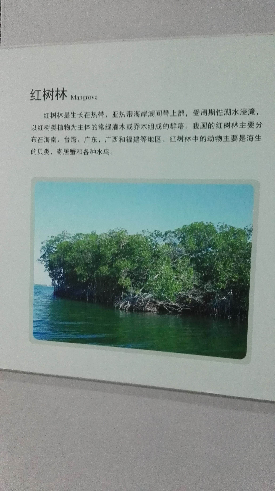
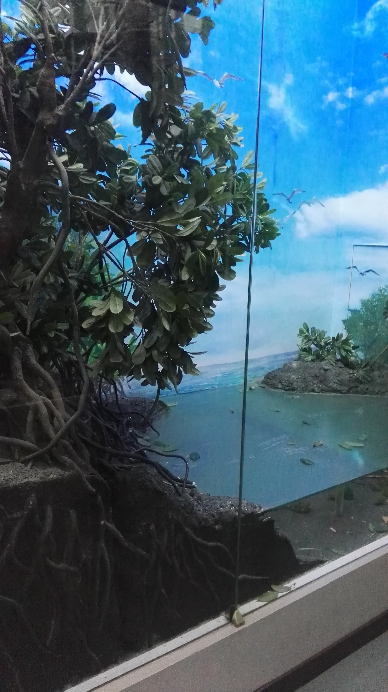

# 博物馆参观报告

###### 黄道吉-1600017857

### 布展情况

我们参观的是自然博物馆. 自然博物馆布有展厅的共有三层, 地下一层主要是水生生物馆, 地上一层主要展出动物, 地上二层有植物的展品. 这种布局和生物圈中物种的分层暗自契合: 水生生物在海平面以下, 动物主要占据海平面以上, 有一些植物可以高耸入云, 也有一些在高寒环境下也可以生存.

每一层的布局大致按照生物进化的顺序排布. 这一点在动物的展厅尤为显著, 沿人流巡回一圈基本上就参观了动物演化的历程.

除此之外, 还有恐龙和人体的专题展厅, 其中人体的展厅线索大致分为两条, 一条是按照人体发育的历程布置展品, 另一条线索是按照人体内各个系统专题介绍.

### 红树林

我想要详细介绍的是红树林(的模型). 它在一层有关生物多样性保护的展区的一个角落里面, 位置并不起眼, 但是引起了我的注意.

红树林和其他的植被类型有很大不同. 它的物种组成比较单一, 主要由红树科植物组成. 生长的环境十分特殊, 红树林在涨潮时一部分被淹没, 退潮时又露出水面, 这就使得红树林中的植物形态特殊, 有很密集的根作为支柱, 防止被浪潮卷走; 有的还发育呼吸根, 从水下伸出来以便获取氧气; 为了适应海水中含盐量高的环境, 红树林中的植物有比较强的耐盐性, 有的本身细胞液渗透压高, 有的还可以通过专门的腺体排盐. 有一些红树林中的植物有胎生的现象, 这样如果新生的幼苗没有插入土中, 还可以随海水漂流直到在某处搁浅, 找到合适的生根地点.

红树林对人类的价值也是很高的, 首先生长在海岸使得它可以消解风浪的危害, 防风固堤, 尤其在我国东南沿海的红树林对防止台风的侵扰发挥着一定的效果; 其次红树林中动植物的共存提供了很高的经济价值: 人类可以捕获红树林中的鱼虾蟹, 产量也是可观的; 此外这种共存也可以为人类恢复生态提供样本: 人们可以通过借鉴红树林的生态模式, 搭建类似的生态环境.

红树林中植物的生理特征反应了生物对环境的适应, 但我们也可以发现同样是适应, 不同的生物适应方式也不同, 似乎反映着生物进化是随机的, 多方向的; 但从另一个侧面看, 这也是环境对生物的改造: 即便具体适应方式不同, 大体上进化方向是类似的. 更进一步的, 红树林还可以固定流沙, 形成以红树林中植物为主的生态系统, 这体现着生物改造环境的能力, 可见红树林充分反映了生物与环境的相互作用. 而在对人类的效益方面, 红树林的生态系统如上所述对人类有很多方面的意义. 这反映着生态多样性对人类十分重要. 人类很有必要保护类似物种丰富, 经济价值高, 生态效益大的生态系统.

###### 与博物馆的合影, 展品的图片

