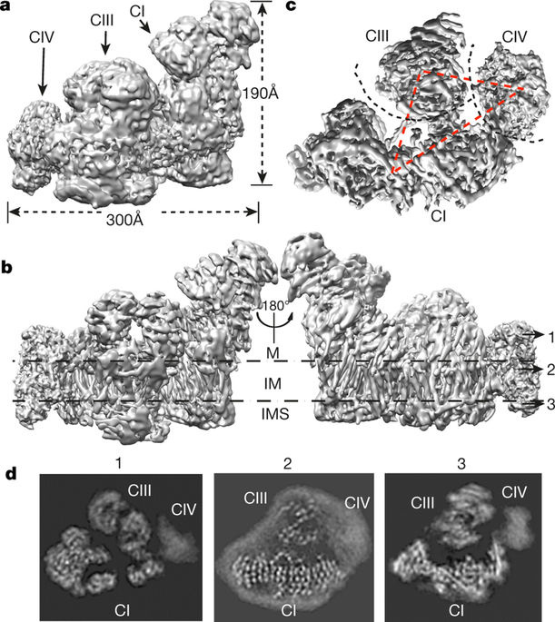
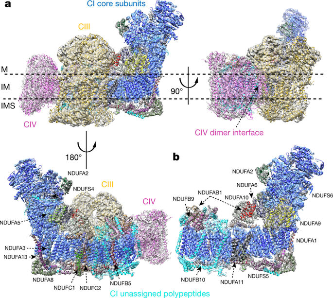
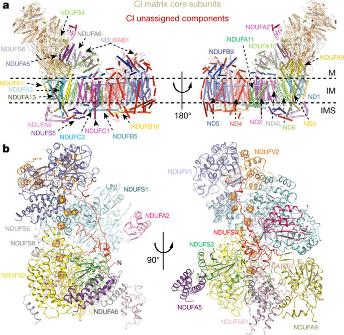
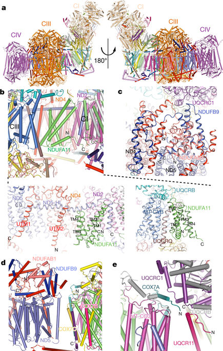

## 论文翻译

###### 黄道吉-1600017857
###### 2018-04-20

### 论文信息

**标题** 哺乳动物呼吸体的结构(The architecture of the mammalian respirasome)

**作者** Jinke Gu, Meng Wu, Runyu Guo, Kaige Yan, Jianlin Lei, Ning Gao & Maojun Yang.

**机构** 清华大学生命科学学院, 结构生物学高精尖创新中心, 清华大学－北京大学生命科学联合中心, 蛋白质科学教育部重点实验室

### 摘要

呼吸链化合物I, II和IV(CI, CIII, 和 CIV) 存在于细菌膜和线粒体内膜中, 并且具有转移电子, 为化合物V合成ATP建立质子梯度的作用. 呼吸链化合物可以合成超负荷物(SC), 但是它们的精确排列是未知的. 这里我们提供由猪心中纯化出的主要是1.7兆道尔顿的SCI$$_1$$III$$_2$$IV$$_1$$的5.4$$\AA$$低温电子显微镜结构. CIII二聚体和CIV结合在L形CI的同一侧, 它们的跨膜结构域基本对齐, 来形成一个跨膜盘. 与自由CI对比, 在呼吸体中的CI因为与CIII和CIV的相互作用而更加紧凑. CI的NDUFA11和NDUF89亚基有助于CI和CIII的寡聚化. 呼吸体的结构提供了关于线粒体中呼吸链化合物精确排列的信息.

### 正文

存在于线粒体内膜或嵴中的线粒体呼吸链化合物在能量转换中具有重要作用. 呼吸链化合物包括四种多亚基化合物: 复合物I(NADH), 复合物II(琥珀酸脱氢酶), 复合物III(细胞色素bc$$_{1}$$复合物)和复合物IV(细胞色素$$c$$氧化酶). 三种复合物(CI, CIII 和 CIV)共同为复合物V(CV, ATP合成酶)合成ATP提供跨线粒体内膜的质子梯度. 呼吸链化合物和CV一起形成氧化磷酸化(OXPHOS)系统. 线粒体呼吸链化合物的功能障碍产生活性氧或氮, 这种功能障碍牵连许多人类疾病, 包括阿尔兹海默症, 帕金森症, 多发性硬化症, 弗里德赖希共济失调和肌萎缩性侧索硬化症.

除了形成随机分散在膜中的单独的复合物之外, 许多证据表明这些复合物也可以组成特定的活性超结构. 超复合物的组成变化多端. 不同物种中都有报道不同种类数目形式组成的超复合物的存在. 从细菌中纯化出的CIII和CIV长期以来被忽视, 直到线粒体研究领域出现一种称作蓝色原生PAGE(BNGA)的策略. 在BNPA分析毛地黄皂苷增容制剂过程中发现的高分子条带被发现含有单个复合物组成的稳定组合. 在没有多亚基CI的酿酒酵母(*Saccharomyces cerevisiae*)中, 可以提取含有III$$_{2}$$IV$$_{1}$$(750kDa)和III$$_{2}$$IV$$_{2}$$(1000kDa)的稳定复合物. 在拟南芥(*Arabidopsis thaliana*)中, 超复合物的主要形式包括I$$_{2}$$和III$$_{2}$$. 在哺乳动物中, 可以从牛心中获取SCI$$_{1}$$III$$_{2}$$IV$$_{1}$$, 并且CII还认为和小鼠肝线粒体超化合物合成有关.

在牛心脏中, 毛地黄皂苷溶解后, ~80%的CI分散到超复合物中, 而只有~20%的CI以游离形式存在. 大约三分之二的CIII被发现在各种形式的超复合物中, 而CIV主要(~85%)以游离形式存在. 这些数据表明呼吸链复合物可能在线粒体中有结构的互相依赖性. 的确, 以往的研究表明在哺乳动物细胞中组装CIII和CIV需要稳定的CI.

有几个研究组认为, 在呼吸链中, 包含CI, CIII, CIV的超复合物会组成呼吸串: 在呼吸串中不同的超复合物在线粒体内膜嵴组织成有序的线性图案, 尽管我们对这个组织的了解十分有限. 在这些超分子组装状态中, SCI$$_{1}$$III$$_{2}$$IV$$_{1}$$的结构引发很大的兴趣, 也是研究最深入的. 然而, 过去曾缺乏复杂的相互作用的精确解释, 主要囿于以前结构的有限的分辨率. 在这项研究中, 我们从猪心中纯化出SCI$$_{1}$$III$$_{2}$$IV$$_{1}$$的主要形式, 并使用单粒子冷冻电子显微镜(cryo-EM)获得了5.4$$\AA$$分辨率的结构. 我们的结构揭示了SCI$$_{1}$$III$$_{2}$$IV$$_{1}$$中复合物的精确位置, 并建立出呼吸链复合物之间的复杂相互作用.

### 蛋白质纯化与结构测定

基本如同之前所述, 超化合物从牛, 猪, 大鼠和小鼠心脏纯化出来. 从猪心中提取出来的用毛地黄皂苷溶解的超化合物用作最终的样品制备和机构测定. BNPA分析检测到几种超复合物, 其中主要的一种形成1.7MDa的迁移, 这和对SCI$$_{1}$$III$$_{2}$$IV$$_{1}$$的大小估计一致. 这条SCI$$_{1}$$III$$_{2}$$IV$$_{1}$$可被活性CI的特异染料硝基蓝四唑(NBT)染色, 表明这种超复合物中的CI具有NADH脱氢酶的活性.

1.7MDa呼吸体的初始三维参考建模由负染色电子显微镜(EM)创建. 正如扩展参考数据图2中所示, 初始模型有类似于以往描述的F型结构. 高分辨率的图像由配备了Falcno II的Titan Krios TEM记录. 原始冷冻电镜的分类使得2D分类平均分辨率较好, 一些耳机结构特征清晰可辨. 在对颗粒进行三维分类后, 一部分粒子得以高分辨率细化, 产生总体分辨率5.4$$\AA$$的3D密度图, 图中部分辨率更高, 外围分辨率较低.

###### 图一: 呼吸体的冷冻电子显微镜结构, 这是沿没有锐化的密度图的膜侧面看到的呼吸体(轮廓图5σ), 其中不同的区域做标记并且用黑色箭头指出. b, 和d一样, 但是以5.4$$\AA$$分辨率锐化的图(CI和CIII轮廓为7σ, CIV是5σ). 跨膜区域用两条虚线表示, M是基质; IM, 内膜; IMS, 膜内空间. c, 是从膜内空间底面观察的未锐化的图. 黑色虚线表示复合物之间的边界, 红色虚线连接三个复合物跨膜区域的中心. d, 选中的与b中编号的箭头相对应的锐化图层的z切片. 跨膜片段的阵列在子面板(sub panel)中清楚可见. 不同复合物的位置也可以推断

F型密度图可以清晰的分为三部分, 一个细长部分位于两个球形部分的下面. 结构的俯视图和正视图的直径分别为300$$\AA$$和190$$\AA$$. 通过使用CI和CIII的两种不同掩码的子区域精修进一步将CI和CIII的密度图分别改进到~3.9-4.0$$\AA$$. 从密度图中可以容易识别跨膜区, 因为它有许多密度棒. 局部解析图显示CIV以外的跨膜螺旋是分辨率最高的区域之一. 随后将牛CI的冷冻电镜5$$\AA$$模型和CIII同型二聚体和CIV的单体的高分辨率晶体结构导入图像中得到很高的相关系数. 使用Coot进一步手动优化得到的模型.

###### SCI$$_{1}$$III$$_{2}$$IV$$_{1}$$的分配 a, 不同成分的分割图(segmented map)的透明平面表示, 列出不同旋转角度的三个沿膜视图. CI的主要亚基和未分配的区域的额外部分分别用蓝色和青色的卡通(cartoon?)表示出来. 分配的亚基用不同的颜色上色并标定. CIII和CIV用金色和洋红着色. b, CI的表示和a中相同, 按我们的推测标出额外的成分.

### CI的分配

CI的结果和功能被深入研究了数十年. 哺乳动物的CI是线粒体内膜最大, 最复杂的酶. CI的整体高度约为190$$\AA$$, 长度约为250$$\AA$$, 包含44个不同的亚基核两份NDUFAB1. 报道称14个保守的(*什么叫保守的(conserved)?*)催化能量转换反应的亚基排成L型结构. 7个基质核心亚基被10个额外亚基包围, 突出到膜外形成基质臂. 7个膜臂核心亚基包在线粒体内膜内, 另有21个额外亚基包围它们. 14个额外结构域至少有一个跨膜结构域. CI的3.97$$\AA$$密度图使我们能够用核心亚基的大部分残基的侧链建立模型, 尤其是在膜臂区域. 侧链的密度在紧密堆积的亚单元那里解决的很好, 但周边区域的边缘密度不那么有序. 在这个结构中, 我们能够准确定位14个核心亚基和20个额外亚基的位置. 此外, 我们还建立了另外17个骨干模型来放到没有占用的密度中, 这些密度应该属于另外11个未分配的额外成分和/或指定蛋白的未分配区域. 总的来说, CI的结构在膜结构域中包含77个跨膜螺旋. 与先前报道的牛结构相比, 我们的结构中没有检测到ND5旁边的膜臂末端的一个跨膜螺旋.

###### CI的总体结构 a, CI的总体结构. 用卡通表示CI结构沿膜的不用角度做旋转. 基质区域的核心亚基的结构, 和已分配的亚基按推测单独着色. FeS簇展示在球体中. b, CI的基质区域. 不同的亚基按推测单独着色.

CI可以分为4个功能模块. 基质臂远端形成N模块, 它包括核心亚单位NDUFV1, NDUFV2和NDUFS1, 以及额外亚基NDUFS6和NDUFA2. N模块含有氧化NADH的FMN分子. 基质臂的近端一半形成另一个功能模块, 它对接在由核心亚基NDUFS2, NDUFS3, NDUFS7和NDUFS8以及额外亚基NDUFA5, NDUFA6, NDUFA9和NDUFAB1组成的膜臂上. NDUFS4额外亚基和两种基质模块的所有核心亚基通过桥接在一起相互作用. 膜臂包括另外两个模块. 核心亚基ND5和ND4连同若干额外成分构成了两个远端逆向运输质子泵(two distal antiporter-like proton pump)模块($$P_p$$), 它包含两个额外的质子泵并于基质臂结合.

### CIII和CI的分配

除了CI的膜臂之外, 具有近似双重对称性的密度区域(高160$$\AA$$, 宽140$$\AA$$)可以容易的分配给CIII同源二聚体. 这种分配与二聚CIII是线粒体呼吸链的核心部件, 从ubihydroquinone转移电子到cytochrome $$c$$生成跨线粒体内膜的质子梯度是一致的. 之前的研究表明, CIII中的Rieske铁硫蛋白亚基的功能域在不同的结构形式中有不同的位置, 称为'$$c$$', '$$b$$', 和'$$int$$'(中间)状态, 对应于从[2Fe-2S]簇到haem $$c_1$$或$$b_L$$的不同距离. 在最终精绘密度图中, [2Fe-2S]到haem $$c_1$$和haem $$b_L$$的相对距离分别为30$$\AA$$和27$$\AA$$

在这个结构中, 每一个CIII单体包含11种不同多肽, 总重大约240kDa. CIII同型二聚体的两个轴向垂直于CI膜臂的膜平面. CIII二聚体的基质结构域在基质一面突出大约75$$\AA$$, 直面CI的亲水臂. 在膜间隙处, CIII 外表面几乎和同侧CI膜臂中额外蛋白质的外表面水平. 然而, 在膜间隙CIII的外表面上预期的细胞色素$$c$$的结合点位处没有密度, 推测细胞色素$$c$$可能在样品纯化过程中丢失.

位于CI的膜臂末端, 与CIII二聚体相邻的矩形密度大致有90, 60, 120$$\AA$$那么大, 和CIV单体的尺寸一致. CIV晶体结构的13个亚基的刚体拟合表明, COX4I1和COX5A亚基向基质侧突出, 预期的细胞色素$$c$$的结合位点位于膜间一侧. CIV在晶体结构凹侧一面的二聚界面面向整个超复合物的外侧, 提高了呼吸体中的CIV可能在高阶组装中形成同型二聚体的可能性.

据报道, SCI$$_{1}$$III$$_{2}$$IV$$_{1}$$包含69种不同的多肽, 它们由来自CI的45种, CIII二聚体的22种和CIV的14种, 合计81种蛋白链构成. 我们的密度图表明仍存在未分配的额外成分和/或CI的未分配区域, 我们的中等分辨率的密度图不允许我们确定它们的成分. 即便如此, 我们可以在CI的跨膜区域和周边未占用的密度中构建17条主链. 这使得我们的呼吸体的结构中有131个跨膜螺旋, 其中77个来自CI, 26个来自CIII, 28个来自CIV. 三个复合物的跨膜区域形成一个巨大的跨膜盘, 它在膜间有一个平坦的平面.

###### 三个复合物的相互作用 a, 呼吸体的整体模型. 指出了CI的核心区域, 已分配亚基和未分配亚基. CIII和CIV分别用金色和洋红着色. CI的基质区域的FeS簇显示在球体中. 展现了沿膜的视图. b, NDUFA11和CI, CIII的相互作用. 不同的亚基分别着色. 下面的两幅图分别展示NDUFA11和CI, CIII的相互作用. UTM, 未分配的跨膜螺旋. c, CIII的UQCRC11和膜臂末端的CI的额外成分相互作用. 未分配的区域用红色着色, 其他的额外亚基如图分别着色. d, CI和CIV的相互作用. 不同亚基按照和b中相同的颜色着色. e, CIII和CIV的相互作用

### CI和CIII的相互作用

结构分析表明NDUFA11亚基直接和CI和CII作用. NDUFA11含有四个跨膜螺旋, N端有一个短螺旋, C端有一个环状区域. 四个跨膜螺旋形成四螺旋束, 它与CI的膜臂中间的跨膜螺旋大致平行. NDUFA11的N端和跨膜螺旋1(TMH1)的C端主要与HL螺旋的C端和ND5的最后一个螺旋相互作用. 跨膜螺旋4(TMH4)的C端和ND4作用. C端的环主要和膜间隙和ND2接触. NDUFA11的另一面朝向CIII的跨膜区域, 它和CIII二聚体的一个单体的UQCRB和UQCRQ亚基接近. 观察到的这些结构和先前的研究一致: 破坏NDUFA11的第一跨膜螺旋的突变使得整个复合物不稳定; 抑制NDUFA11表达破坏了CI的组装, 导致550kDa和815kDa CI亚复合物的积聚, 不能形成超复合物.

包含LYR基序额外成分的NDUF89和SDAP酰基载体蛋白NDUFAB1位于膜臂的远端, CI基质侧的ND5的远部. NDUFAB1结合在NDUBF9的N和C端之间的凹槽中, NDUFB9的N端主要参与CI-CIII的相互作用. 另一个CIII单体的UQCRC1亚基的基质侧的一个短环(UQCRC1$$^{S251-L265}$$)插入NDUFB9的N端和一个未分配额外蛋白形成的凹槽之中. NDUFB9的N端的LYR基序对NDUFAB1的结合和CI和CIII的相互作用都是重要关键的. 这和之前的发现是一致的: NDUFB9上的突变导致CI缺陷, NAD$$^+$$/NADH平衡紊乱, 促进肿瘤转移. CI和CIII之间存在两个未分配的跨膜螺旋, 这可能属于CI和CIII挂菊花所需的未分配的额外部分. 序列分析表明NDUFA11, NDUFB9和UQCRC1的结合基序在物种间是高度保守的(*conserved?*), 推测呼吸体内独自复合物的排列可能是高度保守的.

### 和CIV的作用

虽然CI的额外成分有助于CI和CIII的相互作用, 它们并不直接参与CI与CIV的相互作用. 相反, CI-CIV的相互作用主要通过CIV的COX7C亚基的跨膜螺旋与CI的膜臂远端的ND5的最后一个跨膜螺旋之间的包装. 此外, COX7A跨膜螺旋前面的弹性区域与基质一侧的UQCRC1和UQCR11接触, 进一步加强了CIII和CIV的作用. 与结构观察一致的是: 细胞色素 *c*　氧化酶亚基VIIa的多肽2相似物(*~ like*)在CIII-CIV作用中是必须的. 在小鼠品系C57BL/6中, 该蛋白的天然突变Cox7-a2L可以直接影响SCIII$$_{2}$$IV$$_{1}$$的形成, 而不是如之前叙述直接影响SCI$$_{1}$$III$$_{2}$$IV$$_{1}$$的形成. 和CI与CIII之间有直接结合的桥梁相比, CIV和CI, CIII的相互作用稍微弱一点, 这可能是阻碍该区域高分辨率测定的主要因素.

之前的基于低分辨率的研究表明CIII的细胞色素 *b* , Rieske和UQCR11可以分别和CIV的COX3, COX6A和COX7A作用. 我们的结构证实了COX7A和UQCR11的相互作用, 然而, CIII中细胞色素 *b* 和Rieske到CIV中COX3和COX6A的距离在10-30$$\AA$$ 之间, 表明它们可能没有直接相互作用. 此外, 三个复合物之间存在明显的间隙, 在膜间一侧没有可辩别的相互作用. 由于大量不同的不同的脂双层成分, 如心磷脂, 磷脂酰胆碱和磷脂酰乙醇胺应存在于纯化的复合物中, 我们推测这些脂双层成分应占据复合物中间的空间, 使呼吸物进一步稳定.

有趣的是, 在膜间层, 三种复合物的胞质表面在同一水平面上. 我们认为呼吸物的这种取向, 尤其是CIII和CIV的平面, 可以促进还原细胞色素 *c* 的移位.

### CI的构象变化

结构比较显示呼吸体中的CI比自由CI(PDB accession code 4UQ8)更紧凑, 虽然膜臂中间区域的ND3, ND4, ND4L和ND6亚基基本保持不变, 但是膜臂末端的基质区域和ND4和ND5亚基显示出向中间区域的横向移动. 这些协调的构象变化和之前的猜测一致: 呼吸体中CI的构象需要变化来适应和CIII和CIV的结合

### 结论

线粒体的呼吸链的结构和功能已经被广泛研究了数十年. 先前的研究提出了呼吸链复合物的集中不同的装配模型, 如随机碰撞模型, 固态模型和塑性模型. 最近的通过遗传, BNPA电泳和单粒子EM的研究支持了塑性模型, 并显示了不同的超分子组装体的存在. 之前的电子断层扫描和冷冻断裂EM研究表明, 呼吸复合物形成呼吸行(*row*)或串(*string*)这类高级组件. 和嵴上的线性排列的复合物V二聚体不同, 呼吸链的性质和组成并没有被良定义, 这可能是由于难以在洗涤剂溶解之后维持过渡串(*transient string*). 我们和别人检测到比SCI$$_{1}$$III$$_{2}$$IV$$_{1}$$更高分子量的条带, 这表明呼吸超复合物可以在较高寡聚体形式下存在. 总之, 我们的呼吸链SCI$$_{1}$$III$$_{2}$$IV$$_{1}$$的接近原子冷冻电镜图建立了CI, 二聚III和CIV的空间排列, 为研究电子转移过程中各个复合物之间的协调提供了蓝图, 并为呼吸串的组织提供了新的见解.

### 方法

#### 数据报告

确定样本量并没有使用统计方法. 实验没有随机化. 研究人员没有随机分配到实验和结果评估过程中

#### 从主心脏分离线粒体

以下所有过程在冰上或4℃中进行. 从屠宰场获得的新鲜猪心尽快送到实验室. 分离出100g心肌, 切成小立方体. 用Milli-Q水洗涤两次心肌, 悬浮于100ml缓冲液A(100mM Tris pH7.4, 255mM山梨醇, 60mM KCL, 1mM EGTA, 和0.1% BSA). 在大容量搅拌机中均化300s. 将匀浆液3000g离心20min去除细胞碎片. 收集上清液, 用20000g离心30min获得粗线粒体沉淀. 粗线粒体悬浮于100ml缓冲液B(50mM Tris pH7.4, 250mM 蔗糖, 60mM KCl, 40% Percoll, 和0.1mM EGTA), 用60000g离心50min. 小心的抽吸线粒体带, 用20ml缓冲液C(50mM Tris pH7.4, 100mM山梨糖醇, 60mM KCl, 0.05mM EGTA)稀释.  20000g离心30min后, 得到纯的线粒体.

#### 呼吸超复合物纯化

将纯线粒体悬浮在缓冲液C中. 加入1%(w/v)毛地黄皂苷后, 将样品在4℃下缓慢搅拌一夜. 150000g超速离心30min. 用100Kd截止离心滤器(cutoff centrifugal filter)收集到的上清液浓缩到1ml. 然后, 在03.-1.8蔗糖梯度上以缓冲液D(25mM Tris pH7.4, 60mM KCl, 0.1%毛地黄皂苷)中离心样品20h, 环境是4℃, 使用SW41转子. 通过3-10%BN-PAGE凝胶分级研究梯度(? 原文是gradient). 将纯化的呼吸超复合物浓缩, 进行凝胶过滤色谱, 缓冲液是10mM Tris pH7.4, 60mM KCl, 和0.1%毛地黄皂苷. 收集峰成分, 用于电子显微镜分析.

#### 蓝色野生PAGE(blue native PAGE)

按照蓝色野生PAGE协议, 纯化的呼吸体复合物用3-10%蓝色野生PAGE微型凝胶(1.5\*8.3\*7.3mm), 在150V原生电泳4h, 来进行分析.

#### NBT染色

硝基蓝四唑(NBT)具有两个四唑, 是可溶黄色化合物. 当NBT被还原时, 形成蓝色或紫色沉淀甲瓒. NBT染色可用于NADH脱氢酶的特异性凝胶内活性测定. 为了NBT染色, BN-PAGE凝胶在含有100mM Tris-甘氨酸 pH7.4, 1mg/ml NBT, 和100 μM β-NADH的缓冲液中温育5-10min.

#### 负染色电镜

4μl呼吸超复合物(0.5 mgml$^{-1}$)加以辉光放电的碳涂层铜网格(300 mesh, Zhongjingkeyi, Beijing).. 在室温下温育1min, 用滤纸吸收过量液体. 包含样品的网格用2%的铀酰乙酸染色1min, 风干. 在Tecnai Spirit显微镜(FEI company)上采集显微照片, 使用电压为120kv, 4k*4k电荷耦合器件相机(CCD)(UltraScan 4000, Gatan). 用毛地黄皂苷纯化的呼吸体超复合物的照片用$\times$68000放大, 像素大小1.5$\AA$

#### 低温电子显微镜

用0.2mg ml$^{-1}$增溶的呼吸体的4μl等分式样加以辉光放电的涂有国产(home-made)连续烯碳的400目Quantifoil R1.2/1.3 栅格 (Quantifoil, Micro Tools, Germany).栅格溪水1.5s, 之后插入液体乙烷中, 使用 FEI Mark IV Vitrobot, 在4℃, 100%湿度下操作. 在FEI Titan Krios microscope上使用 Falcon II direct electron detector (FEI), 电压300kv收集高分辨率图像. 自动单粒子数据采集用EPU封装(FEI)完成, 校准放大倍数$\times$132959, 最终像素尺寸10.5$\AA$, 散焦范围-1.8μm到-2.5μm. 检测器上的剂量率为每像素每秒约42个电子, 总曝光时间1.2s. 每个显微图栈包含19帧.

#### 图像处理

负染色电镜的数据集用EMAN2.1和RELION1.4处理. 用RELION进行无参考2D分类. 对于负染色电镜数据处理, 采用EMAN进行粒子采集, 用RELION进行粒子分类, 重建和结构细化. 最终3d分类中使用的数量是9936. 用一个密度球作为3D分类的初始参考. 最终的3个类之中, 用一个有4597个粒子的类细化, 生成3d模型.

对于Falcon II数据集处理, 用MotionCorr程序(X.Li编写)进行显微镜水平的运动矫正, 在所有帧上生成平均显微照片. 用EMAN, RELLON进行显微照片筛选, 颗粒采集和正规化(normalization). 使用CTFFIND3程序来估计对比度转移函数参数. 用RELLON进行2D, 3D分类, 细化. 1371张显微照片中的139996个颗粒进行级联的2D和3D分类. 在细化测试中, 测试了不同类别的粒子组合. 对一组相对均匀的颗粒(50, 370)进行最终细化, 使用负染色模型低滤通波60$\AA$作为初始参考. 细化得到的密度图整体分辨率有7.2$\AA$, 整个复合物的软掩码(soft mask)区域分辨率有6.2$\AA$. 粒子从原始显微照片的第二帧到第十帧进行重建(也重新执行显微图像层面的运动矫正). 使用RELLON进行第二轮细化, 让复合物的软掩码区域的分辨率提高到6.1$\AA$. 第三轮细化通过扩大呼吸体的软掩码区域完成, 将分辨率提高到5.4$\AA$. 进一步改进密度图是通过一组基于子区域细化程序的软掩码实现的, 正如之前描述的对核糖体复合物的结构测定中描述的一样. 具体的, 对CI和CIII的扩大软掩码是通过使用先前的(previous around)密度图制造的, 应用于随后的基于掩码的细化. 在3D细化过程中应用软掩码可以在掩码边界以内的的区域只凭借结构特点更好的对齐粒子. 结果是子区域的改进使CI和CIII的密度图分辨率提高到3.97$\AA$. 但是因为CIV的弱结合和它在超复合物中的亚化学计量作用(sub-stoichiometric occupancy), 我们没能在CIV的密度图上得到显著的改进. 所有得到的分辨率都基于黄金标准(gold-standard)FSC=0.143标准(criteria), 最终的FSC曲线用高分辨率噪声替代校正了软掩码的影响. 最终密度图用RELION锐化B因子到-200$\AA^{2}$. 局部分辨率图使用ResMap计算.

#### 建立模型和分析结构

用Phyre2网络服务器(http://www.sbg.bio.ic.ac.uk/phyre2)对*Sus scrofa*CI的14个保守亚基的原子模型进行预测和建模. 用牛的CI结构作为初始模型, 我们将14个核心亚基和20个已分配亚基和17个未分配额外多肽分配到我们的密度图中. 用Coot进一步优化了模型. 因为*S.scrofa*和*Bos taurus*的CIII和CIV的序列相似性(序列相似性大约85%-97%), 我们直接将CIII二聚体和CIV单体的晶体模型对接到图中. 序列对齐使用DNAMAN完成. 所有图片使用UCSF Chimera创建.

## 参考文献

Jinke Gu, Meng Wu, Runyu Guo, Kaige Yan, Jianlin Lei, Ning Gao & Maojun Yang. (2016) The architecture of the mammalian respirasome. Nature. 537: 639-643.
