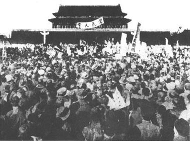

1924年秋, 冯玉祥在第二次直奉战争中接受奉系贰佰万日元贿赂, 向奉系倒戈. 冯随后发动北京政变, 驱逐清廷, 修改皇室优待条件, 随后为控制局面, 请广州军政府的孙中山北上商议和平统一. 奉系在直奉战争中取胜, 从东北陆军中编出6个军共20万人入关, 奉军一路向南占领直隶山东江苏安徽, 张学良率军甚至进入上海.

张作霖和冯玉祥推举段祺瑞为中华民国临时执政. 段就职后企图解除各省兵权, 包括推举他就任的张作霖和冯玉祥, 解散国会, 废除中华民国临时约法.

1925年十月, 直系吴佩孚就任十四省讨贼联军总司令, 发动第三次直奉战争. 1925年11月, 直系孙传芳起兵驱逐苏皖等地奉系势力. 冯玉祥此时再次倒戈, 和奉系郭松龄签订攻守秘密条约. 随后郭松龄叛变奉系, 一度直逼沈阳, 但是日本人决定不让郭军穿过日本控制的南满铁路, 并且把驻屯军司令部移到沈阳.

> 不准郭军通过南满铁路或在附属地二十华里以内作战. -- 日本关东军司令官白川义

 可见日本事实上支持张作霖, 另一方面, 也反应中国军队在主权沦丧的情况下尚不能在中国领土上自由通行作战.(同时, 张作霖和日本签订两个密约, 在承认二十一条的基础上继续卖国).

1925年末, 冯玉祥占领天津. 吴佩孚和张作霖暂时修好, 决定联合包围冯玉祥军(一度得到了阎锡山的支持). 冯军在大沽口设防, 试图阻挡奉系舰艇, 用水雷封锁大沽口, 一度和越线的日军舰艇炮战. 3月16日, 八国(八国联军的八国)抗议冯违反辛丑条约, 提出44小时最后通牒, 要求拆除大沽口国防设施, 同时派军舰到大沽口, 威胁用武力解决. 北洋政府辩解称辛丑条约只限定了炮台, 但没有规定水雷, 但是八国公使团没有回应. 段随后劝冯停止布雷.

> 第八款，大沽炮台以及北京到天津之间的炮台一律拆毁. -- 辛丑条约

3.16 17日, 北京国共两党开会, 国民党执委会代表徐谦和中共北方区委李大钊决定组织学校和群众团体在天安门集会, 一度率领群众冲击国务院, 试图翻墙抓人. 群众和守门的卫兵相持五六个小时, 产生一些流血事件.

> 同国民军的士兵不要搞得太僵，我们还是要争取国民军的. -- 李大钊

3.18上午十点, 北京学生和市民在天安门举行"反对八国最后通牒的国民大会", 临时搭建主席台, 悬挂孙中山遗像, 和"革命尚未成功, 同志仍需努力".

大会结束之后, 李大钊号召与会者去国务院示威, 群众一度畏惧镇压不敢去, 但还是有数百人前往了(随身携带粗棍子, 做游行小旗子的旗杆, 也可自卫). 在时任总理贾德耀从侧门离开执政府之后, 执政府卫队长下令开枪. 击毙学生市民47人, 伤者150余人.
