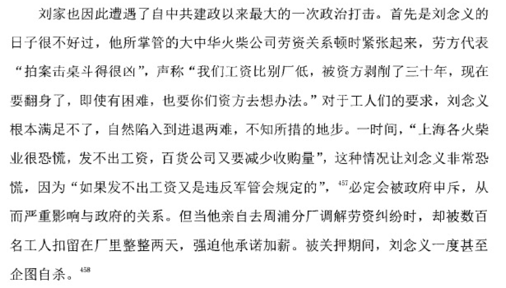

# 从资本家身份转换看工商业改造

###### 曾锶娴 段敏萱 王浩男 尹志祎 黄道吉

## 历史背景介绍

### 经济基础

结束抗战和解放战争, 经济百废待兴

需要利用民族资产阶级的力量帮助新中国的经济发展

1949年人均GDP35.2元, 略低于1894年水平, 第三产业占比比较高(58 : 15: 27) - 出自中国经济史研究2000年1期, 中日学者测算, 年份选取不大好, 但是最高(黄金十年)也就50多元

### 土地改革

1953年大致完成

实现了农业的合作化, 讲土地收归政府控制

为工业的发展提供了充分的原料和广阔的市场, 为工业化开辟了道路

> 党反对不发动群众，用行政命令方法把土地‘恩赐’给农民的‘和平土改’。” - 胡乔木

> “占国民经济总产值90%的分散的个体的农业经济和手工业经济，是可能和必须谨慎地、逐步地而又积极地引导它们向着现代化和集体化的方向发展的，任其自流的观点是错误的。” - 毛泽东, 中共七届二中全会

### 三反五反

时间和土改大致同时

"五反"主要针对国内的资产阶级

 - 反行贿
 - 反偷税漏税
 - 反偷工减料
 - 反盗骗国家财产
 - 反盗窃国家经济情报

一方面巩固的工人阶级的领导地位, 另一方面扫清了工商业改造的障碍(肉体上/精神上, 星四聚餐会 资本家秘密结社)

但也遇到了困难, 产量减少, 邓小平上书反对, 上海十余万人失业.

> 薄一波同志三月二十五日关于“五反”的策略和部署很好，各城市均应仿行。上海“五反”的重点首先放在占六十二万人中的四十三万人方面，是正确的。尤其不误生产，极为重要，各城市凡误生产者，均应立即改变做法。 - 毛泽东

> ...划分私人工商户的类型，应分为守法的、基本守法的、半守法半违法的、严重违法的和完全违法的五类。就大城市说，...后二类约占百分之五左右。 - 毛泽东

> 在此次“五反”斗争中及其以后，我们必须达到下述目的: (一) 彻底查明私人工商业的情况，以利团结和控制资产阶级，进行国家的计划经济。情况不明，是无法进行计划经济的。 - 毛泽东

> 中国内部的主要矛盾即是工人阶级与民族资产阶级的矛盾，故不应再将民族资产阶级称为中间阶级。 - 毛泽东 (1952)

### 思想背景

> "但愿如此, 共产主义者也会是最不反对这种办法(赎买)的人." 恩格斯

> "我们决不认为, 赎买在任何情况下都是不容许的; 马克思曾向我讲过(并且讲过好多次!)他的意见: 假如我们能用赎买摆脱这整个匪帮, 那对于我们是最便宜不过的事情了." 恩格斯

> "对于肯接受并能实施'国家资本主义', ..., 对无产阶级有益的资本家谋求妥协或向他们实行赎买" 列宁

> 这里所说的改造还不是指取消资本家生产资料的私人所有制，使之变为社会主义企业的那种最后的改造步骤。这里所说的改造，是指在承认资本家的受限制的不完全的私人所有制的条件下，使资本主义企业逐步变为国家资本主义企业，即在人民政府管理下的用各种方式和国营社会主义经济联系着的受工人监督的资本主义 - 毛泽东

> 我们要从经济观点，向大的远的方面看，现在中国的私人资本，在全国工商业经济上，比重还是相当大，向着社会主义走，公私双方都需要发展的。只不要让它向坏的方面发展。要教育改造工商业者，中间还要特别重视工业，要在人民政府领导之下，依据国家经济需要，有步骤地把商业资本转向工业，这于国家是有利的 - 毛泽东

### 他山之石?

 - 学习苏东直接没收
 - 挤垮, "不给任务, 不给原料, 不给生意做"
 - 按照马恩提出的赎买方法

合理调整工商业，加强了对私营工业的加工订货，调整了公私商业的营业范围和价格。私人资本主义经济企业大多通过统购包销、加工订货、经销代销和个别企业的公私合营等国家资本主义的初级形式，同国营经济相联系和合作。

> 公私合营是最有利于私有企业改造到社会主义的形式 - 1953.5 中共统战部, "资本主义工业中的公私关系问题"

> "提早消灭资本主义实行社会主义是错误的, 是不适合我们国家的情况的" - 毛泽东, 中共七届三中全会

至此, 和平赎买的经济, 思想, 以及一部分的实践基础全部准备好了.

###### 参考资料: 中国经济史研究, [中国共产党新闻网](http://theory.people.com.cn/n/2012/0627/c49157-18391294.html)

## 从企业家到资方人员：利用民族资产阶级的经验

1955 年 10月 29 日，毛泽东在资本主义工商业社会主义改造问题座谈会上，谈到改造对资本家身份的影响时指出，

> “资产阶级，总有一天，大约三个五年计划之内，就不叫资产阶级了，他们成为工人了”。

同年11月16日，周恩来在中共中央召开的资本主义工商业社会主义改造会议上的讲话中，也从身份转换的角度阐述了改造的意义:

> “整个社会主义改造的过程就是消灭资产阶级的过程，也是改造资本家个人的过程。阶级消灭，个人改造，最后都变成工人，得到一个愉快的前途”。

显然，就毛、周的认识看，对资产阶级的改造并非简单的阶级消灭，而是身份转换。

刘鸿生，民国时期上海著名的大实业家和工商业巨子，中国近代著名爱国实业家，冠有“中国火柴大王”“毛纺业大王”“企业大王”等称号。抗战期间，他拒绝留沪与日本合作，转向大后方的土地。在与民国政府积极合作中，刘鸿生逐渐地打下了千金家业。他的家族枝繁叶茂，弟弟也追随其兄进入商界，妻子为商界名门叶家的孙女。

解放前夕，刘鸿生飞往香港并在港停留半年。这半年期间，他慎重地思考和选择，权衡利弊，最终决定重返大陆，在中共新政权下追求实业的梦想。在留下的企业家中，刘鸿生从声望与影响上属于元老级人物，他的返回受到新政权高层的相当重视，周总理亲自接见了他。在新民主主义的社会图景中，刘鸿生被定性为“民族资本家”，列名全国统战对象。1956年公私合营时，是当时中国仅次于荣氏家族的最富有企业家。

## 和平赎买政策 -- 荣毅仁 vs 困难人

#### 荣毅仁

正如刚才所具体展开的，新中国成立后1949-1956年，是民族工商业积极改造的几年。在农业合作化的推动下，资本主义工商业掀起了全行业公私合营的高潮，中国的民族资本主义在此时迎来了历史上最大的转折。**而作为”中国第一财团”的荣氏家族，其兴衰成败可以说是当代中国政治经济真实而浓缩的写照，是一部关于中国商业家族成长与挫败的传奇。**

对荣家和荣毅仁本人，1949年可以说是个分水岭，也是他们走向新生活的开始。

1949年，中华人民共和国成立，而生活在新中国经济中心的上海的荣家，似乎从一开始就注定了要和新中国的命运息息相关。

当时荣氏是上海工商界的第一大户。解放军进城后，有产阶级们“不恐慌是不可能的”，因为他们都不知道自己将会面对怎样的命运。作为中国著名的棉纱和面粉大王，荣毅仁的父亲荣德生最终决定留下来。但是他的亲戚们大都逃往香港或者国外，只有四子荣毅仁留了下来。几经战火的荣氏产业已经损耗大半，大家各奔东西也将家产拆分得差不多了。而事实上，在这之前棉纱、面粉行业都受到了国民党政府的严厉管制，偌大家业风雨飘摇。

所以荣德生决定隐退，将荣氏的申新纱厂和福新、茂新面粉厂都交由荣毅仁打理。同样也是在1949年，**33岁的荣毅仁肩负起管理家族在大陆余下产业的责任。**

进城之初，**新政府十分注重团结工商业**，当时上海市人民政府采取了一系列措施来帮助私营企业发展，其中包括大力扶植民族资本的棉纺织工业，为了鼓励他们进口外棉，免征进口关税。同时新政府愿意贷款给申新各厂，来帮助它恢复生产，因此之前逃亡香港的好几个股东就从香港汇回资金或者运回原棉，荣氏的生意开始好转。之后，上海市市长陈毅还带着家人公开到荣毅仁家里做客，这种主动示好的做法也在人心不稳的上海引起了轰动。

后来，由于美蒋对上海实行武装封锁，棉花供应十分紧张。由于申新纺织厂的厂子大，因此各厂的棉纱存量较多。**荣毅仁便向市纺织工业局、华东军政委员会贸易部、花纱公司等建议，干脆你供应棉花，我加工棉纱，工厂赚工缴费，实行加工订货**。这一做法很快推广到全市的纺织行业。

在1950年北京召开的七大城市工商局长会议上，荣毅仁建议的加工订货办法，得到了当时的中央财委主任陈云的高度重视，很快被推广到全国。1951年1月，**政务院财政经济委员会颁布了《关于统购棉纱的决定》，私营棉纱厂就此完全纳入了国家的计划轨道**。而后面的转变，则快到超乎荣毅仁的预料。

1950年下半年，**上海的轻工业日用品市场开始活跃**。而抗美援朝战争的爆发，则对商人们又是一次发财的机会。因此 **很多商人不愿在接受加工订货**，自产自销的利润显然更大。但是碍于政策，有些商人便开始在商品中以次充好。

1951年底，上海开始了“三反五反”运动，陈毅提出把全市中上层具有代表性的资本家303户集中起来学习，帮助他们了解政策，其中荣毅仁就在其中。**随着“三反五反”运动的升级扩大，从未见识过革命威力的工商业界很快陷入了巨大的恐慌**。

后来薄一波受命到上海指导运动，在他的建议下，毛泽东批复了上海对“五反”政策的调整方案。新方案特别提到，“考虑到统战需要及经济生产等种种因素”，对荣毅仁在内的一类大资本家实行保护过关的政策。**最终毛泽东批复，将荣家定为了“完全守法户”**。这使得荣毅仁明白，公私合营将会是大势所趋。

**1954年9月，申新集团宣布进行公私合营，由此荣氏积淀了半个世纪的产业，变为国家所有**。荣毅仁作为上海工商业界公私合营的发起人，因此也被陈毅和周恩来冠以红色资本家的称号。到1955年底，接受政府加工订货，统购包销的上海工商企业已经占私营工业总产值的92%。

1956年初，毛泽东还特意南下到申新纺织厂视察，在视察后荣毅仁就代表上海工商界集体给毛泽东写信，表示在6天之内上海要实现全行业公私合营。

他当时这样说了一段话。

在这场新中国经济所有制的改造运动中，每个人都能感受到身边的变化。原来的老字号不见了，取而代之的是各种公私合营的新牌子。公私合营，这对于当时很多资本家来说，都是一种撕心裂肺的痛。自己几辈人辛辛苦苦创办的家业就这样交出去，他们担心财产被全部充公，自己今后的生活无着落。

“顺应时代发展，把握之命运”，这是毛泽东50年代时送给荣毅仁的一句话。之后，荣毅仁的仕途一路绿灯，先是出任全国人大代表，后来在陈毅的帮助下1957年当选上海副市长，**1959年调任纺织部副部长，巅峰时期还出任国家副主席**。事实上，在种种力量的推助下，荣毅仁最终逐渐变为红色中国的一个特殊的“政治符号”。

荣毅仁作为商人，能在政治地位上取得前所未有的突破，其实还是非常罕见的。相比起其他的资本家，他的一生是相当幸运的。

#### 困难人

所以我在这里想强调这样一些人的存在，由于荣毅仁被标榜成了一个“红色资本家”，所以这里的反面案例就被称为“困难人”。**他们大多是一些资本基础比较弱的民族资产阶级，并不像是如荣毅仁一般的大资本家一样被国家所重视和保护**。其实国家之所以额外关注荣毅仁一类的大企业家，归根结底还是他们掌握着国家的经济命脉，需要更强的稳定性，而不是强制性的“和平赎买”。

在工商业改造之前，当时多数上海的私营企业都面临着生存危机，资产与原料被国民党政府、军队以及四大家族大批卷走。所以说这些“困难人”，由于战乱和政治动荡产业摇摇欲坠，而由于他们的力量薄弱也并不涉及稳定局面的需求，所以想来当时针对他们的工商业改革举措就并不用那么周折了。

所以也许也存在着极度抵抗企业收归公有的悲惨下场，但是这些都没有什么正经的史料，所以也不详细说了。但是提这些个“困难人”，还是要说除了像荣毅仁一样的这些红色资本家们，依然有很多无可奈何、被政策逼得走投无路的民族资产阶级。

## 总结

#### 资本主义工商业改造的结果

 - 奠定了走向社会主义的经济基础（尤其是和平改造、快速改造）
 - 合并与改组增添了工商企业的活力
 - 劳动者积极性提高，生产力提升
 - 促进了工业化进展

 但是我们从“人”的角度看，却可以看到这次改革像任何一次改革一样，都有着说不尽的艰难。这次改革生效快、成果好，然而快有快的坏处，在《中共中央关于建国以来党的若干历史问题的决议》中提到，要求过急、工作过粗、改变过快、形式过于简单，现在想来这样的问题是不可避免的，毕竟整个过程比预想的还要提前十二年。前面提到，改革之前的工商业者中，企业规模大的只占很少数，多数是小商小贩、个体经营的，而他们各自的情况又不一样，所以在56年的这次全行业公私合营高潮之前，初级国家资本主义的形式是多样的，采用公私合营、四马分肥这一种手段就显得有点考虑不周，而实际开展工作的过程中确实出现了许多矫枉过正的问题，小商小贩也卷入公私合营，得到的定息很少，常常对此颇有怨言，还就此戴上了资本主义的帽子，此后受了很多不必要的委屈。另外在资本家的身份转换中出现的问题也很多，资本家的收入与企业利润脱钩，导致资本家对经营不关心了，在共同经营中出力较少，属于人力资源的浪费；而公方代表的态度则构成另一原因：干部在与资本家的合作当中，想拿捏好分寸也是不容易的，陈云在报告中提到

 > “现在业务部门的普遍缺点是，开专业会议时大体上只找本系统的干部，不找资本家，认为资本家是包袱。”

 > “采取隔离办法来避免资产阶级思想的侵蚀”。

 公私双方大多数时候都能保持良好的关系，而生产力也有提高，但是实际上双方是貌合神离，职权范围难以界定。
 1956年毛泽东与工商业者进行会谈，没有提以前提过的“让资本主义绝种”，而是提出要适当保存资本主义（地下工厂），与“地上的”做对，实际是为了提高产品质量。对于资本家的利益问题，提出了定息不变、时间延长的政策，得到了实施。可惜的是，“在社会主义公有制占优势的情况下允许多种所有制形式存在、把阶级当作财富、社会变革不能太快”等关键点没能付诸实现。小商小户也没能摘帽子，进工会。直到1979年，才有70万人被摘掉资本家的帽子，恢复劳动人民的身份。健在的资本家才真正成为了财富。
 追根溯源，资本主义工商业改造的理论基础在于马克思说的“消灭私有制”，但是马克思在解释这个问题时说，

 > “政治经济学在原则上把两种极不相同的私有制混同起来，其中一种以生产者自己的劳动为基础，另一种以剥削他人的劳动为基础”

 > “共产主义并不剥夺任何人占有社会产品的权利，它只剥夺利用这种占有去奴役他人的权利”。

 1950年有人提出“今天的斗争对象主要是资产阶级”，遭到了毛泽东的反对，他那时的观点是极为清晰而理性的，他说

 > “应限制和排挤的是那些不利于国计民生的工商业，而不是有利于国计民生的工商业，对这些工商业当它们困难时应给予扶助使之发展"

 可惜他的这些思想并没有贯彻始终。
 新中国的第一个十年是辉煌的，经济情况逐渐好转、人民生活水平得到提升、工业化进程按部就班、社会主义国家的整体架构也大致完工。但是这个架构是否稳定呢？从中央关于资本主义工商业的改造这个问题的思想几次反复就可以看出，我们的社会主义道路要如何走，其实还是个很模糊的设想。在这种设定下，就更应该让决策民主化，并尽量使用缓和的、低压的执行模式，不能单单让革命热情把持着国运命脉。然而这个问题并没有得到深入思考，直接导致中国共产党接下来的十年走了更多的弯路。
