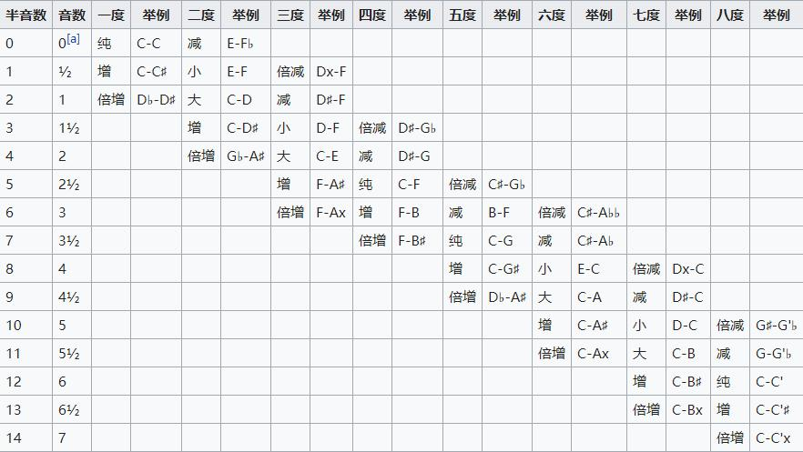
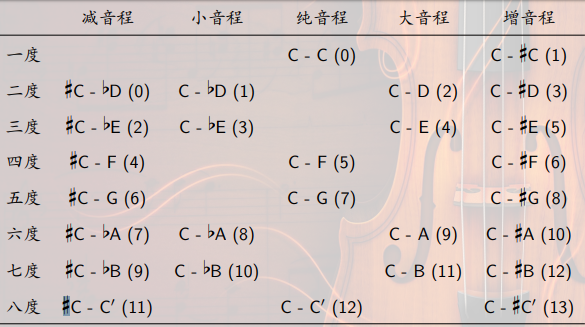

# 音乐基础知识

声音是音乐的载体, 物体振动引起声音, 声音是纵波

压力的单位是帕斯卡, 人耳的听力下线阈值是2e-5Pa; 声压水平$L_p = 20 \log_{10}(\frac{p}{p_0})$ 单位是分贝; 人耳对不同频率的声音有不同的听觉下限阈值

音色: 声音的波形不同; 傅里叶变换, 时域频域分解

声音分成乐音和噪音, 区别是物体振动规律不同; 音乐也利用噪音, 打击乐器(固定音高的: 木琴, 定音鼓; 无固定音高的: 小军鼓, 大镲)

乐音体系: 全体乐音的集合, 乐音叫做音级; 音级排序叫音列, 相邻的两个音级差一个半音, 一个全音是两个半音; 每一个音级的名字, 音名; 按照八度把音级分成若干音组; 基本音级, 加升降号成为变化音级, 变音记号$\sharp, \flat, \natural$, 重升号类似x, 重降号$\flat\flat$; 异名同音, 等音的(音高相同)

唱名法: do re mi af sol la si; 固定唱名法: do = C, 首调唱名法: do可以是任何一个音级, mi fa, si do之间是半音

五线谱

```text
--五线--

--四线--

----
二间
----

--一线--
下加一间
-下加一线-
```

音符代表相对长度, 全音符中空, 二分音符加一竖线, 四分音符填满, 八分音符加尾巴

拍号: m/n 以n分音符为一拍, 每小节m拍; 速度: 四分音符 = 60, 每分钟60个四分音符

谱号: 高音谱号的圆圈位于二线, 表明中央C上方的G的位置; 低音谱号中心位于四线, 表明中央C下方的F的位置; 中音谱号中心位于三线, 放到四线叫次中音谱号, 表明中央C的位置

音程: 两个音级的距离; 高的叫冠音, 低的跟音; 先后发声旋律音程, 同时和声音程; 通过度数和音程同时确定音程



基本音级之间的音程叫自然音程, 改变半音数叫变化音程



通常认为, 纯四度, 纯五度, 纯八度, 大小三度, 大小六度属于协和音程; 二度, 七度, 所有增减音程都不协和. 进一步的, 纯*的音程叫完全协和音程, 大小三六度叫不完全协和音程

毕达哥拉斯: 声音震动频率的比越简单, 音程越协和

泛音列理论: 写音的傅里叶展开, 泛音列重合的越多, 越协和

```text
f  2f  3f  4f
2f 4f  8f 16f
```

拍音理论

$\sin (2\pi(\omega + \delta)t) + \sin (2\pi \omega t) = 2\sin(2\pi (\omega + \frac{\delta}{2})t) \dot\ \cos(\pi\delta t)$

所以两个声音叠加, 产生了拍的感觉, 44Hz和50Hz的叠加, 仿佛有6拍

赫尔姆霍兹认为拍音小于6或多于120的协和, 中间的, 特别是33的不协和, 但是$C_4 D_4\ C_6 D_6$之间的拍音是变化的

心理学检验说明协和音程确实听起来协和
