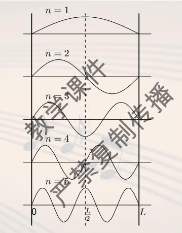
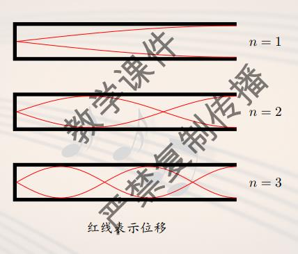
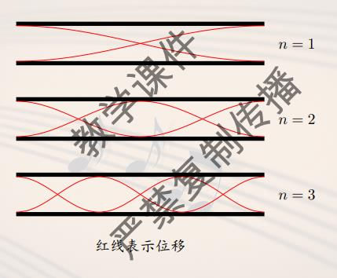

# 弦外之音

乐器分类
- 气鸣乐器: 唇鸣, 簧鸣
- 弦鸣乐器: 弓弦, 弹拨, 击打
- 电鸣乐器
- 体鸣乐器: 打击乐, 木琴
- 膜鸣乐器: 鼓, 卡祖笛

弦的一维震动方程$\frac{\partial^2 u}{\partial t^2} = c^2 \frac{\partial^2 u}{\partial x^2}, c = \sqrt{T / ρ}$, 边值条件$u(0, t) = u(L, t) = 0, \forall t \geq 0$

最终得到完整解$u(x, t) = \sum_{n = 1}^{\infty} \sin (\frac{n\pi}{L}x)(a_n \cos \frac{n\pi c}{L}t + b_n \sin \frac{n\pi c}{L}t).$

进一步化简, 得到$u_n(x, t) = \sqrt{a_n^2 + b_n^2} \sin (\frac{n\pi c}{L} t + \theta_n) \sin (\frac{n\pi}{L}x).$

得到$f_1 = \frac{1}{2L}\sqrt{\frac{T}{ρ}}$(Mersenne 梅森素数$2^p - 1$)

$f_n = nf_1$, 称为第n个震动模态, $\{f_1, f_2, f_3, \dots\}$称为固有频率, $f_1$称为基频, 相应的声音叫基音, $f_n\ (n > 1)$统称为泛音, $f_2, f_3$分别为第一泛音, 第二泛音, 泛音列.

驻波:两个频率振幅相同的波叠加, 波节(振幅为零), 波腹(振幅最大)

傅里叶级数: $f(x) = \frac{\alpha_0}{2} + \sum_{n = 1}^{\infty}(\alpha_n \cos nx + \beta_n \sin nx),\ \forall x \in [-L, L]$

求一个傅里叶级数, 发现在中间拨弦, 只有可能出现奇数项(对称性)

高维的情形$\frac{\partial^2 u}{\partial t^2} = c^2 \nabla^2 u., \mbox{初值条件} u|_{\partial \Omega} = 0.$

管乐器: 震动的空气柱会超过管口, 需要对频率进行管口矫正

不计管口矫正, 开口总是处于波腹, 闭口总是处于波节

设声速v, 频率f, 波长λ, 有$f = \frac{v}{\lambda}$

闭管的震动

总有$\lambda_n = 4L / n$, n奇, 只有偶次泛音

开管的震动

有所有泛音列

长笛算开管, 单簧管算闭管; 超吹
