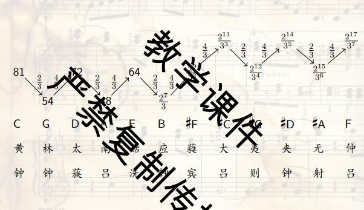
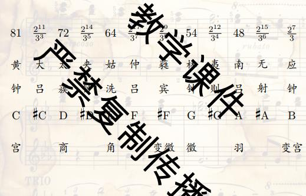
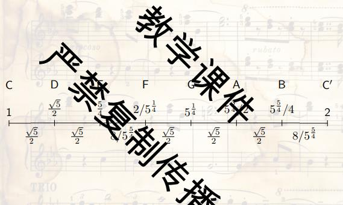

# 乐音体系的生成

律学解决两个问题: 每一个音级对应的震动频率, 确定同一个八度内不同音级的相对音高

### 三分损益

```text
宫(81) --三分益一--> 徵 --三分损一--> 商 --三分益一--> 羽 --三分损一--> 角
```

这里的长度是指长度, 所以数字越大, 频率越低

徵-宫 刚好是纯四度; 宫-高八度的商 刚好是纯五度

再加上变徵(变宫三分损一), 变宫(角三分益一), 七声音阶

```text
徵   羽   变宫   宫  商   角   变徵
108  96  256/3  81  72   64  512/9
```

吕氏春秋记载了十二律的相生关系



旋宫不归: 对仲吕做三分损一, $\frac{2_{18}}{3^8}$, 期望得到清宫, 但是实际上会高一点, 旋宫不归了



### 五度相生

采用3:2作为生律元素, 不断乘1.5, 超出这个八度就除2. 相当于每一次增加7个半音

```text
C -> G -> D -> A -> E -> B -> #F -> #C -> #G -> #D -> #A -> F
```

这样所有的纯五度都是3:2, 所有的纯四度都是4:3, 但是三度音程之间不统一; 同样的, F再升一个五度得到$\frac{3^{12}}{2^{19}} \approx 1.013643$, 叫毕达哥拉斯音差

### 纯律

再添加一个生律元素, 5:4理想大三度的比例; 总之最终得到

```text
C    D    E    F    G    A     B   C'
1  9/8  5/4  4/3  3/2  5/3  15/8   2
```

这样, 基本的三和弦CEG, FAC, GBD都符合理想的4:5:6, 非常理想, 非常悦耳

同样的, 从C出升7个纯五度, 降两个八度, 一个大三度, $(\frac{3}{2})^4 \times (\frac{1}{2})^2 \times \frac{4}{5} = \frac{81}{80} = 1.0125$, 还是比C高一点, 这个音差叫谐调音差

### 其他探索

京房六十律; 三百六十律

### 中庸全音律

把D插到CE的几何平均值里面, 之后再做微调, 相当于有$\frac{\sqrt{5}}{2}$和$\frac{8}{5^{\frac{5}{4}}}$两个生律元素



但是牺牲了纯五度的比例

### 平均律

只用一个生律元素$2^{\frac{1}{12}}$, 无脑乘就好了; 朱载堉:"凡学开方, 需造大算盘", 古中国分子叫实, 分母叫法

巴赫的音乐的奉献, 升12次调, 就又回去了

### 音分

$1200\log_2 (\frac{f_2}{f_1})$, 十二平均律的一个半音正好是100音分

$r = 2^{\frac{c}{1200}}, c = 1200 \log_2 r$, 分别是频率的比c和音分的换算式

理想大三度386音分, 平均律高了14音分; 理想大六度5:3, 884音分, 平均律高了16音分

八度循环2:1; 五度纯正3:2; 和弦协和5:4

历史上并没有标准的绝对音高, 19世纪的欧洲和北美趋向于不断提高绝对音高

1939国际标准化协会确定A = 440Hz

理论上纯五度3:2, 跨7个半音, 这样就应该有12个纯五度音程等于7个八度音程, 但是$(\frac{3}{2})^{12} \not= 2^{7}$, 但是差不太多

为了表示无理数, 可以利用连分数

$a_{0} + \frac{1}{a_{1} + \frac{1}{a_{2} + \frac{1}{a_{3} + \dots}}}$

简记为$[a_0, a_1, a_2, a_3, \dots]$

取前n + 1项就得到连分数的N次渐进, 这是一个有理数, 利用ceil和floor可以计算任意数的连分数表示, 连分数是分母有限的有理数中最接近的, 最佳有理逼近

利用连分数逼近$\log_2(\frac{3}{2}) = [0, 1, 1, 2, 2, 3, 1, 5, \dots]$

得到$1, \frac{1}{2}, \frac{3}{5}, \frac{7}{12}, \dots$, 每一个分数都可以建立一个平均律, 把一个八度分成分母分, 每一份一个半音, 用分子个半音定义纯五度
