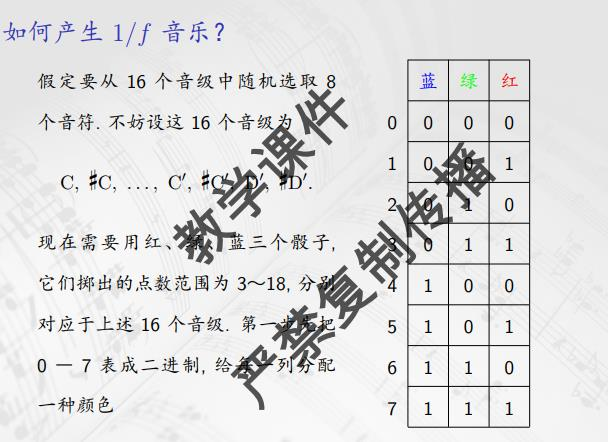
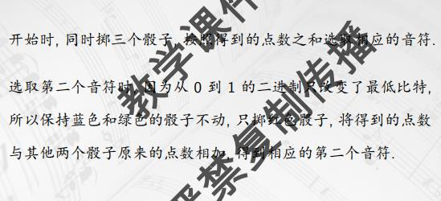

# 音乐与随机过程

音乐骰子游戏: 波格涅茨舞曲共14节, 每节有11种不同的旋律, 演奏者每一次掷两个骰子, 得到的点数之和减一, 就是这一个小节的旋律, 掷14次, 做完了, 但是每次选到11种旋律的某一个概率是不相同的

海顿小步舞曲, 中间16小节, 每一个小节掷一个骰子

随机变量, 随机事件, 概率分布(课件中用表格表示)

$p_{k} \geq 0, \forall k \in \Omega \\ \sum_{k \in \Omega} p_{k} = 1$

连续性随机变量, 取值范围是实轴上的一个区间, 每一点上的概率是0, 由分布函数刻画, 概率密度函数, 微分形式

第十一钢琴曲, 从19个片段中随机取一个, 直到某一个片段被取了三次, 结束

建模

$\forall i, 1 \leq i \leq k - 1, x_{i + 1} \not= x_{i}$

$\forall i, 1 \leq i \leq k - 1, x_{i} \mbox{出现的次数不超过}r$

$x_{k}$出现$r + 1$次

利用生成函数可以解决, 一共有1.7e41种演奏方式, 平均长38, 而k的最大值为39

随机音乐: 克赛纳基斯, 梅西安. 用音乐的统计均值控制微观效果. 变形, 大量的滑奏, 构成直纹面. 气体分子总体的速度分布满足maxwell-boltzmann分布, 概率之动: 把每一个弦乐器当成一个气体分子, 滑奏是分子的的随机运动, 要求滑奏速度均匀分布, 速度的密度等于常数, 任何一个音域内, 上升和下降的声音数相等; 得到每一个分子的运动满足正态分布

UPIC: 输入图像作曲

可以把音乐当成一个随机过程, 一个序列中的每一个元素都来自相同的范围, 状态空间; 马尔科夫性质: 只和前一个有关, 满足这一性质叫马尔科夫链, 无记忆性; 如果条件概率和时间没有关系, 时间齐次的, 可以用矩阵刻画$P = (p_{ij}) = (P(\epsilon_{t + 1} = k_{j} | \epsilon_{t} = k_{i}))$, 转移概率/转移概率矩阵

高阶马尔科夫链, 每一个状态只和前m个状态有关, 叫m阶的马尔科夫链

遗传算法: 对由个体构成的种群, 进行交叉, 变异, 进化产生下一代种群; 事先设定适应度函数衡量进化结果.

音乐片段的编码: 可以是[pc, duration], 这样交叉就是交换两个个体的基因片段, 变异就改变某一点的基因(当然要考虑时值如何调整); 适应度函数如何选取? 人机交互, 机器学习; 进化策略: 部分适应度高的个体进入下一代; 预先给定交叉和变异的比例; 增加进化操作的种类(移调, 倒影, 逆行)

把音乐看成一个随机序列, 分析它的功率谱, 它等于自相关函数的傅里叶变换, 反映了随机序列的自相似性.

无标度: 用不同的速度播放一种乐曲, 听起来声音完全一样, 它和自相似性紧密相连

无标度噪声的数学特征就是功率谱等于常数, 在各个频率上的平均功率都相等. 白噪声是一种无标度噪声, 自相关函数除原点都是0, 也就是随机变量的取值和前一个状态无关, 可以用独立同分布随机事件生成.

棕色噪声是和之前的状态完全相关的序列, 可以用iid变量的前缀和生成,

白噪声功率谱密度在f轴上是一个常数, 等于1/f^{0}, 但是棕色噪声功率谱密度反比于f的平方, 1/f^{2}.

对各种音乐和语言信号分析得到, 信号的功率谱密度均在下述范围变动

$\frac{1}{f^{\gamma}},\quad 0.5 \leq \gamma \leq 1.5$

太阳黑子, 洪水水位, 股票涨跌, 大致呈1/f规律, 1/f噪声叫粉噪声

产生粉噪声

