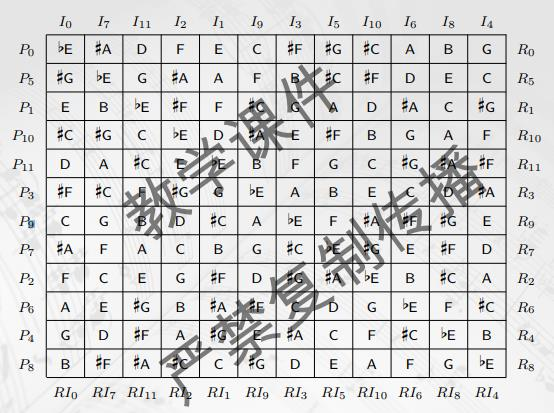

# 旋律与对称

对旋律做变换, 譬如说移调; 严格移调, 调性移调

把乐音体系数字化$C_0 \iff 0, \dots, C_8 \iff 96$

移调变换: $T_{z}(x) = x + z$, 变换的复合$T_{n} \times T_{m} = T_{m + n}$, 移调变换都成一个交换群(结合, 单位元, 逆变换, 交换), 实际上是循环群

倒影变换: 用I表示关于$C_4 = 48$所在直线的倒影变换, 即$I(x) = 96 - x$, 得$I^2 = T_{0}$, $T_{n} * I = I * T_{-n}$

逆行: $R(x_1 x_2 \dots x_k) = x_k x_{k - 1} \dots x_{2} x_{1}$, R和T, I可交换

八度关系, 两个音相等或者相差若干个八度, 等音的也视为相等; 这是一个等价关系(自反对称传递); 等价, 等价类; 任两个等价类不相交, S表示为若干不相交的等价类的并, 得到S中元素的一个分类, 等价类叫音类; 音类空间$\mathcal{PC} = \{\bar{C}, \dots, \bar{B}\}$

带余除法; 同余; 同余类; 模12加法; $\mathcal{PC} \iff Z_{12}$同构; 这样移调变换变成PC到自身的映射;

群, 二面体群(保持二面体形状不变的变换的集合, 旋转和对称变换, 正n边形就是2n阶的群, 叫D_{2n}), 对称群(n元置换的集合), 群的阶

同态, 同构$(\mathcal{T}, * ) \cong (Z_{12}, +)$

倒影变换作用在音类空间上可以认为是取负号, 记D = <I, T>, 则有D同构于D_{24}, 即正12边形变换群, 再加入R, 可以证明<T, I, R>的阶为48

调性音乐总有一个主音, 使得严格的移调和倒影变换受限制

勋伯格: 十二音技术, 出发点是十二音序列, 一个音列是十二个音类的排列; 令初始音列(P_)0的第一个音对应Z_{12}中的0, 其他的音类类似. 对初始音列进行移调变换, 得到P_{n}; 对P_{n}做关于第一个音类的倒影变换, 得到倒影音列, 叫I_{n}, 对P_{n}做逆行变换, 得到R_{n}, 对I_{n}做逆行变换, 得到RI_{n}. 得到48个音列, 构成一个音列矩阵(先写P0, 再写I0, 之后就都好了); 作曲时, 只指定音类, 至于选取哪一个八度的音符, 作曲家自由决定



```text
定理A
给定P_{0} = 0, a_1, ..., a_11
存在I_k = R_0的充要条件是
0 + a_11 = ... = a_5 + a_6 = k, 其中k必为奇数
```

有多少满足定理A的音列? 首项有12种取法, k有6种取法, k给定之后, a_11也给定了; 之后选取a_1, ..., a_5, 共有12 * 6 * 10 * 8 * 6 * 4 * 2 = 276480种


```text
定理B
给定音列P_{0} = 0, a_1, ..., a_11
存在k使得, P_0 = R_k的充分必要条件是k = 6
并且a_6 = a_5 + 6, ..., a_11 = a_0 + 6
```

满足定理B的音列共有: 首项12种取法, a_1有10种, ..., a_5两种, 共有12 * 10 * 8 * 6 * 4 * 2 = 46080种

记T为全体音列的集合, 则|T| = 12! = 479001600; 定义二元关系, X~Y \iff Y在X的音列矩阵中, 则这是一个等价关系, 划分等价类

```text
共有9985920 = (12! - A - B) / 48 + (A + B) / 24个等价类
```

勋伯格的音乐需要哲学反思
