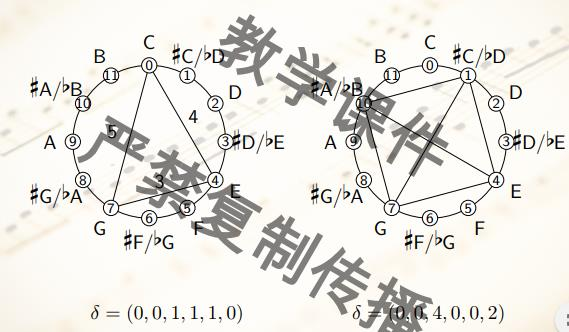
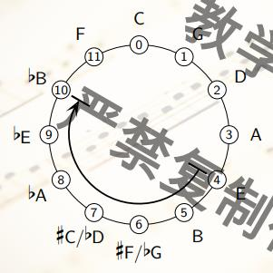
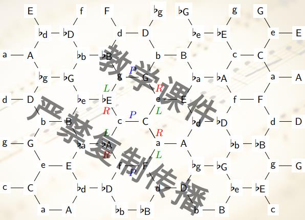
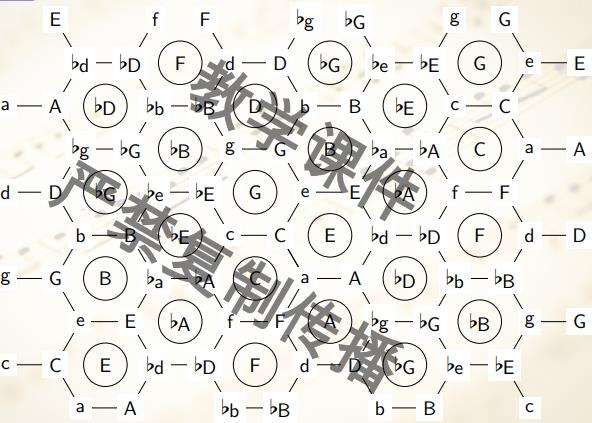
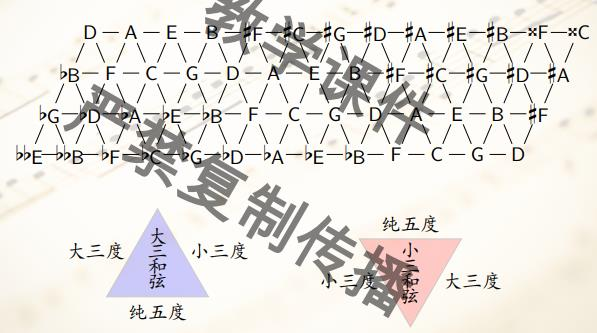

# 和弦与音网

19世纪, 黎曼等在纯律框架内发展音网理论; 20世纪, 后人在平均律下形成新黎曼理论

一个n-和弦就是PC中的一个n元子集, 在音类圆周中的一个n边形;

把一个和弦进行移调变换就是进行旋转; 倒影变换就是进行左右的轴对称, 大三和弦进行倒影变换就得到一个小三和弦

$\Omega = \{1, \dots, n\}, \Omega$到自身的可逆变换构成n次对阵群$S_{n}$, 它的子群称为置换群, 任给一个置换群, 得到它导出的一个等价关系. 任给$\alpha \in \Omega, \mbox{Orb}(\alpha) = \{\beta \in \Omega | \beta ~ \alpha\}$, 称为包含$\alpha$的轨道, $G_{\alpha} = \{g \in G | g(\alpha) = \alpha \}$称为α的稳定化子.

```text
Orb(α) = {g(α) | \forall g \in G}
G_{\alpha}是G的子群
g(α) = β, 则有G_{β} = gG_{α}g^{-1}
g(α) = h(α) \iff h^{-1}g \in G_{α}
|Orb(a)| = |G : G_a| = |G| / |G_a|
```

这样, 三和弦就分成了12条轨道; 每一个等价类中找一个音类做代表, 大小三和弦的等价类是3-11

距离向量: 音类圆周上, $C_{n}^{2}$条连线的长度的counter



则有X与T^k(X)的交有d_k个元素; 特别的, 当k = 6时, X交T^6(X) = 2d_6

减七和弦的稳定化子有8个(n = 4的二面体群), 轨道就长3(24 / 8), 在音类集合中的标号为4-28; 但是大小七和弦稳定化子就是平凡的;

全音程和弦, 距离向量为(1, 1, 1, 1, 1, 1), {B, C, D, #F}, {C, #C, E, #F}就是两个例子, 不是传统七和弦, 在无调性音乐中地位重要; 互不等价的全音程和弦只有上述两种(4-Z29, 4-Z15)

定义音阶: 音列圆周上若干顶点按顺时针方向排序的有序集合, [#F, #G, #a, #C, #D]叫五声音阶, [C, D, E, #F, #G, #A]叫全音音阶, [C, #C, D, ..., #A, B]叫半音音阶. 对自然大调音阶C做移调得到12个大调音阶, 倒影不会得到新的大调音阶, 因为大调本身有对称轴.

从任一个音类出发, 每一次升高5个半音, 得到五度圆周, 每一个半圆弧对应一个自然大调音阶, 其主音是半圆弧顺时针方向的第二个音类



并且很容易得到两个大调共享哪些音类, 某一个音类在哪些大调音阶中, 和弦出现在哪些大调音阶中的话筛法即可.

用三个数字的集合表示大小三和弦C = {0, 4, 7}, c = {0, 3, 7}, 定义平行变换: 某一个三和弦变成和它平行的三和弦(改变三音); 关系变换: 定义C和a有关系, 其余类似; 导音变换: 大三和弦的跟音降一个半音, 小三和弦的冠音升一个半音.

小三和弦进行关系变换升高的三音也叫Picardy三度

任一个三和弦进行PRLPRL变换, 都会回到原来的和弦, 构成一个六边形, 12个六边形叠置, 得到音网



发现PRLPRL变换的三和弦都包含用一个音类, 把它标在音网的中间



发现, 和C相邻的正六边形的标号音级都和C构成协和音程

也可以做音网的对偶形式(平面图的对偶图)



音网在两个方向上都有周期, 双环面, 同胚于甜甜圈; 标出音阶的位置, 就可以找它们围成的三角形, 也就是音阶包含的三和弦; 在对偶图中, P就是底边重叠的两个三角形的变换, R是下三角-上三角之间的变换, L是上三角-下三角之间的变换.

N = <P, R, L>关于变换的复合构成新黎曼群, 当然RLRLRLR = P, N = <R, L>, 可以证明, N同构于24阶二面体群(正十二边形变换群).

和弦的进行就相当于从初始和弦不断进行变换, 群中的字是形如$\prod s_i^{\epsilon_{i}}$, 譬如RPRLR, LRLRLRLRLR都是群中的字. 新黎曼群中的字, 和弦序列, 音网上的路径. 元素LR是12阶的, 所以可以不断LR遍历24个大小和弦, Hamilton回路, PRL都是只变化一个音, 所以可以平滑的遍历所有协和三和弦.

D = <T, I>(移调变换和倒影变换的群), 和N = <P, L, R>是相对偶的, 互为在$S_{24}$中的中心化子
