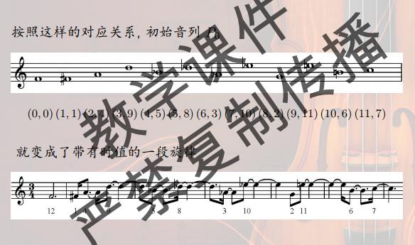

# 节奏与几何

节奏是乐音时值的有组织的顺序, 节拍重音休止的结合. 固定节奏型是在乐曲中无变化反复出现的节奏模式. 节奏型划分成基本的单位, 每一个单位叫一个拍. 节奏型用01序列表示, 1代表起拍. 极大均衡, 相位差, 节奏奇性(对径点不是起拍), 影子(起拍的中点), 距离序列(从原点之后的第一个顶点计数), 轮廓(第一个是d_2 - d_1), 轮廓同构(差一个轮换).

极大均衡原则: Bjorklund算法, 本质上是euclid算法, 只有一列比较短的时候, 算法就终止, 所以并不会求到最后

```text
1111100000000

11111
00000
000

111
000
000
11
00

1001010010100
```

所以得到的节奏型也叫euclidean节奏, 打后半拍(backbeat)

如果不互素的话, 得到的是由一些子节奏组合的节奏型

时值序列: 把连在一起的音符算到一起, 对时值序列也可以移调, 倒影, 逆行

<为十二件乐器而作>, 把音列, 时值序列和力度音区音色结合到一起, 形成了整体上的序列音乐

把音列拓展成数对的序列(i, d_i), 再把d_i解释成时值长度, 特别的, 0对应12, 这样一个音列就变成了带有时值的旋律



计数: 12拍, 4个休止符, 休止符不连续出现(第一个不是休止符$C_{8}^{4}$, 第一个是休止符$C_{7}^{3}$), 共有105种, 但是在循环左移位下有重复的

**Burnside引理** $t = \frac{1}{|G|} \sum_{g \in G} |\mbox{fix}(g)|$

经过一些枚举数数, 得到一共有10种不同的节奏形(其实就是第二类斯特林数$\{\frac{8}{4}\}$)

极简主义: 采用简单的和声语言, 重复短小的音乐动机, 使用较少的音乐材料得到尽可能大的效果. 将转瞬即逝的音响反复呈现才能给听众留下深刻印象; 必须要有足够的冗余信息使得能够重建缺失的部分, 整体序列音乐呈现极少的内在冗余, 实验音乐并非有待聆听的音乐, 而是研究的对象; 音乐几乎无法从听觉上进行核查和纠正; 先锋音乐作曲技术冗余/内部荣誉非常低, 人们无法将有序, 持久的关系内化; 有些先锋音乐写作时指定了明确冗余的计划, 但是作品的感知冗余非常低; 间歇性聆听应该提供足够的冗余; 简约主义者的冗余带有侵略性; 先锋派音乐历史意义是使音乐探索走到极限.
