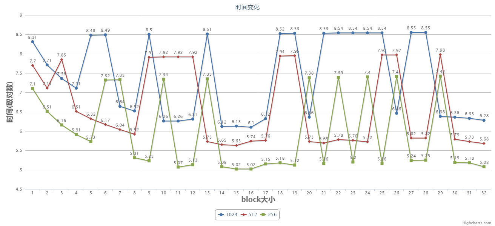

# 矩阵转置作业

###### 黄道吉 1600017857

### 作业目标


 - [x] 随机生成N * N矩阵, 对其转置
 - [x] 附带验证函数, 验证计算结果
 - [x] 解释基本原理, 实验结果, 代码路径, 运行代码

### 基本原理

 - **输入处理**  允许输入矩阵的大小(行数)
 - **矩阵生成**  利用rand()函数随机生成矩阵
 - **计算过程**  将原矩阵拷贝到显存中, 显卡上计算之后再拷贝回内存
 - **验证函数**  在cpu上对结果进行验算, 有一个位置出错就认为结果不正确
 - **测量时间**  每一个block记录时间, 取最早的起始时间和最晚的结束时间的差值作为程序运行时间
 - **参考资料**  主要参考了[这一个专栏](https://blog.csdn.net/sunmc1204953974/article/category/6156113)中的方法.

### 代码实现

#### 初始化与设备信息

主要参考了[这一个专栏](https://blog.csdn.net/sunmc1204953974/article/category/6156113)中的函数, 获取本地显卡的一些信息.

```c
void printDeviceProp(const cudaDeviceProp &prop) {
	printf("Device Name : %s.\n", prop.name);
	printf("totalGlobalMem : %d.\n", prop.totalGlobalMem);
	printf("sharedMemPerBlock : %d.\n", prop.sharedMemPerBlock);
	printf("regsPerBlock : %d.\n", prop.regsPerBlock);
	printf("warpSize : %d.\n", prop.warpSize);
	printf("memPitch : %d.\n", prop.memPitch);
	printf("maxThreadsPerBlock : %d.\n", prop.maxThreadsPerBlock);
	printf("maxThreadsDim[0 - 2] : %d %d %d.\n", prop.maxThreadsDim[0], prop.maxThreadsDim[1], prop.maxThreadsDim[2]);
	printf("maxGridSize[0 - 2] : %d %d %d.\n", prop.maxGridSize[0], prop.maxGridSize[1], prop.maxGridSize[2]);
	printf("totalConstMem : %d.\n", prop.totalConstMem);
	printf("major.minor : %d.%d.\n", prop.major, prop.minor);
	printf("clockRate : %d.\n", prop.clockRate);
	printf("textureAlignment : %d.\n", prop.textureAlignment);
	printf("deviceOverlap : %d.\n", prop.deviceOverlap);
	printf("multiProcessorCount : %d.\n", prop.multiProcessorCount);
}

bool InitCUDA()
{
	int count;
	cudaGetDeviceCount(&count);

	if (count == 0) {
		fprintf(stderr, "There is no device.\n");
		return false;
	}

	int i;
	for (i = 0; i < count; i++) {
		cudaDeviceProp prop;
		cudaGetDeviceProperties(&prop, i);
		printDeviceProp(prop);
		if (cudaGetDeviceProperties(&prop, i) == cudaSuccess) {
			if (prop.major >= 1) {
				break;
			}
		}
	}

	if (i == count) {
		fprintf(stderr, "There is no device supporting CUDA 1.x.\n");
		return false;
	}
	cudaSetDevice(i);
	return true;
}
```

#### 转置与计时

使用共享内存来减少访存次数, 每一个block中, 取第0个线程计时, 近似作为整个block的执行时间.

```c
__global__ static void trans(int* mat, int* res, int size, clock_t* time) {
    /* blocksize是一个宏定义 */
	__shared__ int cache[blocksize][blocksize];
	int i = blockIdx.x * blockDim.x + threadIdx.x;
	int j = blockIdx.y * blockDim.y + threadIdx.y;

	clock_t start_time;
	if (threadIdx.x == 0 && threadIdx.y == 0) {
		time[blockIdx.x * (size / blockDim.x) + blockIdx.y] = clock();
	}

	if(i < size && j < size){
		cache[threadIdx.y][threadIdx.x] = mat[j * size + i];
		__syncthreads();
		res[i * size + j] = cache[threadIdx.y][threadIdx.x];
	}

	if (threadIdx.x == 0 && threadIdx.y == 0) {
		time[blockIdx.x * (size / blockDim.x) + blockIdx.y + size * size / (blockDim.x * blockDim.y)] = clock();
	}
}
```

### 实验结果

##### 测试机器参数

 - 显卡名: GeForce 920M
 - warpSize: 32
 - maxThreadsPerBlock: 1024
 - clockRate: 954000
 - bandwith: 14.4G/s

##### 运行时间

实验结果如图, 纵轴取时钟周期的对数(10为底数), 其中数据的波动经多次测试都存在, 推测并不是偶然的误差, 每一次计算的时间大致在+-0.2范围内波动, 不会影响整体的趋势.

观察得到, 随着block大小的扩大, 执行时间大体上是下降的, 其中在2的方幂处一般时间比较小.

在这块显卡上, 取blocksize为16或32结果是很好的.



##### 吞吐量

分别取每条曲线的的最小时间作为计算吞吐量(运行速度)的时间, 计算得到
 - 1024 * 1024: 约7G/s
 - 512 * 512: 约4.5G/s
 - 256 * 256: 约4.5G/s

在课程机器(K20c, 查到的带宽有41.6G/s)上的结果
 - 1024 * 1024: 约42.10G/s
 - 512 * 512: 约38.86G/s
 - 256 * 256: 约35.61G/s

### 完整的代码及路径

课程机器上的路径: 课程机器/uers/Huang.Daoji/test.cu

###### 2018-04-06
